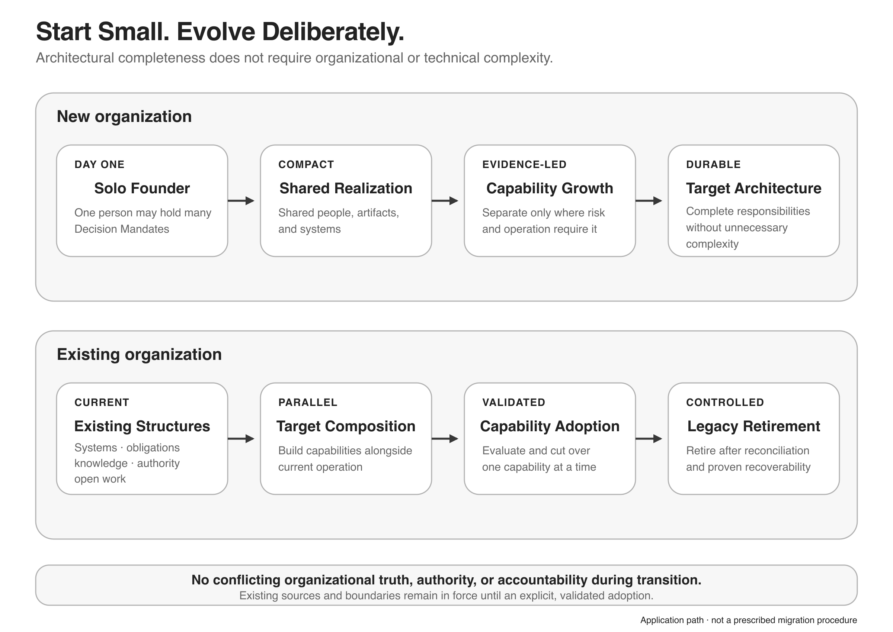

# The Core Idea

An AI-First Company is an organization in which humans and AI systems operate within one coherent organizational system.

That does not mean adding AI tools to otherwise unchanged work. It means designing knowledge, responsibility, authority, execution, and learning so that AI can contribute within explicit boundaries while humans retain accountability.

At a high level, the organization connects shared understanding, organizational capabilities, controlled execution, evidence, and deliberate evolution:

```text
Organizational Knowledge and State
              ↓
      Company Capabilities
              ↓
      Controlled Execution
              ↓
       Outcomes and Evidence
              ↓
       Learning and Evaluation
              ↓
        Deliberate Change
```

Authority and human accountability constrain this flow rather than appearing as automatic steps within it.

## One organization, not separate worlds

Humans and AI systems need compatible organizational knowledge and current state. If each person, model, or tool acts from a private version of the organization, work becomes inconsistent and difficult to govern.

Coherence does not require every participant to see everything. Each activity should receive the smallest sufficient context, subject to its information and authority boundaries.

Different participants may therefore see different authorized views, but they must not operate from conflicting organizational realities.

## Stable responsibilities, replaceable implementations

An organization should define what it must be able to do before deciding who or what performs the work.

> **The capability belongs to the organization. Its current performer does not.**

A capability may be performed by a person, an AI system, software, or a combination of them. Those implementations will change. The organizational capability, its purpose, its boundaries, and the evidence about its performance should remain understandable across those changes.

This keeps a model replacement, tool migration, or staffing change from silently redefining the organization.

## Knowledge belongs to the organization

Important organizational knowledge must not live only in individual conversations, models, people, or tools. Those sources can contribute information, but none of them is the organization’s memory.

Organizational memory is curated. Material is observed, evaluated, validated for a stated context, and intentionally preserved when it has lasting company value. Sources, evidence, decisions, provenance, and applicable review conditions remain connected to what the organization accepts.

Shared understanding is therefore different from shared storage. Putting information in one place does not make it reliable, current, authoritative, or useful.

Different information may remain authoritative in different Systems of Record. The organization preserves their meaning, relationships, authority, and provenance while preparing the relevant Working Context for each authorized activity.

## Capability is not authority

A person or AI system may be technically able to perform an action without being organizationally authorized to do it.

Authority comes from governance. Consequential decisions remain assigned to accountable humans through explicit boundaries. AI systems may prepare, analyze, recommend, monitor, and execute authorized work, but their technical access or apparent competence does not create permission.

Confidence follows the same rule. Evidence that a capability performs well may justify a governance decision to reduce repetitive supervision within bounded conditions. It does not automatically grant authority, and it can also justify narrower authorization or greater supervision.

## Work remains controlled and visible

Intent should enter execution only after the applicable authority and admission boundaries have been satisfied.

During execution, the organization should be able to understand what is happening, which context and authorization apply, and who or what performed the work.

Outcomes remain attributable and become evidence for later review and learning. External actions pass through controlled boundaries rather than occurring merely because a system holds a credential.

Failure and uncertainty must stay visible and bounded. A failure must not silently expand authority, erase execution state, or turn an uncertain external effect into an assumed success.

Safe behavior may include stopping, waiting, restricting, gathering additional evidence, escalating, preserving state, or recovering where the situation requires it.

## Trust grows from evidence

Organizational trust is not a permanent property of a person, model, or tool. It is confidence in a defined capability under defined conditions, supported by evidence.

The organization observes outcomes, retains relevant evidence, and evaluates performance in context.

Accountable governance can then decide whether to keep, narrow, expand, or revoke an authorization. This makes increased autonomy progressive, bounded, and reversible.

## Learn continuously, change deliberately

An AI-First Company can continuously observe its operation and environment without continuously modifying itself.

Evidence can reveal a need to improve knowledge, context, policy, process, human guidance, or an implementation. A proposed change is still evaluated, authorized, tested where appropriate, and adopted through controlled evolution.

> **The organization may learn continuously while changing deliberately.**

## Start small, evolve deliberately

The model applies to an organization beginning with one founder as well as to an established organization moving toward an AI-first target architecture.

Complete architectural responsibility does not require a large organization, separate teams, or one technical system for every responsibility. A solo founder may initially hold several responsibilities and Decision Mandates, while compact artifacts and implementations may realize multiple requirements as long as their distinctions, boundaries, authority, and accountability remain explicit.

An existing organization may establish the target architecture progressively, including capability by capability alongside current structures. Existing organizational truth, authority, and accountability remain in force until each transition is explicitly validated and adopted.



*A compact realization can preserve the complete architectural distinctions without requiring unnecessary organizational or technical complexity.*

A founder can begin with one real Company Capability and follow it from an expected result, explicit Intent, and authority through bounded execution to an observed Outcome, Evidence, and review. The [LLM usage document](USING_THE_FOUNDATION_WITH_AN_LLM.md) provides a repository-grounded prompt and a compact starting loop for applying the Foundation this way through a general-purpose LLM.

## Continue to the Architecture

The [AI-First Company Architecture](../01-architecture/ARCHITECTURE.md) defines the concepts, responsibilities, boundaries, and relationships that make this organizational model precise.

For optional context on the project's origin, its relationship to established fields of work, and its development through human–AI collaboration, see [Origin, Related Work, and Contribution](ORIGIN_AND_RELATED_WORK.md).
