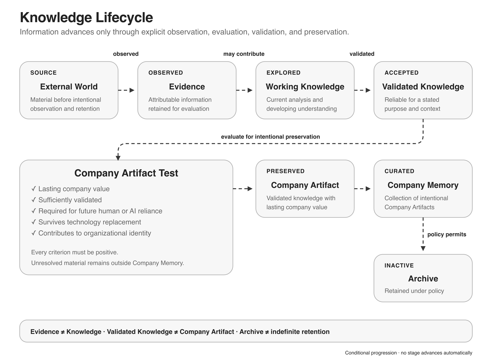
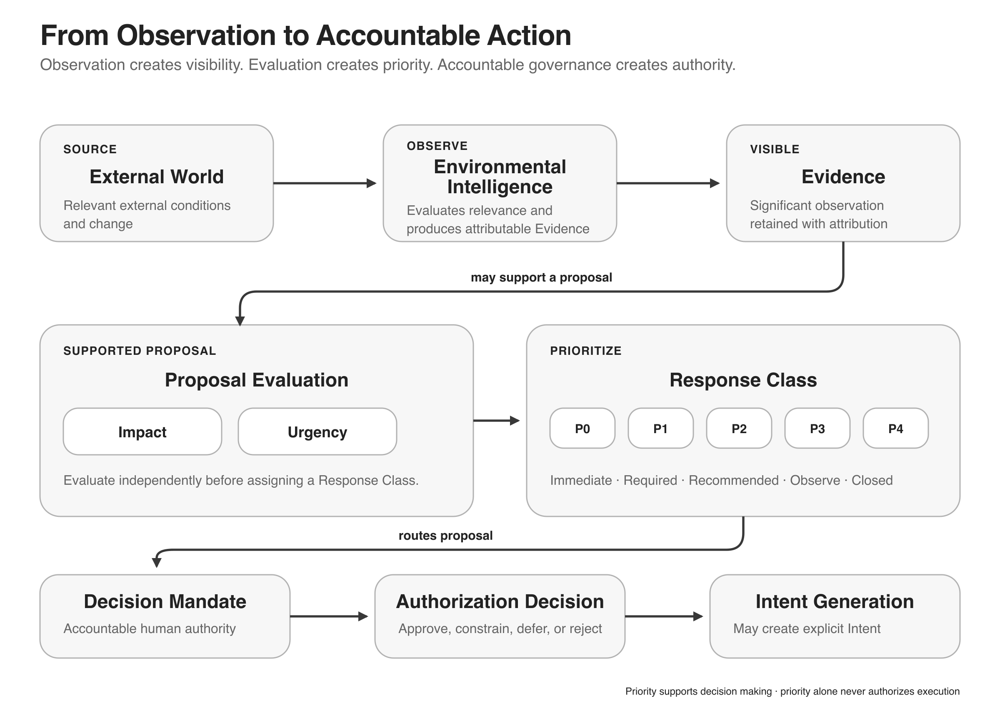

# AI-First Company Architecture

This document is the vendor-neutral conceptual reference for designing and operating an AI-first company. It explains why a subject matters, which distinctions and capabilities are required, how the concepts depend on one another, and when decisions must be made or revisited.

Within this repository, this document is authoritative for Architecture concepts, responsibilities, boundaries, and relationships. The [Reference Design](../02-reference-design/REFERENCE_DESIGN.md) translates the Architecture into an organizational design. The Technical Requirements define the technology required to realize that design.

The Architecture applies to new organizations and may serve as a target organizational architecture for existing organizations. It does not prescribe transformation, migration, or modernization procedures or implementation sequencing for existing organizations.

The Architecture is industry-agnostic and internationally applicable. Regional procedures, named products, and implementation instructions are outside its scope.

The following diagram is a non-authoritative Derived Representation of selected Architecture concepts and relationships. It provides orientation and does not define a technical implementation or replace the authoritative Architecture text.


*Derived overview of shared organizational understanding, Company Capabilities, Controlled Execution, Outcomes and Evidence, governance, and continuity.*

## Contents

1. [What is an AI-First Company?](#what-is-an-ai-first-company)
2. [Company Identity](#company-identity)
3. [Company Execution Environment](#company-execution-environment)
4. [Company Memory](#company-memory)
5. [Knowledge Representation](#knowledge-representation)
6. [Knowledge Access](#knowledge-access)
7. [Company Capabilities](#company-capabilities)
8. [Operating Cycle](#operating-cycle)
9. [Controlled Execution](#controlled-execution)
10. [Organizational Events](#organizational-events)
11. [Operational Confidence](#operational-confidence)
12. [Standing Authorization](#standing-authorization)
13. [Founder Continuity](#founder-continuity)
14. [Continuous Environmental Intelligence](#continuous-environmental-intelligence)
15. [Proposal Evaluation](#proposal-evaluation)
16. [Decision Mandates](#decision-mandates)
17. [Information Classification](#information-classification)
18. [Company State](#company-state)

## What is an AI-First Company?

### AI-First Company Problem

Many organizations use AI tools. Using AI tools does not automatically make an organization AI-first.

The term is frequently used without defining the organizational characteristics that distinguish an AI-first company from a conventional organization.

### AI-First Company Outcome

The reader understands:

- what an AI-first company is;
- what it is not;
- how the Architecture applies to new organizations and as a target organizational architecture for existing organizations; and
- why the Architecture exists.

### AI-First Company Common Assumptions

These assumptions confuse implementation choices with organizational design:

- Using AI tools makes a company AI-first.
- Installing AI agents creates an AI-first company.
- AI-first is primarily a technology decision.
- AI-first means replacing humans.
- AI-first means maximizing automation.
- AI-first requires one specific model or vendor.
- AI-first is defined by the tools currently in use.

### Why AI-First Design Matters

An AI-first company has an organizational architecture intentionally designed for long-term collaboration between humans and AI systems. AI is considered during the design of knowledge, governance, execution, responsibilities, and continuous evolution rather than added as an isolated capability.

New organizations can design these elements and their boundaries coherently before conventional structures become dependencies. This includes organizations beginning with one founder or one primary accountable individual.

Architectural completeness does not require organizational or technical complexity. One person may initially hold multiple responsibilities and Decision Mandates, and one artifact or implementation may support multiple architectural responsibilities, provided the required distinctions, boundaries, authority, and accountability remain explicit.

Existing organizations must separately reconcile established structures, systems, obligations, and accumulated knowledge. This Architecture may define their target organizational architecture and may be adopted incrementally, including capability by capability. It does not prescribe the transformation, migration, modernization, or implementation process. During any transition, parallel structures must not silently create conflicting organizational truth, authority, or accountability.

### AI-First Company Definition

An **AI-first company** is an organization whose organizational architecture is intentionally designed for durable human–AI collaboration.

Its organizational knowledge, governance, execution, responsibilities, and continuous evolution are structured so that AI systems can contribute within explicit boundaries while humans retain accountability.

AI-first describes an organizational architecture. It is not a technology definition, product definition, or implementation guide.

### Scope

This Architecture defines the organizational foundation and operating architecture of an AI-first company. It is intended to remain applicable whether the organization is a software company, manufacturing company, construction company, healthcare organization, consulting firm, or another type of organization. The following topics remain important but are intentionally outside this Architecture and may instead be addressed through Company Strategy, Business Strategy, Product Blueprints, or industry-specific documentation:

- product strategy and customer discovery;
- market analysis and competitive strategy;
- pricing, revenue models, and sales strategy;
- business-model design; and
- industry-specific operating procedures.

### Foundational Characteristics

An AI-first company:

- preserves organizational knowledge independently of current people and technologies so that it can survive personnel and implementation changes;
- structures organizational knowledge for human understanding and machine reasoning without creating separate organizational truths;
- provides controlled Knowledge Access by assembling the smallest sufficient Working Context for the current activity;
- separates organizational truth from replaceable representations, systems, and execution technologies;
- organizes operational work around outcomes and capabilities instead of unnecessary permanent hierarchy;
- makes human accountability, authority, and decision boundaries explicit; and
- supports continuous organizational learning by turning observations and Outcomes into Evidence, review, and accountable proposals.

These characteristics define architectural requirements. They do not prescribe an organizational structure or implementation.

### What an AI-First Company Is Not

An AI-first company is not defined by:

- a specific model;
- a specific vendor;
- a specific agent framework;
- a specific runtime;
- a specific cloud provider;
- a specific programming language; or
- a specific workflow tool.

These are replaceable implementation choices.

### Humans and AI Systems

Humans remain accountable for consequential decisions and outcomes.

AI systems may contribute through bounded execution, preparation, analysis, monitoring, recommendation, and authorized operational work. The Architecture treats AI systems as operational contributors rather than organizational leaders.

### Progressive Evidence-Based Autonomy

> **The objective of an AI-first company is not to maximize automation, but to progressively replace supervision with evidence-based confidence.**

Early-stage organizations possess limited organizational Evidence. New capabilities therefore normally require stronger human supervision and narrower authorization.

Real operation produces organizational Evidence. That Evidence informs Operational Confidence, and accountable governance may use that confidence to grant bounded Standing Authorization. Justified authorization can reduce repetitive human supervision while preserving human accountability.

```text
Human Supervision
  -> Organizational Evidence
     -> Operational Confidence
        -> Accountable governance decision
           -> Standing Authorization
              -> Reduced Repetitive Supervision
```

Here, Organizational Evidence means Evidence generated through organizational operation. It is not a separate Knowledge Lifecycle stage.

This progression is neither automatic nor irreversible. Evidence may reduce Operational Confidence, narrow or revoke Standing Authorization, and increase supervision. The objective is greater operational self-sufficiency within accountable boundaries, not unrestricted autonomy. Critical decisions may remain permanently subject to human accountability or approval.

### Organizational Architecture

AI-first is fundamentally an architectural decision rather than a technology decision.

Technology changes. The organizational principles, knowledge boundaries, governance mechanisms, authority model, and accountability structure should remain durable across implementation changes.

### Architecture Roadmap

The following chapters define the architecture required to realize an AI-first company.

The Architecture proceeds from identity and execution foundations through knowledge, the Operating Cycle, Controlled Execution, organizational intelligence, and governance. Together, these capabilities describe one coherent operating model that supports continuous evolution.

### AI-First Company Principles

> **AI-first is an organizational architecture, not a technology stack.**

> **Humans and AI systems should operate from the same organizational truth.**

> **Organizational knowledge should be intentionally structured for both human understanding and machine reasoning.**

> **AI systems participate within explicit governance and human accountability.**

> **Replaceable implementations must not redefine organizational identity.**

## Company Identity

### Identity Problem

Company identity spans independent systems for names, rights, domains, platform identities, assets, contracts, and payment relationships. These systems may change at different times and remain subject to different authorities and evidence.

Treating these systems as interchangeable, or introducing them in the wrong order, creates avoidable conflicts, ownership ambiguity, and migration work.

### Identity Outcome

Maintain an identity that supports the company and its products without avoidable naming, rights, ownership, payment, or operational conflict.

### Identity Common Assumptions

These assumptions repeatedly lead to incorrect decisions:

- A domain is available, therefore the company name is available.
- A company name can be registered, therefore the trademark is available.
- A registered legal name gives unrestricted rights to use the same name as a trademark.
- An exact-match search is sufficient to identify relevant conflicts.
- Control of an asset or account automatically proves company ownership.
- A paid service can always be reassigned without cost or operational impact.

Each question requires independent evidence and a decision appropriate to its governing system.

### Why Identity Sequencing Matters

An early identity decision propagates into registrations, contracts, domains, accounts, software distribution, public communications, and product assets. A late conflict can therefore affect many dependent systems at once.

The objective is not to eliminate all uncertainty. It is to reduce uncertainty before making commitments that are expensive, public, difficult to reverse, or legally significant.

### Company Identity and Product Identity

Company identity and product identity are related but distinct.

- **Company identity** identifies the legal and operating organization.
- **Product identity** identifies a product, service, or product family offered by that organization.

A company and one or more products may share a name, but the Architecture does not require this. The choice should reflect expected product scope, portfolio strategy, rights constraints, and the cost of changing either identity later.

The distinction must be made before candidate evaluation because the intended use determines which names, rights, domains, and public identities are relevant.

### Brand Identity

Company identity is broader than the company name. Recognizable brand elements may include:

- company names;
- product names;
- logos;
- word marks;
- figurative marks;
- visual identity;
- icons; and
- other recognizable brand elements.

The Architecture does not prescribe branding or visual design. It identifies that these elements can become identity commitments and may require conflict checks before significant public or commercial use.

### Brand Identity Verification

Visual identity may create conflicts even when company or product names differ. Logos, figurative marks, icons, and other visual identifiers should therefore be reviewed before significant design investment, registration, publication, or commercial launch.

AI-assisted visual research can reduce uncertainty and help identify potentially similar visual identities. It cannot establish legal availability or prove that no conflicting right exists. Professional trademark, design-right, or other qualified legal review may become appropriate when the identity is commercially significant, a relevant similarity is found, or legal certainty is required.

### Independent Identity Questions

An identity candidate must be evaluated independently across the contexts that matter to the intended use:

- **Company-name availability:** whether the name can be used in the relevant commercial and market context.
- **Legal-name status:** whether the company's legal name remains valid and appropriate in the relevant jurisdiction and operating context.
- **Trademark availability:** whether earlier rights may prevent or constrain use or registration for the relevant goods, services, and territories.
- **Domain availability:** whether a domain can currently be registered or acquired under a specific top-level domain.
- **Platform identity:** whether the required account, publisher, developer, marketplace, or service identity can be established.
- **Social identity:** whether relevant public handles are available and whether acquiring them is justified.

A favorable result in one context is evidence only for that context. It does not establish that the identity can be used without conflicting with relevant rights or requirements.

For the illustrative identity associated with `example.com`, company-name, trademark, and domain research still produces separate evidence. A domain result does not resolve the company-name or trademark questions.

Checks that do not depend on one another may run in parallel:

```text
Candidate and intended use
  +-> Company and legal-name research -------+
  +-> Trademark research --------------------+-> Combined evidence review -> Decision
  +-> Domain research -----------------------+
  +-> Platform and social-identity research -+
```

### Name and Similarity Risks

Identity research must consider more than exact text matches. Relevant forms of similarity may include:

- textual similarity, including spelling variants and shared distinctive elements;
- phonetic similarity, including likely pronunciations in relevant languages;
- visual similarity, including stylization, symbols, and figurative elements;
- conceptual similarity, including equivalent meanings or associations;
- transliteration and script variants;
- unintended meanings, ambiguity, or negative associations in relevant regions.

The importance of each form depends on the identity, intended use, audience, territory, and applicable rules. Automated searches can reduce the candidate set but cannot reliably resolve every similarity or rights question.

### Identity Evidence Sources

Evidence may come from:

- official company and legal-entity registers;
- official trademark and intellectual-property databases;
- domain registries and registration-data services;
- authoritative public sources;
- professional research and qualified advisers;
- direct technical observation of platform requirements;
- AI-assisted research; and
- documented implementation experience.

For each material check, preserve the source, query or method, date, scope, result, and unresolved uncertainty. Time-sensitive evidence must be revalidated before a consequential commitment.

For example, an evidence record might state that a named register was searched on a specific date for an exact term and two spelling variants, in a stated jurisdiction and goods-or-services context; it would retain the relevant result and identify any similarity question still requiring review.

Evidence quality must match decision risk. An informal search may be sufficient to discard an early candidate; it is not sufficient evidence for a legally or financially significant commitment.

### AI-Assisted Identity Research

AI systems can assist with candidate generation, spelling and pronunciation variants, cross-language review, broad web research, and organization of evidence. They can accelerate discovery but introduce specific limitations:

- generated candidates may follow common patterns or already be in use;
- search coverage may be incomplete, stale, or opaque;
- results may combine jurisdictions or identity contexts incorrectly;
- citations may not support the stated conclusion;
- absence from retrieved results is not evidence of availability;
- legal similarity and likelihood of conflict require contextual judgment.

AI-assisted findings must be treated as leads to verify against the underlying evidence. They do not replace official searches, professional clearance, or accountable human decisions.

### Identity Capabilities

The company requires the following capabilities:

- **Identity definition:** define the intended company and product identities and their relationship.
- **Candidate generation:** create a bounded set of candidates against explicit requirements.
- **Independent evaluation:** evaluate candidates in each relevant identity context.
- **Evidence preservation:** retain dated, reviewable support for decisions and unresolved questions.
- **Professional escalation:** recognize when qualified legal, trademark, tax, or accounting review is required.
- **Asset custody:** preserve attributable ownership, access, recovery, and evidence for identity-dependent assets.
- **Legal identity:** maintain the recognized identity through which the company owns assets, enters agreements, and assumes obligations.
- **Financial identity:** maintain the means through which the company contracts, pays, receives funds, and preserves accounting evidence.
- **Dependency management:** establish prerequisite capabilities before dependent services and commitments.

### Legal Identity and Financial Identity

Legal identity and financial identity are distinct capabilities.

- **Legal identity** allows the company to own assets, enter contracts, and bear legal obligations.
- **Financial identity** allows transactions and recurring services to be attributed, paid, received, and evidenced as company activity.

Changes to Legal Identity do not automatically update Financial Identity, banking, tax, contracts, or provider records. Each identity must remain attributable, current, and supported by appropriate evidence.

Recurring paid operational services should use the applicable legal and financial identities. Exceptions require a documented owner, payer, evidence trail, and correction path.

### Identity Dependency Boundaries

```text
Intended company and product outcomes
  -> Identity definition
     -> Independent evidence and evaluation
        -> Consequential identity commitment
           -> Legal identity alignment
              -> Financial identity alignment
                 -> Identity-dependent operational services
```

The diagram expresses capability dependencies, not a universal legal or administrative procedure. A regional context may introduce additional prerequisites or allow some activities in parallel.

### Identity Risks and Failure Modes

- **False equivalence:** using one availability result as proof for another identity context.
- **Narrow search:** checking only exact text and missing phonetic, visual, conceptual, regional, or earlier-use conflicts.
- **Premature commitment:** publishing, registering, or integrating an identity before risk-appropriate checks are complete.
- **Unclear ownership:** operating identity-dependent assets without attributable ownership or custody evidence.
- **Non-transferable dependency:** selecting an account or asset whose ownership or control cannot be reassigned when organizational needs change.
- **Payment ambiguity:** using contracts or payment identities that do not match accountable company activity.
- **Stale evidence:** relying on an earlier search after the relevant register, market, or intended use has changed.
- **Automation overreach:** treating AI output or an automated search as professional clearance.
- **Evidence loss:** failing to preserve queries, dates, decisions, ownership records, or transfer confirmation.

### Identity Decision Boundaries

- Identity candidates must be evaluated separately in every context material to their intended use.
- The evidence depth must increase with commitment cost, public exposure, and legal or financial significance.
- A human remains accountable for the final identity decision.
- Unresolved rights, similarity, ownership, transfer, tax, or accounting questions require qualified review.
- Identity-dependent assets require a known owner, controlled custody, appropriate evidence, and a documented path for organizational change.
- Recurring paid services should use the intended contracting and payment identities unless an accountable exception is documented.
- Defensive acquisition of domains or handles is optional and should have a current, explicit reason.

### Identity Timing and Review Triggers

Make or revisit identity decisions:

- before public identity commitments or material design work;
- before acquiring an identity-dependent asset;
- before applying for a legal name or trademark;
- when intended goods, services, territories, or audiences change;
- before creating a dependent platform or publisher identity;
- when Legal Identity, Financial Identity, ownership, or custody changes;
- before adding recurring paid services;
- when a register, provider, contract, ownership status, or material search result changes; and
- before relying on evidence that is no longer current for the decision.

### Identity Regional Considerations

Jurisdictions differ in legal-identity rules, name rules, registers, trademark systems, tax treatment, professional roles, and ownership-transfer requirements.

Apply the conceptual sequence by mapping it to the relevant home market and any additional territory in which the identity will be used. Regional procedures and source links must state their jurisdiction and evaluation date. They must not be generalized into universal requirements.

## Company Execution Environment

### Execution Environment Problem

The company needs a controlled place where humans and AI systems can perform work, retain state, access company data, and recover from disruption. Early choices about devices, identities, networks, data locations, compute, and remote access can create persistent security and ownership dependencies.

The environment must support immediate product work without becoming an unnecessary infrastructure project.

### Execution Environment Outcome

Establish the smallest execution environment that can perform current company work with explicit ownership, bounded trust, durable state, controlled access, and tested recovery.

### Execution Environment Common Assumptions

These assumptions repeatedly lead to incorrect decisions:

- A local service is secure because it is not a cloud service.
- Remote access requires exposing a service directly to the public internet.
- Cloud execution removes the company's responsibility for identity, data custody, or recovery.
- Synchronization is equivalent to backup.
- A successful backup job proves that restoration will work.
- Open-weight software is necessarily open source.
- Continuous operation is required before a workload justifies it.
- Possession or payment automatically proves that hardware belongs to the company.
- A conversational interface automatically provides persistent System Work.
- A locally running agent necessarily uses a locally executed model.
- One isolation mechanism can make unintended agent behaviour impossible.
- Adding many agents, integrations, and triggers at once accelerates useful adoption.

### Why the Execution Environment Matters

The execution environment becomes a trust and dependency boundary for code, knowledge, credentials, evidence, and agent actions. If its identities, data custody, access paths, or recovery mechanisms are unclear, later systems inherit that uncertainty.

The objective is not maximum infrastructure. It is sufficient control and recoverability for current work, with clear triggers for adding complexity.

### Patterns Before Tools

> **Design around enduring patterns and required capabilities, not around current tools.**

Tools, providers, models, and agent products can change faster than the operating requirements they implement. Define decisions in this order: `outcome -> capability -> requirements -> implementation choice`.

Products are replaceable implementations of those requirements. Installing a tool before defining the intended operating pattern can add identities, data dependencies, permissions, and maintenance work without improving the required outcome.

### Company Execution Environment Concepts

The **Company Execution Environment** is the set of controlled resources in which company work is performed. It includes compute, storage, identities, networks, access mechanisms, recovery capabilities, and the policies that constrain them.

A **Persistent Execution Environment** retains enough authorized state, or has a tested recovery path to that state, for work to resume across sessions and disruptions. Persistent state may include repositories, working data, configuration, task state, logs, and evidence. Persistence does not require continuous operation, unattended operation, or one permanent machine.

### Session Work and System Work

**Session Work** is human-initiated, bounded interaction. A human starts the activity, supplies immediate context, reviews the output, and deliberately continues or ends the session. Typical uses include design, coding, analysis, drafting, and complex interactive problem-solving.

**System Work** is persistent operation defined in advance. Within applicable governance and authorization, including Standing Authorization where approved, it can continue without a continuously active human, retain state across interactions, respond to schedules or Organizational Events, and report results, request approval, or raise exceptions.

Neither mode is inherently superior, and a company may require both. A conversational interface does not by itself create a persistent system. System Work requires explicit state, initiation conditions, Working Context, applicable authorization, observability, recovery, accountable ownership, Controlled Execution, and approval boundaries. Its availability and unattended-operation requirements must follow the value and risk of the workflow.

### Execution Environment Selection

Deployment location and operating responsibility are separate decisions:

- **Local environment:** execution occurs on company-controlled local equipment.
- **Cloud environment:** execution occurs on remotely operated infrastructure accessed as a service.
- **Hybrid environment:** local and cloud resources divide workloads, data, or control responsibilities.

No location is inherently sufficient or secure. Each implementation must define ownership, administration, identity, data flow, access, failure modes, and recovery.

Practical environment options may include:

- an existing local computer;
- a dedicated local computer;
- a repurposed older computer;
- a local server;
- a cloud virtual server;
- a managed cloud agent service; or
- a hybrid local/cloud environment.

An older device may be sufficient when local workloads are light and model inference occurs remotely. A local environment is available only while the required device, power, network, and configuration remain operational. Cloud or virtual-server operation can support longer continuous availability but adds provider, cost, identity, security, data-custody, and recovery dependencies. Dedicated hardware can improve isolation but adds acquisition, ownership, maintenance, and replacement obligations.

### Agent System Component Model

An agent system consists of separately identifiable components even when one product bundles several of them:

- **Execution Environment:** where the system runs.
- **Agent Runtime or Harness:** what coordinates agent behaviour, tools, context, and execution.
- **Model Provider:** the model or models used for reasoning and generation.
- **Memory and Knowledge:** persistent state and authoritative company knowledge available to the system.
- **Capabilities:** approved tools, integrations, APIs, computer interaction, and actions.
- **Interaction Channels:** authenticated interfaces through which humans or systems exchange requests, results, alerts, and approvals.
- **Triggers:** schedules, Organizational Events, messages, requests, or evaluated conditions that may initiate Intent Generation or request Work Admission. They do not grant authority.
- **Governance and Observability:** permissions, approval boundaries, logs, evidence, evaluation, failure handling, and revocation.

The labels in this component model are generic implementation categories. They are not Architecture Concept Nodes and do not define additional organizational responsibilities.

These components must not be treated as one inseparable product. Replacing one component should not unnecessarily remove company knowledge, execution history, credentials, workflows, decision records, or operational control. Interfaces, data formats, ownership, export paths, and recovery responsibilities should make replacement possible where the cost is proportionate to the dependency.

### Gradual Capability Growth

> **Add one validated capability at a time; scale the system only after the previous capability is understood and controlled.**

Begin with one valuable workflow. Validate its output, permissions, recovery path, failure behaviour, and operating cost under human review. Add an integration, Agent, model, trigger, or automation only when a current recurring need justifies it and the preceding capability has sufficient Operational Confidence within its current authorization boundary.

### Trust Domain Isolation

A trust domain is a set of resources that share an accepted security and administrative boundary. Company execution should be isolated from unrelated personal, household, guest, and experimental activity to the degree justified by risk.

Isolation may include separate devices, operating-system accounts, identities, storage, network segments, credentials, or cloud tenants. The required mechanism depends on the expected damage if one domain is compromised.

**Damage containment** is the purpose of isolation. A failure or compromise in one domain should not automatically expose unrelated credentials, data, administrative control, backups, or production systems.

```text
Personal trust domain        Company trust domain              External services
Personal devices  -X->  Company device and identities  --->  Authorized providers
Home or guest data -X->  Company data and credentials   <---  Authenticated channels
                           |
                           +-- no default public inbound administration
```

The boundary may be implemented in different ways. The required outcome is that unrelated personal activity does not receive implicit access to company identities, data, administration, or recovery resources.

Process, account, container, virtual-machine, device, and network isolation are different controls with different boundaries. No one mechanism makes unintended agent behaviour impossible. Effective containment also depends on mounted files, credentials, network access, privileges, host configuration, patching, and misconfiguration or escape risk.

### Identity Isolation

Company-oriented identities must be distinguishable from personal identities. This applies to device administration, platform accounts, cloud services, code hosts, AI services, recovery channels, and billing relationships.

Identity isolation supports attribution, revocation, transfer, and later multi-person operation. It does not require every service identity to be permanent. Temporary service identities are acceptable when their scope, owner, recovery path, and replacement trigger are explicit.

### Platform Identity and Temporary Service Identity

Some platforms require an account before a permanent company domain, mailbox, payment method, or legal entity is available.

- **Temporary service identity:** a controlled identity used to activate, replace, or recover a prerequisite service until the intended company-controlled identity is available.
- **Permanent company identity:** the intended long-term identity under company control.
- **Platform identity:** an identity required by a specific operating system, marketplace, provider, or service.

Platform dependencies are conditional. If a platform permits the intended company-controlled identity, use it. If a temporary service identity is necessary, document its recovery factors, owner, dependencies, and replacement trigger. Do not present one platform's account sequence as universal.

### Data Custody and Systems of Record

**Data custody** identifies who controls the storage, access, encryption, export, retention, and deletion of company data. Custody must be explicit for local, cloud, and hybrid data.

A **system of record** is the authoritative source for a defined class of information. Different classes may have different systems of record. For example, versioned knowledge, live financial transactions, identity records, and source code may require different authoritative systems.

For each material data class, define:

- the authoritative source;
- owner and accountable human;
- authorized readers and writers;
- retention and deletion expectations;
- export and portability requirements;
- backup and recovery method; and
- whether an AI service may receive or retain the data.

Synchronization, replication, and cached copies must not be mistaken for an independently recoverable system of record.

Agent-product memory may improve convenience but can create dependency on a runtime, model provider, or interface. Memory and Company Memory are not necessarily the same: transient context can support current work, while authoritative company knowledge requires explicit custody and a defined system of record.

> **Company knowledge should remain portable across agent runtimes and model providers.**

Durable knowledge must use an accessible, exportable, inspectable, and recoverable representation appropriate to its information class. It should survive replacement of the current Agent Runtime or Harness, Model Provider, or Interaction Channel. Transient conversational memory must not silently become the only authoritative company record.

### Compute Strategy

Compute may be local, cloud-hosted, or hybrid. Select it according to current workload, data sensitivity, latency, connectivity, cost, operational capacity, and recovery requirements.

For AI workloads:

- **Cloud AI execution** can reduce local setup and capacity requirements but creates external identity, connectivity, data-processing, and service-dependency considerations.
- **Local AI execution** can increase local control and offline capability but creates hardware, model, maintenance, performance, and local-security responsibilities.
- **Hybrid AI execution** can route workloads according to sensitivity or capability but adds policy, integration, observability, and consistency complexity.

Agent-runtime location and model-inference location are separate decisions. A locally running Agent Runtime or Harness may still use a cloud Model Provider and transmit permitted data externally. Local execution therefore does not by itself establish local inference, data confinement, or complete security.

Start with the least complex strategy that satisfies current constraints. Add local or hybrid execution when a demonstrated requirement justifies the additional operating burden.

### Optional: Open-Weight and Open-Source Distinction

**Open-weight** means that model weights are available under stated conditions. **Open-source AI** requires broader freedoms and access to components sufficient to study, use, modify, and share the system under an applicable definition.

The terms are not interchangeable. Evaluate licenses, source availability, training information, modification rights, redistribution rights, operational dependencies, and security implications against the intended use. Neither label alone establishes suitability, privacy, safety, or maintainability.

### Access Boundary

The access boundary defines how authorized humans and AI systems reach the execution environment and what they can do after authentication.

Local services do not require public exposure. Remote interaction may use an authenticated outbound channel mediated by a trusted service, a private network layer limited to authenticated members, a virtual private network, or another access-control mechanism without opening a general public inbound path.

Remote connectivity and system security are separate concerns. A secure connection does not compensate for weak identity, excessive privilege, unpatched software, unsafe agent permissions, or exposed secrets. Conversely, avoiding remote access does not remove local compromise, theft, or recovery risks.

Public inbound administration interfaces, remote shells, desktops, and internal dashboards increase exposure and should exist only for a justified need with explicit authentication, authorization, patching, monitoring, and incident controls.

Interaction Channels may include desktop interfaces, web interfaces, messaging systems, email, command-line interfaces, dashboards, APIs, and other authenticated channels. The chosen channel is separate from the Execution Environment, Model Provider, system of record, and permission model. A convenient messaging channel must not become an uncontrolled administrative boundary.

### Recoverability

Recoverability is the ability to restore required company data and execution capability within an acceptable time after deletion, corruption, device loss, compromise, provider failure, or site disruption.

A **recovery objective** states the maximum acceptable data loss and the target time to restore required work. A **failure domain** is a set of resources that can be lost or compromised by the same event, such as one device, account, provider, power source, or physical site.

A recoverable environment requires:

- defined recovery objectives appropriate to the workload;
- backup copies independent of the primary failure domain;
- protection of backup confidentiality and integrity;
- at least one copy separated from the primary physical location for material data;
- retained recovery credentials and instructions;
- replacement or alternate execution capacity; and
- periodic restoration validation.

A backup is not validated until the required data or service has been restored and checked. Geographic separation reduces correlated physical risk; it does not replace access control, encryption, or restore testing.

### Availability and Unattended Operation

Availability requirements derive from business outcomes, not from an assumption that all company systems must run continuously.

Consider:

- acceptable interruption duration;
- dependence on utility power and network connectivity;
- safe shutdown and restart behavior;
- alternate power, network, or execution paths;
- monitoring and notification;
- physical and thermal safety; and
- whether unattended operation is necessary and supportable.

Power generation, energy storage, backup power, redundant connectivity, and automatic failover are implementation options. Introduce them only when the workload, interruption cost, or recovery objective justifies their complexity and maintenance.

### Triggers and Proactive Operation

Schedules, recurring conditions, Organizational Events, incoming messages, Company State changes, monitored conditions, and explicit human requests may initiate Intent Generation or request Work Admission. None of them grants authority or requires execution by itself.

- **Scheduled initiation** occurs at a defined time or interval.
- **Condition-based initiation** occurs when an evaluated state or Organizational Event matches a defined condition.
- **Proactive notification** reports a result, risk, exception, or recommendation without waiting for a new human request.
- **Consequential action** changes material company or external state and remains subject to the applicable Decision Mandate, authorization, and approval boundary.

A scheduled or proactive AI system may prepare work, notify, or recommend. Only an authorized Intent admitted through Controlled Execution may perform consequential work.

Every recurring process requires an accountable Decision Mandate, initiation definition, stop condition, failure behaviour, review trigger, Evidence trail, applicable authorization, and recovery path.

### Execution Asset Ownership

Hardware, subscriptions, domains, and recovery media require attributable company ownership or an explicitly governed custody arrangement. Payment, physical possession, account access, and legal ownership must not be treated as interchangeable evidence.

Record the purchaser, current owner, intended company use, custody, cost evidence, transferability, and transition status. Device cleanup or company-only use does not itself transfer legal ownership.

### Execution Environment Dependencies

```text
Current company outcome
  -> Minimum execution requirements
     -> Asset and identity ownership boundaries
        -> Trust and access boundaries
           -> Data custody and systems of record
              -> Compute strategy
                 -> Recoverability
                    -> Availability justified by workload

Conditional platform requirement
  -> Controlled temporary service identity
     -> Platform identity
        -> Permanent company identity when available
```

The ordering identifies decision dependencies. Tasks may run in parallel where one does not rely on the unresolved output of another.

### Execution Environment Risks and Failure Modes

- **Mixed trust domains:** personal or guest activity can access company data or credentials.
- **Identity coupling:** company access depends on a private identity that cannot be transferred or revoked cleanly.
- **Unclear custody:** no authoritative answer exists for where material data is stored or who controls it.
- **Public management exposure:** administrative services are reachable from the internet without a demonstrated need.
- **Excessive agent authority:** an authenticated agent can access more data or perform more actions than its mandate requires.
- **Single failure domain:** primary data and backups can be lost in the same event.
- **Untested recovery:** backup completion is monitored but restoration is not validated.
- **Connectivity confusion:** a remote-access mechanism is treated as complete system security.
- **Premature infrastructure:** local AI, high availability, or unattended operation is built before a current workload requires it.
- **Ownership ambiguity:** hardware or accounts are treated as company property without sufficient ownership or custody evidence.

### Execution Environment Decision Boundaries

- The environment must be sufficient for the current product outcome and no more complex than current constraints require.
- Company work must have explicit identity, data-custody, access, and ownership boundaries.
- Privileges for humans and AI systems must be scoped, attributable, revocable, and no broader than the authorized work.
- Public inbound administration must not be the default.
- Material data must have an identified system of record and a tested recovery path.
- Agent-system components must have explicit boundaries and proportionate replacement paths.
- Cloud, local, and hybrid compute are implementation choices, not maturity rankings.
- Local or hybrid AI execution requires a demonstrated reason and an accountable human for operation, maintenance, security, and recovery.
- Continuous or unattended operation requires an explicit availability objective and safe failure behavior.
- Scheduled or proactive operation does not expand an agent's authority or remove human-approval requirements.
- Platform-specific prerequisites apply only when the chosen platform requires them.

### Execution Environment Timing and Review Triggers

Establish the minimum environment before product work begins. Revisit it when:

- a new data class, credential, agent, or collaborator enters the environment;
- ownership, custody, or identity changes require controlled transition;
- a workload requires remote access, continuous operation, or stronger isolation;
- cloud, local, or hybrid compute requirements change;
- recovery objectives or the cost of interruption change;
- a device, site, provider, network, or recovery factor becomes a material dependency;
- a restore test fails or an incident exposes an incorrect assumption; or
- the operating burden exceeds the value delivered by the current design.

### Execution Environment Regional Considerations

Regional requirements may affect data location, privacy, employment, communications, energy systems, insurance, accounting, asset transfer, and provider contracts. Map those requirements onto the conceptual boundaries without turning one regional implementation into a universal sequence.

Physical power systems, network equipment, and unattended operation may also be subject to local safety, installation, building, or insurance requirements. Obtain qualified review where the implementation creates material legal, safety, or financial consequences.

## Company Memory

### Company Memory Problem

Company knowledge naturally becomes fragmented across humans, AI systems, conversations, documents, systems, and software.

Without intentional curation, the company gradually loses context, reasoning, evidence, consistency, and organizational identity. Knowledge may still exist somewhere while no longer being sufficiently attributable, reviewable, connected, or reliable for future use.

### Company Memory Outcome

The company possesses a durable, reviewable, machine-readable organizational memory composed of curated Company Artifacts.

Company Memory preserves the company's identity and accumulated organizational knowledge across people, AI systems, software, providers, technology changes, and time.

### Company Memory Common Assumptions

These assumptions confuse retained information with organizational memory:

- Conversation history is Company Memory.
- Communication history is Company Memory.
- An AI agent remembers everything the company needs.
- A backup equals organizational memory.
- Every note belongs in Company Memory.
- All knowledge has equal long-term value.
- Stored content is Company Memory.

Retention alone does not provide validation, curation, accountability, relationships, review triggers, or lasting organizational value.

### Why Company Memory Matters

Company Memory belongs to the company. It does not belong to its current people, AI systems, tools, or providers.

Humans and AI systems contribute to Company Memory. Neither owns it.

Company Memory enables the company to survive organizational and technological change without losing accumulated context, accountable decisions, evidence, enduring structures, or organizational identity.

### Knowledge Lifecycle

Company knowledge progresses from the External World through Evidence, Working Knowledge, Validated Knowledge, Company Artifacts, Company Memory, and Archive.

Movement through the lifecycle is intentional; retained information does not advance automatically.

The following non-authoritative Derived Representation summarizes the conditional Knowledge Lifecycle.



*Derived overview of the conditional Knowledge Lifecycle. No stage advances automatically.*

### External World

The **External World** is the source of conditions, events, experiences, and material that may become relevant to the company. It includes company operations and the environment in which the company operates before an observation has been intentionally retained as evidence.

Question answered: **What may need to be observed?**

### Evidence

**Evidence** is observed information retained for evaluation. It may originate from research, customer feedback, measurements, meetings, videos, papers, or logs.

Question answered: **What has been observed?**

Evidence does not by itself establish an accepted conclusion or decision.

### Working Knowledge

**Working Knowledge** is the company's current thinking while it explores ideas, analysis, assumptions, brainstorming, and discussions.

Question answered: **What are we currently exploring or believing?**

Working Knowledge may later prove incomplete or wrong. It must remain distinguishable from Validated Knowledge and Company Memory.

### Validated Knowledge

**Validated Knowledge** is knowledge accepted as sufficiently reliable for its stated context through review, testing, measurement, implementation, experience, or an accountable decision.

Question answered: **What do we currently accept as true?**

Validation must retain its scope, evidence, accountable decision, and review conditions. Source attribution alone does not establish integrity or reliability; manipulated, compromised, or adversarial information must not pass validation merely because its origin is known. Validated Knowledge does not automatically become Company Memory.

### Company Artifact

A **Company Artifact** is validated organizational knowledge intentionally preserved because it possesses lasting company value.

Company Artifacts are implementation-independent. Examples include:

- Decision Records;
- policies;
- processes;
- architectures;
- registries;
- specifications; and
- standards.

A Company Artifact is defined by its organizational meaning, authority, and lasting value rather than by the implementation used to represent it.

### Decision Records

A **Decision Record** is a specialized form of Company Artifact that preserves accountable organizational context for a decision.

A Decision Record typically includes:

- the decision;
- reasoning;
- evidence;
- alternatives;
- trade-offs; and
- review trigger.

Not every Company Artifact is a Decision Record.

### Company Artifact Test

Validated Knowledge should become a Company Artifact only when every question can be answered positively:

- Does it have lasting company value?
- Has it been sufficiently validated?
- Should future humans or AI systems rely on it?
- Should it survive technology replacement?
- Does it contribute to long-term organizational identity?

If any answer is negative or unresolved, the knowledge remains outside Company Memory until its status changes.

### Company Memory Definition

**Company Memory** is the curated collection of Company Artifacts intentionally preserved by the company.

It preserves:

- organizational identity;
- accumulated knowledge;
- accountable decisions;
- enduring structures; and
- reusable organizational understanding.

Company Memory is not a storage system, knowledge base, or documentation collection. Those descriptions concern possible representations, while Company Memory is the enduring organizational capability and curated knowledge they may support.

### Archive

The **Archive** contains Company Artifacts that are no longer operationally active but remain retained under applicable policy because they are historically valuable.

Archived artifacts remain attributable and reviewable while retained, but they must not be mistaken for current operational guidance or Company State. Archive status does not override retention, deletion, privacy, or other legal and organizational obligations.

### Company Memory Relationships

Company Memory is not:

- Company State;
- a System of Record; or
- Information Classification.

These concepts may reference, derive from, or contain Company Artifacts, but they serve different purposes.

Company State answers: **What is true now?**

Company Memory answers: **What has the company intentionally decided to preserve?**

### Knowledge Independence and Knowledge Portability

> **The company should remain independent of replaceable implementation choices.**

**Knowledge Independence** means that Company Memory does not depend on one person, AI agent, Model Provider, software product, runtime, or storage technology.

**Knowledge Portability** is the ability to preserve and transfer required organizational knowledge across implementation changes. It is one implementation property that supports Knowledge Independence.

Portability alone does not establish independence. Knowledge also requires clear ownership, meaning, relationships, validation, accountability, and recovery.

### Company Memory Capabilities

Company Memory should support the capability to:

- preserve;
- curate;
- validate;
- reference;
- search;
- version;
- relate;
- review;
- archive;
- migrate; and
- recover.

These are required capabilities, not prescribed implementation mechanisms.

### Company Memory Failure Modes

- **Contradictory artifacts:** multiple artifacts provide incompatible guidance without a resolved authority boundary.
- **Obsolete artifacts:** superseded knowledge remains presented as current.
- **Duplicate organizational truth:** more than one artifact appears authoritative for the same subject.
- **Missing evidence:** an artifact cannot be traced to sufficient supporting evidence.
- **Knowledge poisoning:** manipulated or adversarial information becomes accepted organizational knowledge without sufficient integrity and reliability review.
- **Missing accountability:** no accountable human or Decision Mandate owns acceptance or review.
- **Loss of context:** the conclusion remains but its reasoning, alternatives, or constraints are lost.
- **Provider dependence:** organizational knowledge cannot survive replacement of a provider or implementation.
- **Orphaned artifacts:** no subject, owner, relationship, or review path remains clear.
- **Forgotten review triggers:** changed conditions do not cause an artifact to be reconsidered.
- **Conversation-only knowledge:** material organizational knowledge exists only in transient interaction.

### Company Memory Decision Boundaries

- Not every piece of information becomes Company Memory.
- Evidence and Working Knowledge remain outside Company Memory unless they become Validated Knowledge and pass the Company Artifact Test.
- Validated Knowledge does not enter Company Memory automatically.
- Only intentionally curated Company Artifacts become part of Company Memory.
- Archiving an artifact changes its operational status without erasing its historical value.
- Company Memory must remain distinguishable from current Company State and from transient agent memory.

### Company Memory Timing and Review Triggers

Company Memory begins when the company intentionally preserves its first Company Artifact, evolves continuously, and is never considered complete.

Review Company Memory when:

- new Validated Knowledge may possess lasting company value;
- an artifact reaches its review trigger;
- artifacts contradict one another;
- evidence, assumptions, or operating conditions materially change;
- an artifact becomes obsolete or operationally inactive;
- a person, agent, provider, runtime, or other implementation dependency changes; or
- recovery or migration exposes missing context, relationships, or accountability.

### Company Memory Principles

> **Company Memory preserves what the company has intentionally decided to remember.**

> **Only validated Company Artifacts become part of Company Memory.**

> **Company Memory belongs to the company, not to its current people, AI systems, tools, or providers.**

> **The company should remain independent of replaceable implementation choices.**

## Knowledge Representation

### Knowledge Representation Problem

Humans and machines require different representations of the same organizational knowledge.

A single representation rarely optimizes both. Knowledge optimized only for humans can limit efficient machine reasoning. Knowledge optimized only for machines can reduce human understanding, reviewability, and accountability.

### Knowledge Representation Outcome

Every Company Artifact has one authoritative Canonical Representation.

Additional representations may exist for particular consumers or purposes. All derived representations originate from the same organizational truth.

### Knowledge Representation Common Assumptions

These assumptions confuse representation with organizational authority:

- A document is the organizational truth.
- The search index is the organizational truth.
- Machine representations replace Company Memory.
- Every representation has equal authority.
- Changing one representation automatically changes organizational truth.

### Why Knowledge Representation Matters

Humans and AI systems require different representations for different purposes. Both must operate from the same organizational truth.

Representations optimize access and processing. They do not redefine truth.

### Canonical Representation

The **Canonical Representation** is the authoritative representation of a Company Artifact from which every other representation is derived.

Each Company Artifact has one Canonical Representation. The Architecture intentionally does not prescribe its technical format.

Organizational authority belongs to the Company Artifact and its validated meaning. The Canonical Representation preserves that meaning authoritatively without making the Artifact dependent on one format or technology.

### Derived Representations

A **Derived Representation** is produced from the Canonical Representation for a particular consumer or purpose.

Derived Representations may optimize:

- human understanding;
- machine reasoning;
- search;
- interoperability; and
- future processing needs.

Derived Representations remain derived. They do not become organizational truth themselves.

### Representation Independence

One Company Artifact may have multiple representations for different consumers.

The representations may differ in structure or presentation. The underlying organizational meaning remains identical.

### Relationship to Company Memory

Company Memory preserves Company Artifacts.

Knowledge Representation defines how those Company Artifacts may be represented. It does not replace Company Memory or create a separate organizational truth.

### Relationship to Knowledge Access

Knowledge Representation concerns representation.

Knowledge Access concerns retrieval and use. This chapter does not define Knowledge Access.

### Knowledge Representation Capabilities

Knowledge Representation should support the capability to:

- create a Canonical Representation;
- derive additional representations from it;
- validate correspondence between representations;
- reproduce Derived Representations;
- transform representations without changing their underlying organizational meaning;
- compare representations;
- version representations; and
- export representations.

These are conceptual capabilities, not prescribed implementation mechanisms.

### Knowledge Representation Failure Modes

- **Loss of the Canonical Representation:** the authoritative representation cannot be recovered.
- **Multiple canonical truths:** more than one representation claims authority for the same Company Artifact.
- **Derived representation divergence:** a Derived Representation no longer corresponds to its Canonical Representation.
- **Machine representation authority:** a Derived Representation intended for machine use becomes treated as authoritative.
- **Human-machine inconsistency:** human and machine representations no longer correspond.
- **Irreproducible representations:** Derived Representations cannot be regenerated from the Canonical Representation.
- **Technology-bound meaning:** replacing a technology destroys or changes the organizational meaning.

### Knowledge Representation Decision Boundaries

- The Company Artifact and its validated meaning carry organizational authority; the Canonical Representation is its authoritative representation.
- Derived Representations may be replaced at any time provided they remain reproducible from the Canonical Representation.
- Changing a Derived Representation must never silently change the Canonical Representation.

### Knowledge Representation Timing and Review Triggers

Review Knowledge Representation when:

- new Company Artifacts are introduced;
- machine-processing requirements change;
- representation technology changes; or
- interoperability requirements change.

### Knowledge Representation Principles

> **A Company Artifact carries organizational authority; its Canonical Representation is the authoritative representation of that Artifact.**

> **Human and machine representations are derived from the same Company Artifact.**

> **Derived Representations should remain reproducible from the Canonical Representation.**

> **Changing a Derived Representation must never silently change the Canonical Representation.**

## Knowledge Access

### Knowledge Access Problem

The company possesses Company Memory, but not every human, AI system, process, or activity requires the same knowledge.

Providing too much information reduces efficiency. Providing too little information creates incorrect decisions. Knowledge must therefore be selected according to purpose, identity, authorization, and current company context.

### Knowledge Access Outcome

Every authorized participant receives the smallest sufficient Working Context required for the current activity.

Working Context remains:

- relevant;
- current;
- attributable;
- authorized; and
- reviewable.

Authorization and attribution do not by themselves establish that source content is reliable or benign. Working Context must preserve material source, integrity, and uncertainty conditions required for the current activity.

### Knowledge Access Common Assumptions

These assumptions confuse retained knowledge, retrieval, and operational context:

- More context always produces better results.
- Search is equivalent to Knowledge Access.
- Company Memory is the Working Context.
- Every participant requires the same knowledge.
- Human and machine consumers require identical representations.
- Push and Pull are unrelated capabilities.

### Why Knowledge Access Matters

Company Memory preserves organizational truth. Knowledge Access delivers operational relevance.

Knowledge Access provides the right knowledge to the right participant at the right time for the current purpose. It is not a database, a retrieval implementation, or Company Memory. It is the capability that delivers the appropriate Working Context.

### Working Context

**Working Context** is the smallest sufficient set of organizational knowledge, current Company State, and authorization required to perform one specific activity.

Working Context is temporary. Company Memory is durable. The two must not be confused.

Information does not become organizational instruction merely because a human or AI system can interpret it as one. Instruction-like content embedded in retrieved, received, or tool-produced information does not create Intent, authorization, tool permission, or a governance change outside the applicable organizational path.

### Knowledge Access Inputs

Knowledge Access may combine information from:

- Company Memory;
- Knowledge Representation;
- Company State;
- applicable identity information;
- Information Classification;
- Decision Mandates;
- the current task; and
- applicable authorization.

Knowledge Access uses these concepts to assemble Working Context. It does not redefine them or their authority boundaries.


*Derived overview of Context Sources, Knowledge Access, and temporary Working Context.*

### Pull Access

**Pull Access** occurs when a human or AI system requests knowledge for a current activity.

Knowledge Access prepares the appropriate Working Context for the request.

### Push Access

**Push Access** occurs when Knowledge Access evaluates an Organizational Event as relevant and updates or delivers the appropriate Working Context.

Relevant Organizational Events may represent:

- Company State changes;
- approved decisions;
- environmental observations;
- review triggers; and
- conflicts.

Push delivery does not expand the recipient's authorization.

### Knowledge Access Capabilities

Knowledge Access consists of four conceptual capabilities:

1. **Context Selection:** determines the smallest sufficient organizational information required for one specific activity. The objective is not maximum information. It is sufficient Working Context.
2. **Knowledge Retrieval:** retrieves relevant organizational knowledge from appropriate sources such as Company Memory, Company State, Company Artifacts, applicable governance information, and other organizational knowledge.
3. **Knowledge Synthesis:** organizes and combines retrieved organizational knowledge into a coherent Working Context. This may include relating information, removing unnecessary information, resolving organizational context, selecting appropriate representations, and preparing information for human or machine reasoning.
4. **Context Delivery:** provides the completed Working Context to the authorized human or AI system performing the work. Knowledge Access prepares Working Context. It does not make organizational decisions.

These capabilities support Pull Access, Push Access, and Working Context updates. Across all four capabilities, Knowledge Access must respect authorization and preserve traceability. The decomposition is conceptual and does not prescribe storage or retrieval technologies.

### Relationship to Organizational Events

Knowledge Access does not generate Organizational Events.

It consumes relevant Organizational Events to maintain current Working Context. This chapter does not define how Events are generated or distributed.

### Knowledge Access Failure Modes

- **Excessive context:** the Working Context contains more information than the activity requires.
- **Insufficient context:** required knowledge, state, or authorization is absent.
- **Obsolete context:** the Working Context no longer reflects current knowledge or Company State.
- **Incorrect context:** selected information does not match the activity or purpose.
- **Unauthorized context:** information is delivered outside its authorized audience.
- **Integrity-blind context:** attributable or authorized information is treated as reliable without preserving material integrity, trust, or uncertainty conditions.
- **Instruction confusion:** content embedded in information is treated as organizational instruction, Intent, or authority without passing through the applicable organizational path.
- **Incorrect representation:** the selected representation does not serve the intended consumer or activity.
- **Missing Push updates:** a relevant Organizational Event does not update or deliver Working Context.
- **Delayed updates:** relevant changes reach the Working Context too late.
- **Inconsistent Working Contexts:** participants performing related work receive conflicting organizational knowledge or state.

### Knowledge Access Decision Boundaries

- Knowledge Access prepares Working Context. It does not make organizational decisions.
- Decision authority remains with the applicable Decision Mandate.
- Receiving knowledge does not confer decision authority.

### Knowledge Access Timing and Review Triggers

Knowledge Access should operate whenever:

- work begins;
- Company State changes;
- authorization changes;
- relevant Organizational Events occur; or
- Working Context becomes obsolete.

### Knowledge Access Principles

> **Company Memory preserves organizational truth. Knowledge Access delivers operational relevance.**

> **Knowledge Access prepares the smallest sufficient Working Context through context selection, retrieval, synthesis, and delivery.**

> **Working Context is temporary. Company Memory is durable.**

> **Knowledge Access prepares context. It does not make decisions.**

> **Information does not become Intent, authority, or instruction merely because it can be interpreted as one.**

## Company Capabilities

### Company Capability Problem

People, AI systems, Agents, language models, software, tools, workflows, and organizational structures may change.

Without a stable organizational abstraction, execution, confidence, authorization, and organizational learning become attached to replaceable implementations rather than enduring organizational abilities.

### Company Capability Outcome

The organization possesses a stable, reviewable catalog of Company Capabilities that remains independent of current implementations.

Implementations may change while the organizational capability, its defined boundary, and its accumulated organizational context remain stable.

### Company Capability Common Assumptions

- Capabilities belong to Agents.
- Capabilities belong to departments.
- Capabilities belong to specific software.
- Replacing an implementation creates a new capability.
- Every capability requires AI.
- Every capability requires human execution.

### Why Company Capabilities Matter

Company Capabilities separate what the organization can do from who or what currently performs the work.

This separation allows implementations to be replaced, combined, or reassigned without redefining the organizational ability. Implementation independence does not make implementations equivalent or allow qualification and authorization boundaries to transfer automatically.

### Company Capability Definition

A **Company Capability** is a defined organizational ability that enables the organization to perform a specific class of work.

A Company Capability describes what the organization can do. It does not describe who or what currently performs the work.

The capability catalog identifies these organizational abilities and their boundaries. It is not an inventory of people, systems, tools, or departments. The Architecture does not prescribe its representation.

### Company Capability Characteristics

A Company Capability should be:

- **implementation-independent:** its definition does not depend on the current performer or technology;
- **organizationally meaningful:** it represents an ability required for organizational work or outcomes;
- **reusable:** it can support repeated work within its defined scope;
- **reviewable:** its definition, boundary, and organizational relevance can be evaluated;
- **compatible with replaceable implementations:** its current implementation can change without silently redefining the capability;
- **attributable:** its definition, changes, and performance Evidence can be traced to accountable sources; and
- **bounded by organizational scope:** its work class, context, and limits are explicit.

### Implementation Independence

One Company Capability may be performed by:

- a human;
- an AI system;
- an Agent;
- software;
- automation; or
- a combination of these.

Changing the implementation does not automatically change the Company Capability.

A changed implementation does not automatically inherit the previous implementation's qualification or authorization. Material implementation change remains subject to Operational Confidence evaluation and Standing Authorization review within the capability's defined boundaries.

### Relationship to Other Architecture Capabilities

- **Knowledge Access** prepares the Working Context required for work performed through a Company Capability.
- **Controlled Execution** performs authorized organizational work through applicable Company Capabilities.
- **Operational Confidence** evaluates the evidenced reliability of a Company Capability within defined context and implementation boundaries.
- **Standing Authorization** permits specified recurring actions through a Company Capability only within approved boundaries.
- **The Operating Cycle** transforms Intent into work and Outcomes through applicable Company Capabilities.

Work performed through Company Capabilities consumes Working Context and produces Outcomes and Evidence that may contribute to organizational knowledge. Company Capabilities may evolve while their implementation-independent identity remains stable.

### Company Capability Failure Modes

- **Implementation coupling:** a capability is defined by one implementation.
- **Provider coupling:** a capability is treated as belonging to one provider.
- **Person coupling:** a capability is treated as belonging to one person.
- **Agent coupling:** a capability is treated as belonging to one Agent.
- **Duplicated capabilities:** overlapping definitions split Evidence, confidence, authorization, or accountability.
- **Unclear capability boundaries:** the class of work or organizational scope is ambiguous.
- **Ownership confusion:** organizational capability ownership is confused with implementation ownership.
- **Misplaced confidence:** Operational Confidence is attached permanently to an implementation instead of the bounded Company Capability.

### Company Capability Decision Boundaries

Company Capabilities define organizational abilities.

They do not:

- grant authority;
- define governance;
- define organizational structure;
- prescribe implementations; or
- prescribe technology.

A capability definition does not establish that particular work is authorized, admitted for execution, or qualified for broader autonomy.

### Company Capability Timing and Review Triggers

A Company Capability exists continuously while the organizational ability remains required. Individual executions terminate and implementations may change.

Operational Confidence and Standing Authorization evolve throughout the capability's lifetime. Review the capability when its organizational purpose, class of work, boundary, implementation, or relationship to other capabilities changes materially.

### Company Capability Principles

> **Company Capabilities belong to the organization.**

> **Company Capabilities remain independent of their current implementations.**

> **Operational Confidence belongs to a Company Capability within defined boundaries; it does not belong permanently to its current implementation.**

> **Standing Authorization applies to a Company Capability only within defined organizational and implementation boundaries.**

> **Replacing an implementation should not redefine the organizational capability.**

## Operating Cycle

### Operating Cycle Problem

Organizational knowledge alone creates no value.

Work performed without explicit Intent, governance, or learning creates inconsistency and organizational drift. An AI-first company therefore requires a continuous operating model connecting organizational knowledge, intentional work, Controlled Execution, and organizational learning.

### Operating Cycle Outcome

The company operates through a continuous Operating Cycle.

Individual work may complete. The organization continuously operates and learns. The Operating Cycle has no terminal organizational state.

### Operating Cycle Common Assumptions

These assumptions confuse individual work with organizational operation:

- Organizational knowledge automatically creates work.
- Every observation requires execution.
- Intent automatically authorizes execution.
- Every execution becomes permanent organizational knowledge.
- Individual workflows and the Operating Cycle are identical.
- The company performs only one Operating Cycle at a time.

### Why the Operating Cycle Matters

Knowledge must be transformed into explicit Intent before it becomes organizational work. Work must produce observable outcomes before it can contribute to organizational learning.

The Operating Cycle connects these boundaries without redefining the knowledge or governance capabilities on which work depends.

### Operating Cycle Definition

The **Operating Cycle** continuously transforms organizational knowledge into intentional work and intentional work into observable Evidence that may contribute to new organizational knowledge.

It describes organizational operation rather than project execution, technical implementation, or software workflow.

### Operating Cycle Sequence

```text
Evidence
  -> Knowledge
     -> Intent Generation
        -> Intent
           -> Controlled Execution
              -> Outcome
                 -> Evidence
```


*Derived overview of one Operating Cycle. Governance remains outside the cycle, and many cycles may operate concurrently.*

- **Evidence** represents observable facts.
- **Knowledge** represents organizational understanding relevant to the current purpose.
- **Intent Generation** transforms organizational knowledge into explicit organizational work.
- **Intent** represents explicit organizational work to be performed.
- **Controlled Execution** coordinates authorized organizational work.
- **Outcome** represents completed, cancelled, failed, or partial work.
- **Evidence** generated by the Outcome makes the result observable and available for organizational learning.

An observation does not automatically create Intent. Intent does not automatically authorize Controlled Execution. Relevant Evidence generated by an Outcome may enter the Knowledge Lifecycle; it does not automatically create another Intent or become Company Memory.

### Knowledge Definition

**Knowledge** is organizational understanding relevant to a purpose.

Knowledge supports interpretation and Intent Generation. It may draw on Evidence, Working Knowledge, Validated Knowledge, Company Memory, Company State, and other applicable organizational understanding while preserving their distinct epistemic status and authority.

Knowledge is not automatically validated, durable, authoritative, or a Company Artifact. It must not be confused with Company Memory, Working Context, or one technical knowledge representation.

### Concurrent Operating Cycles

One Operating Cycle instance describes one organizational work cycle for one Intent.

An organization normally operates many Operating Cycle instances simultaneously. Company Memory, Company State, Operational Confidence, and governance remain shared organizational capabilities outside individual instances.

The company must not be modeled as one single sequential Operating Cycle.

### Relationship to Organizational Knowledge

The Operating Cycle consumes organizational knowledge. It does not redefine Company Memory or replace Knowledge Access.

Knowledge remains a shared organizational capability. Individual Operating Cycle instances receive the organizational knowledge appropriate to their current work.

### Relationship to Governance

Governance exists outside individual Operating Cycle instances.

The following shared concepts influence execution but are not stages of the Operating Cycle:

- Decision Mandates;
- Information Classification;
- Company State;
- Standing Authorization; and
- Operational Confidence.

The Operating Cycle consumes applicable governance boundaries. It does not redefine governance.

### Operating Cycle Failure Modes

- **Knowledge without work:** organizational knowledge never produces explicit Intent.
- **Missing Intent:** work begins without explicit Intent.
- **Ungoverned execution:** execution occurs outside applicable governance.
- **Unobserved outcomes:** outcomes are never observed.
- **Missing Evidence:** outcomes generate no Evidence.
- **Disconnected Evidence:** Evidence never contributes to organizational knowledge.
- **Interrupted learning:** organizational learning stops between cycles.
- **Stale-context execution:** work continues after organizational context has materially changed.

### Operating Cycle Decision Boundaries

- The Operating Cycle performs organizational work. It does not define organizational authority.
- Intent does not by itself authorize execution.
- The Operating Cycle does not replace governance.
- The Operating Cycle does not replace Company Memory.
- An Outcome does not automatically create another Intent.
- Outcomes and Evidence do not automatically become permanent organizational knowledge.

### Operating Cycle Timing

An Operating Cycle instance begins whenever explicit organizational work is initiated through Intent.

Individual executions terminate. The organization continuously operates through many concurrent Operating Cycle instances.

### Operating Cycle Principles

> **Organizational work begins with explicit Intent.**

> **Knowledge enables work. Evidence from work enables continuous organizational learning.**

> **Controlled Execution coordinates work. It does not redefine organizational knowledge or governance.**

> **Every Outcome should produce observable Evidence.**

> **Individual work completes. Organizational learning continues.**

## Controlled Execution

### Controlled Execution Problem

Intent alone does not produce safe organizational work.

Organizational work must be:

- authorized;
- coordinated;
- resource-aware;
- observable;
- attributable; and
- reviewable.

Without Controlled Execution, organizational work becomes inconsistent, unsafe, or impossible to reproduce.

### Controlled Execution Outcome

Every authorized Intent is executed through Controlled Execution.

Controlled Execution coordinates organizational work while preserving organizational accountability, governance boundaries, organizational consistency, and continuous learning.

### Controlled Execution Common Assumptions

These assumptions confuse authorization, admission, coordination, and execution:

- Authorized work should begin immediately.
- Unlimited parallel work improves performance.
- AI systems should execute independently of governance.
- Organizational work never changes after execution begins.
- Every organizational task requires orchestration.
- Every organizational task requires choreography.

### Why Controlled Execution Matters

Authorized work still requires coordination, sufficient capacity, current context, observation, and an attributable conclusion.

Controlled Execution provides these operating boundaries without assuming that every Intent should begin immediately or continue unchanged.

### Controlled Execution Definition

**Controlled Execution** coordinates authorized organizational work without redefining organizational knowledge, governance, or authority.

Controlled Execution performs work. It does not decide whether the work is authorized.

### Foundational Responsibilities

Controlled Execution should:

- admit authorized organizational work;
- coordinate execution;
- respect governance boundaries;
- preserve applicable boundaries across delegated participants and combined actions;
- respect organizational capacity;
- coordinate work across humans and AI systems;
- observe execution; and
- produce attributable Outcomes.

### Work Admission

Not every authorized Intent begins execution immediately.

Controlled Execution determines when authorized work is admitted. Admission may depend on:

- authorization;
- dependencies;
- organizational capacity; and
- execution readiness.

Authorization must exist before admission. Admission determines whether authorized work is ready to begin; it does not grant authority.

### Capacity Governance

Organizational work should respect the available capacity of required participants and dependencies.

Relevant capacity may include:

- humans;
- AI systems;
- organizational capabilities;
- external dependencies; and
- organizational resources.

The Architecture does not prescribe capacity calculations. Capacity provides a boundary for admitting and continuing work.

### Concurrency

Organizations normally execute many independent Operating Cycle instances simultaneously.

Controlled Execution should preserve organizational consistency during concurrent work. Concurrency should remain bounded by organizational capacity rather than unlimited technical capability.

### Case Consistency

Related observations, Intents, executions, and Outcomes concerning the same organizational matter should remain coordinated.

Controlled Execution should avoid duplicate or conflicting work for that matter while preserving traceability between its observations, Intent, execution, and Outcome.

### Coordination Models

Controlled Execution may coordinate work through:

- **orchestration:** a coordinating responsibility directs work, dependencies, or sequence;
- **choreography:** participants coordinate through shared boundaries without one directing responsibility; or
- an appropriate combination of both.

The coordination model depends on the work and its governance boundaries.

### Material Context Change

Execution should remain responsive to material changes affecting its Working Context.

A significant organizational change may require execution to:

- continue;
- pause;
- restart;
- cancel; or
- request further review.

The appropriate response depends on the Intent, current context, governance boundaries, and remaining value of the work.

### Controlled Execution Outcomes

Controlled Execution may conclude with an Outcome that is:

- completed;
- partially completed;
- cancelled;
- failed;
- superseded; or
- no action required.

Every Outcome should remain attributable to its Intent, execution, responsible participants, and supporting Evidence.

### Relationship to Other Architecture Capabilities

Controlled Execution consumes:

- Intent;
- Working Context; and
- applicable governance boundaries.

Controlled Execution produces:

- an Outcome; and
- observable organizational Evidence.

Controlled Execution does not redefine:

- Company Memory;
- Knowledge Access;
- Decision Mandates; or
- Company State.

### Controlled Execution Failure Modes

- **Unauthorized execution:** work begins without applicable authority.
- **Uncontrolled parallel work:** concurrent work exceeds organizational capacity or control.
- **Duplicated execution:** equivalent work is performed more than once without justification.
- **Conflicting execution:** concurrent work pursues incompatible Outcomes.
- **Resource exhaustion:** execution consumes capacity required by other organizational work.
- **Authorization composition:** individually permitted information access, tools, or actions are combined into an Outcome outside the authorized organizational boundary.
- **Delegation expansion:** delegated work gains broader information access, action scope, or onward-delegation authority than the originating execution possesses.
- **Unobservable Outcome:** execution ends without an observable, attributable Outcome.
- **Obsolete Working Context:** execution relies on context that is no longer current.
- **Unresponsive execution:** work continues after a significant organizational change without appropriate review.

### Controlled Execution Decision Boundaries

- Controlled Execution performs work. It does not grant authority.
- Controlled Execution does not redefine governance.
- Controlled Execution does not redefine organizational knowledge.
- Work Admission determines readiness to begin, not authority to act.

### Controlled Execution Timing

Controlled Execution begins after an authorized Intent is admitted.

It terminates when organizational work reaches an attributable Outcome.

### Controlled Execution Principles

> **Controlled Execution coordinates authorized work.**

> **Authorization precedes execution.**

> **Execution should respect organizational capacity.**

> **Execution should remain attributable.**

> **Execution should remain responsive to material organizational change.**

> **Delegation and composition must not expand the authority of the originating execution.**

## Organizational Events

### Organizational Events Problem

Organizations continuously experience changes originating from:

- humans;
- AI systems;
- external actors;
- internal systems;
- organizational processes; and
- environmental changes.

Without a common event concept, organizational change becomes inconsistent, difficult to observe, difficult to coordinate, and difficult to reproduce.

### Organizational Events Outcome

The organization possesses a common event model describing observable organizational change.

Organizational Events provide a shared mechanism through which relevant organizational occurrences become visible.

### Organizational Events Common Assumptions

These assumptions confuse observed change with organizational response:

- Every Event immediately requires action.
- Every Event creates organizational work.
- Events authorize execution.
- Events modify Company Memory.
- Events replace organizational decisions.

### Why Organizational Events Matter

Organizational Events communicate that something organizationally relevant has happened.

They make occurrences visible to the capabilities that may evaluate them. They do not define what should happen next.

### Organizational Event Definition

An **Organizational Event** is an attributable, observable occurrence or change of state that is significant to the organization.

Organizational Events describe organizational change. They do not define organizational response.

### Foundational Characteristics

An Organizational Event should be:

- **observable:** the represented occurrence can be examined;
- **attributable:** its source and organizational origin can be identified;
- **timestamped:** its relevant time is recorded;
- **classifiable:** it can be placed within an appropriate organizational context; and
- **immutable:** the recorded occurrence is not silently rewritten.

An Organizational Event represents something that has already occurred. A correction or changed interpretation must remain separately attributable.

### Organizational Role

Organizational Events may contribute to:

- Evidence;
- Company State; and
- Intent Generation.

An Organizational Event does not:

- authorize work;
- perform work;
- redefine organizational knowledge; or
- make decisions.

### Event Sources

External sources may include:

- customers;
- partners;
- suppliers;
- regulators; and
- market developments.

Internal sources may include:

- humans;
- AI systems;
- organizational processes;
- monitoring;
- runtime operation;
- execution Outcomes; and
- Company State changes.

These are conceptual sources. The Architecture does not prescribe how events are produced or distributed.

### Relationship to Other Architecture Capabilities

Organizational Events may contribute observable Evidence.

Organizational Events may update Company State or trigger Intent Generation. Neither effect is automatic merely because an Event exists.

Controlled Execution may produce Organizational Events. Knowledge Access may consume organizational information influenced by Organizational Events.

### Organizational Events Failure Modes

- **Lost Events:** a significant occurrence never becomes organizationally visible.
- **Duplicate Events:** one occurrence is represented more than once without a clear relationship.
- **False Events:** an Event represents an occurrence that did not happen.
- **Delayed Events:** an Event becomes visible too late for its intended organizational purpose.
- **Unattributable Events:** an Event lacks a sufficiently identifiable source or origin.
- **Incorrectly classified Events:** an Event is placed in the wrong organizational context.
- **Ignored significant Events:** an important Event is visible but not evaluated.
- **Unintended organizational work:** an Event is incorrectly treated as authorization or an automatic instruction to act.

### Organizational Events Decision Boundaries

Organizational Events describe organizational change.

They do not:

- authorize work;
- perform work;
- redefine governance; or
- redefine organizational knowledge.

### Organizational Events Timing

An Organizational Event exists only after the represented organizational occurrence has been observed.

Organizational Events describe completed occurrences rather than future work.

### Organizational Events Principles

> **Organizational Events describe organizational change. They do not determine organizational response.**

> **Events should remain observable and attributable.**

> **Events may contribute Evidence, Company State, or Intent Generation.**

> **Events are immutable representations of observed organizational change.**

## Operational Confidence

### Operational Confidence Problem

Humans, AI systems, Agents, models, instructions, tools, runtimes, and workflows may change.

A capability that performed reliably in one context may fail in another. A high success rate alone does not establish sufficient confidence because it may conceal:

- too few observations;
- severe but infrequent failures;
- narrow evaluation coverage;
- obsolete Evidence;
- changed operating conditions;
- implementation changes; or
- unrecorded human corrections.

Without an explicit Operational Confidence model, organizations may grant autonomy based on reputation, convenience, isolated successes, or provider claims rather than organizational Evidence.

### Operational Confidence Outcome

The organization maintains dynamic, reviewable, and reversible Confidence Profiles for specific capabilities within defined organizational boundaries.

Operational Confidence reflects the Evidence available for the capability, scope, conditions, and implementation being evaluated.

### Operational Confidence Common Assumptions

These assumptions conceal relevant uncertainty:

- Confidence belongs generally to an Agent.
- One aggregate score represents every capability.
- A high average success rate establishes sufficient confidence.
- General evaluation results prove company-specific reliability.
- Confidence transfers automatically across implementation changes.
- Operational Confidence grants authorization.
- Confidence is permanent once established.

### Why Operational Confidence Matters

Operational Confidence creates an evidence-based basis for deciding how much supervision and authorization a capability may justify within a defined context and where the capability may require improvement.

It makes reliability claims and improvement needs reviewable while preserving the distinction between demonstrated performance and accountable authorization.

### Operational Confidence Definition

**Operational Confidence** is evidence-based organizational trust in the reliable performance of a specific capability within defined organizational boundaries.

Operational Confidence belongs to a capability in a defined context. It does not belong permanently to an Agent or implementation.

It is not general or subjective trust in an Agent, model, or implementation, and it is not permanent approval.

An Agent may have different Operational Confidence for different capabilities. The same capability may have different Operational Confidence under different conditions. Operational Confidence is dynamic, reviewable, and reversible.

### Capability-Specific Confidence

Confidence should be evaluated at an appropriately granular capability or work-type level.

For example, a communication capability may have:

- high confidence for message classification;
- moderate confidence for drafting routine responses; and
- low confidence for interpreting contractual consequences.

These descriptions illustrate capability-specific differences, not a required scale. One aggregate Agent score can conceal material differences in reliability, consequence, and uncertainty.

### Confidence Profile

Operational Confidence is a profile rather than one universal number.

A **Confidence Profile** may include:

- capability;
- defined scope;
- applicable conditions;
- organizational Evidence;
- number and diversity of observed executions;
- Outcome quality;
- correction and override history;
- failure frequency;
- failure severity;
- known failure modes;
- recency of Evidence;
- operating-context coverage;
- implementation identity and version;
- review history;
- unresolved uncertainty; and
- confidence limitations.

The Architecture does not prescribe a mathematical formula, percentage, or universal scoring method.

### Evidence from Organizational Operation

Within this chapter, organizational Evidence means Evidence generated or retained through organizational operation. It is not a separate Knowledge Lifecycle stage.

Operational Confidence should be based primarily on this Evidence from real organizational operation.

Relevant Evidence may include:

- actual Outcomes;
- human approvals;
- human corrections;
- rejected proposals;
- escalations;
- reversals;
- exceptions;
- observed failures;
- repeated successful execution;
- recovery behaviour; and
- review findings.

Controlled or predefined evaluations may supplement organizational Evidence, especially during initial qualification. They must not silently replace representative operational history.

> **Operational Confidence should be derived primarily from organizational Evidence generated through real operation rather than artificial evaluation alone.**

### Capability History

A **Capability History** is a durable, governed organizational record that preserves sufficient Evidence to understand how a capability performed over time.

It may include:

- representative inputs or governed representations of them;
- relevant Working Context;
- proposed actions;
- human decisions;
- corrections;
- Outcomes;
- failures;
- applicable operating conditions; and
- implementation versions.

A Capability History is not an unrestricted permanent copy of all operational data. Information Classification, retention, deletion, privacy, and other governance obligations continue to apply.

Where raw information cannot or should not be retained, governed Derived Representations may be used when they remain sufficient for qualification. Only organizationally valuable and legitimately retained Evidence should be preserved.

### Initial Qualification

A new capability or implementation begins with limited organizational Evidence. Initial operation therefore normally requires stronger human supervision and narrower authorization.

Initial qualification may use:

- controlled evaluation;
- historical organizational cases;
- representative scenarios;
- supervised operation;
- shadow execution; and
- comparison with accepted human or organizational Outcomes.

The appropriate qualification method depends on the capability, context, consequence, and uncertainty. The Architecture does not prescribe one fixed method.

### Requalification and Replay

Material implementation changes may invalidate or reduce existing Operational Confidence.

Relevant changes may include:

- Agent implementation;
- model or model version;
- prompts or instructions;
- tools;
- accessible knowledge;
- data representation;
- workflow;
- runtime;
- external dependency; or
- governance boundary.

A materially changed implementation must not automatically inherit the previous implementation's Operational Confidence.

Before productive use or expanded authorization, the changed implementation should be evaluated against relevant governed organizational Evidence and representative historical cases. This may be performed conceptually through replay or re-evaluation without prescribing a particular mechanism.

The same organizational history can support comparison between replaceable implementations. A new implementation must establish that it can perform the capability within the required boundaries. Superior general benchmark performance does not prove superior company-specific performance. Operational authorization remains an accountable organizational decision.

### Continuous Evaluation

Operational Confidence continues to evolve during real operation.

New Outcomes may:

- increase confidence;
- preserve confidence;
- reduce confidence;
- reveal a new limitation;
- trigger review; or
- require requalification.

Confidence should remain sensitive to:

- recent failures;
- changed conditions;
- drift;
- missing Evidence;
- reduced observability;
- implementation changes; and
- material differences between evaluated and actual work.

Operational Confidence may decay when Evidence becomes obsolete or insufficiently representative. The Architecture does not prescribe a fixed decay period.

### Human Review as Evidence

Human review is an Evidence source, not merely an approval step.

Human decisions should, where appropriate, preserve:

- accepted proposals;
- rejected proposals;
- corrections;
- reasons for intervention; and
- observed consequences.

This Evidence helps the organization understand where a capability succeeds or fails and improves future qualification. Human judgments are not automatically correct; they may also require accountability, review, and Evidence.

### Capability Improvement

Operational Confidence serves two complementary organizational purposes:

1. supporting accountable Standing Authorization; and
2. identifying evidence-based opportunities for Capability Improvement.

**Capability Improvement** uses weaknesses and patterns revealed through Operational Confidence to identify how the organizational capability should improve over time.

Improvement should target the Company Capability itself rather than assume that its current implementation is the primary cause of poor performance. Potential improvement areas may include:

- Company Memory;
- Working Context;
- organizational knowledge;
- policies;
- organizational processes;
- prompts;
- tools;
- AI systems;
- human guidance; and
- other implementations.

Different causes require different improvements. A weak capability does not automatically imply a poor Agent, an inadequate language model, or an incorrect prompt.

Organizational Evidence may reveal:

- recurring human corrections;
- missing knowledge;
- insufficient Working Context;
- inappropriate authorization;
- missing organizational policy;
- implementation limitations; and
- process weaknesses.

Capability Improvement should be guided by organizational Evidence rather than assumptions about the current implementation. Improvements that materially change the capability boundary or implementation remain subject to requalification and authorization review.

### Relationship to the Operating Cycle

Controlled Execution produces Outcomes. Outcomes produce observable Evidence. Relevant Evidence contributes to Capability History, and Capability History informs Operational Confidence.

```text
Controlled Execution
  -> Outcome
     -> Evidence
        -> Capability History
           -> Operational Confidence
              -> Accountable governance decision
```

Operational Confidence may inform future governance decisions. It does not itself authorize execution.

### Relationship to Company Memory

Capability Histories and qualification decisions may produce Company Artifacts when they possess lasting organizational value.

Not every execution record or evaluation result becomes Company Memory. Company Memory must not become an unrestricted activity log. Information Classification, retention, and deletion governance continue to apply.

### Operational Confidence Failure Modes

- **Insufficient Evidence:** confidence is based on too few or too narrow observations.
- **Artificial-only confidence:** confidence is based only on predefined or artificial evaluation.
- **Aggregate-score masking:** one Agent score conceals capability-specific weaknesses.
- **Average-rate masking:** severe failures are hidden by a high average success rate.
- **Obsolete Evidence:** confidence relies on Evidence that is stale or unrepresentative.
- **Inherited confidence:** a materially changed implementation retains confidence without requalification.
- **Missing corrections:** human corrections and overrides are not recorded.
- **Provider-claim confidence:** confidence is based on external claims rather than organizational Evidence.
- **Failure-insensitive confidence:** significant failures do not reduce confidence or trigger review.
- **Excessive retention:** more operational data is retained than qualification and governance justify.
- **Permanent confidence:** confidence is treated as irreversible.
- **Implementation-replacement loop:** the organization repeatedly replaces implementations instead of improving the underlying capability.
- **Misattributed capability weakness:** a capability weakness is attributed to the current implementation without sufficient organizational Evidence.
- **Authorization confusion:** Operational Confidence is treated as authorization.

### Operational Confidence Decision Boundaries

- Operational Confidence evaluates evidenced capability reliability.
- Operational Confidence may identify evidence-based Capability Improvement opportunities but does not select or execute an improvement.
- Operational Confidence does not grant authority.
- Operational Confidence does not redefine governance.
- Operational Confidence does not guarantee correctness.

### Operational Confidence Timing and Review Triggers

Operational Confidence begins with initial qualification and continues throughout the life of the capability.

Review Operational Confidence when:

- a material implementation change occurs;
- operating conditions change;
- a significant failure occurs;
- Evidence becomes obsolete; or
- a review trigger is reached.

### Operational Confidence Principles

> **Operational Confidence belongs to capabilities within defined boundaries, not permanently to individual implementations.**

> **Operational Confidence must be grounded in organizational Evidence.**

> **Real operation continuously strengthens, preserves, or weakens Operational Confidence.**

> **Material implementation changes require renewed qualification.**

> **A single score must not conceal capability-specific limitations.**

> **Capability Improvement should be guided by organizational Evidence rather than assumptions about current implementations.**

> **Operational Confidence informs authorization. It does not grant authorization.**

## Standing Authorization

### Standing Authorization Problem

Requiring a human decision for every recurring action creates:

- approval bottlenecks;
- excessive supervision;
- delayed work;
- approval fatigue; and
- routine human intervention without additional organizational value.

Unlimited autonomy creates the opposite risk. The organization therefore requires authorization that is bounded, explicit, reviewable, and reversible.

### Standing Authorization Outcome

The organization can permit justified recurring actions without requiring a new individual approval for every execution.

The authorization remains capability-specific, bounded by governance, attributable to an accountable decision, and reversible when its justification or conditions change.

### Standing Authorization Common Assumptions

These assumptions confuse evidenced reliability with organizational authority:

- Operational Confidence automatically creates authorization.
- An Agent accumulates authority through repeated successful execution.
- Standing Authorization is permanent.
- Authorization applies to every action performed by a capability.
- A replacement implementation inherits existing authorization.
- Revocation depends on the affected Agent surrendering authority.

### Why Standing Authorization Matters

Standing Authorization reduces repetitive approval work where prior Evidence and accountable governance justify bounded recurring action.

It preserves human accountability while allowing supervision to remain proportionate to consequence, uncertainty, observability, and demonstrated capability reliability.

### Standing Authorization Definition

**Standing Authorization** is a prior organizational decision permitting a defined capability to perform specified recurring actions within explicit boundaries without obtaining a new approval for every execution.

Standing Authorization is an organizational authorization. It is not a confidence score, an inherent Agent right, or permanent approval.

It applies only to the capability, action type, conditions, and implementation scope that were approved. It remains bounded and revocable.

### Relationship to Operational Confidence

Operational Confidence may provide Evidence supporting Standing Authorization.

```text
Evidence from organizational operation
  -> Operational Confidence
     -> Accountable governance decision
        -> Standing Authorization
```


*Derived overview of evidence-based confidence and accountable, bounded authorization.*

Confidence does not automatically create authorization. Authorization remains an accountable governance decision.

High Operational Confidence may still be insufficient for legally, financially, ethically, or strategically consequential actions. Low Operational Confidence may require supervision even for otherwise routine work.

### Authorization Boundaries

Standing Authorization should define, where applicable:

- capability;
- action type;
- information scope;
- affected systems or organizational resources;
- permitted Outcomes;
- financial or resource limit;
- risk limit;
- operating conditions;
- required Working Context;
- applicable implementation or qualified implementation class;
- delegation and onward-delegation boundary;
- escalation conditions;
- review trigger;
- expiry or renewal condition;
- responsible Decision Mandate; and
- revocation conditions.

The Architecture does not prescribe a technical policy format.

### Progressive Authorization

A capability may move through modes such as:

- observation only;
- proposal only;
- supervised execution;
- bounded autonomous execution; and
- broader bounded autonomous execution.

These are conceptual examples, not a mandatory universal scale. The Architecture does not prescribe a fixed maturity ladder or numeric level system.

### Revocation and Reduction

Standing Authorization must be reversible.

It may be:

- narrowed;
- suspended;
- revoked;
- expired;
- replaced; or
- returned to supervised execution.

Possible triggers include:

- material failure;
- reduced Operational Confidence;
- implementation change;
- changed regulation;
- changed company policy;
- changed Information Classification;
- changed risk;
- insufficient observability;
- context drift;
- a review trigger; or
- expired authorization.

Revocation must not depend on the affected Agent voluntarily surrendering authority.

### Material Implementation Change

A replacement model, Agent, prompt, workflow, toolset, runtime, or other material implementation change must not silently inherit Standing Authorization.

Existing authorization may continue only where accountable governance has explicitly established that the changed implementation remains within the qualified and authorized boundary.

Otherwise, authorization should be reduced, suspended, or renewed after qualification.

### Human Supervision

Human supervision should be proportionate to:

- Operational Confidence;
- consequence;
- uncertainty;
- reversibility;
- legal or organizational obligation;
- quality of observability; and
- qualification history and operating-context coverage.

As organizational Evidence grows and capabilities demonstrate reliable performance, repeated human supervision may be reduced within justified boundaries.

Human supervision does not always disappear. Some actions may permanently require human accountability or approval.

### Relationship to Company Memory

Standing Authorization decisions may become Decision Records and Company Artifacts when they possess lasting organizational value.

Not every execution under Standing Authorization becomes Company Memory. Company Memory must not become an unrestricted activity log. Information Classification, retention, and deletion governance continue to apply.

### Standing Authorization Failure Modes

- **Insufficient Evidence:** authorization is granted without sufficient relevant Evidence.
- **Automatic authorization:** Operational Confidence is treated as authorization without an accountable decision.
- **Overbroad authorization:** capability, action, information, resource, or risk boundaries are insufficiently constrained.
- **Missing review:** authorization has no expiry, renewal condition, or review trigger.
- **Inherited authorization:** authorization survives a material implementation change without explicit governance review.
- **Authority drift:** recurring execution expands authority without an accountable decision.
- **Failure-insensitive authorization:** a material failure does not reduce or suspend authorization.
- **Unclear escalation:** the boundary requiring review or human intervention is ambiguous.
- **Identity-based authority:** Agent identity is treated as authority.
- **Authorization composition:** separately permitted capabilities, information, tools, or actions are combined into an unapproved consequential Outcome.
- **Delegation expansion:** a delegated participant receives or creates broader authority than the delegating execution possesses.
- **Irrevocable authorization:** the organization cannot effectively reduce or revoke authority.
- **Approval fatigue:** authorization is too narrow to remove repetitive approval without added value.
- **Consequence mismatch:** irreversible or critical actions are delegated solely because routine work performed reliably.

### Standing Authorization Decision Boundaries

- Standing Authorization grants bounded recurring authority.
- Standing Authorization does not create unlimited autonomy.
- Standing Authorization does not transfer human accountability.
- Standing Authorization does not attach permanently to an Agent or provider.

### Standing Authorization Timing and Review Triggers

Standing Authorization begins only after an accountable authorization decision.

It ends or changes when:

- it expires;
- it is revoked;
- its conditions no longer hold;
- its implementation boundary changes; or
- review determines that it is no longer justified.

### Standing Authorization Principles

> **Standing Authorization is granted by accountable governance, not earned automatically.**

> **Authorization must remain capability-specific, bounded, reviewable, and revocable.**

> **Operational Confidence may justify broader authorization but never replaces accountable decision-making.**

> **Material implementation change must not silently inherit authorization.**

> **Delegation and composition must remain within the originating authorization boundary.**

> **Reduced human supervision must follow Evidence, not aspiration.**

## Founder Continuity

### Founder Continuity Problem

Many AI-first companies begin with one founder or one primary accountable individual.

If organizational accountability, authority, knowledge, or access depends entirely on that individual, temporary or permanent unavailability may stop accountable decisions, prevent authorized work, or leave the organization unable to operate.

Technical backups alone do not resolve this organizational dependency.

### Founder Continuity Outcome

The organization can deliberately continue, reduce, pause, or transfer accountable operation when its primary accountable individual becomes unavailable.

Accountability, authority, organizational knowledge, and access remain governed rather than depending on an assumed or automatic transfer.

### Founder Continuity Common Assumptions

These assumptions create organizational dependency on one individual:

- Technical backups alone provide organizational continuity.
- One trusted founder is sufficient indefinitely.
- Company Memory can remain inside one person's head.
- Authority automatically transfers.
- Access automatically implies authority.
- Authority automatically implies access.

### Why Founder Continuity Matters

An organization cannot remain accountable if its ability to decide, authorize, understand, or access required organizational resources disappears with one person.

Founder Continuity separates organizational responsibility from continuous individual availability while preserving explicit human accountability and existing governance boundaries.

### Founder Continuity Definition

**Founder Continuity** defines how organizational accountability, authority, organizational knowledge, and operational continuity are preserved when the primary accountable individual becomes unavailable.

It applies to temporary and permanent unavailability, including:

- illness;
- vacation;
- resignation;
- retirement;
- death; and
- other long-term absence.

The term is not limited to legal founders. It applies whenever the organization depends on a primary accountable individual or organizational role.

Founder Continuity defines organizational continuity. It does not define technical disaster recovery.

### Founder Continuity Responsibilities

**Accountability Continuity** defines how accountable decision-making continues or is deliberately suspended when the primary accountable individual is unavailable.

**Authority Continuity** keeps Decision Mandates operable or transferable through explicit governance. Authority does not transfer automatically.

**Operational Continuity** determines which authorized organizational work may continue, pause, or require escalation. Continuity does not broaden existing authority.

**Knowledge Continuity** ensures that required organizational knowledge remains available through Company Memory rather than depending on individual memory.

**Access Continuity** ensures that required organizational access can continue through governed organizational responsibility. Access remains distinct from authority and subject to applicable boundaries.

### Founder Continuity Relationships

Founder Continuity relies on existing Architecture concepts:

- **Company Memory** preserves enduring organizational knowledge beyond individual memory. Founder Continuity does not determine what becomes Company Memory.
- **Decision Mandates** make accountable authority explicit and transferable. Founder Continuity does not create or automatically transfer a mandate.
- **Standing Authorization** may allow recurring authorized actions to continue within existing boundaries. Founder Continuity does not expand or recreate authorization.
- **Company State** makes current unavailability, active mandates, open decisions, and blocked work observable. Founder Continuity does not replace current operational state.
- **Information Classification** continues to constrain what may be shared. Continuity does not declassify information or grant unrestricted access.
- **Company Identity** keeps the organization's identity distinguishable from one individual. Founder Continuity does not define legal succession.
- **Operational Confidence** may inform whether a Company Capability can continue within its established boundaries. Founder Continuity does not establish confidence or authorize execution.

The Company Execution Environment may support technical availability and access continuity. Founder Continuity defines organizational continuity rather than infrastructure recovery.

Founder Continuity supports these concepts. It does not replace them.

### Founder Continuity Failure Modes

- **Individual dependency:** the only accountable individual is unavailable and accountable operation stops.
- **Missing substitute:** no successor, substitute, or applicable mandate-transfer path is defined.
- **Knowledge dependency:** required organizational knowledge is lost or inaccessible because it remained with one person.
- **Authority gap:** no accountable human can exercise required organizational authority.
- **Access without authority:** an identity can reach organizational resources but lacks the mandate to decide or act.
- **Authority without access:** an accountable Mandate Holder cannot reach the information or resources required to exercise the mandate.
- **Operational paralysis:** the organization cannot deliberately continue, reduce, pause, or transfer required work.

### Founder Continuity Decision Boundaries

Founder Continuity defines the organizational requirements for preserving accountability, authority, knowledge, access, and appropriate operational continuity during individual unavailability.

It does not define:

- disaster recovery;
- cybersecurity;
- infrastructure recovery;
- password management;
- backup technologies; or
- legal succession procedures.

These areas may support Founder Continuity but remain outside this chapter and subject to their own organizational, professional, or legal requirements.

### Founder Continuity Timing and Review Triggers

Establish Founder Continuity before the organization becomes dependent on the continuous availability of one primary accountable individual.

Review it when:

- the primary accountable individual changes;
- accountable organizational roles or Decision Mandates change;
- a temporary or permanent unavailability condition occurs;
- required organizational knowledge or access changes materially; or
- an incident exposes an accountability, authority, knowledge, or access dependency.

### Founder Continuity Principles

> **Organizational continuity must not depend on the continuous availability of one individual.**

> **Organizational accountability should remain transferable through defined governance wherever applicable obligations permit.**

> **Organizational knowledge should survive individual availability.**

> **Operational continuity requires both organizational authority and organizational access.**

## Continuous Environmental Intelligence

### Environmental Intelligence Problem

The external environment changes continuously.

Organizations that fail to observe relevant external change may:

- make decisions using obsolete assumptions;
- miss emerging risks;
- overlook opportunities; or
- become strategically outdated.

### Environmental Intelligence Outcome

Relevant external change becomes observable.

Significant external observations may become attributable organizational Evidence. Subsequent organizational response is determined by other Architecture capabilities.

### Environmental Intelligence Common Assumptions

These assumptions create incorrect capability or authority boundaries:

- Every observation requires action.
- Every external change creates organizational work.
- Environmental Intelligence determines priorities.
- Environmental Intelligence replaces organizational decision-making.
- Internal operational monitoring belongs to Environmental Intelligence.
- A research function alone constitutes Environmental Intelligence.

### Why Environmental Intelligence Matters

Company decisions depend on assumptions about the external environment. Material changes can invalidate those assumptions without affecting current internal execution immediately.

Continuous Environmental Intelligence reduces the delay between relevant external change and organizational visibility. Observation itself is not a decision or improvement.

### Environmental Intelligence Definition

**Continuous Environmental Intelligence** continuously observes relevant changes in the external environment and transforms significant observations into organizational Evidence.

It observes. It does not decide, authorize, or execute.

Research is one possible observation method. The capability is defined by its responsibility and Evidence output, not by a specific method, role, agent, tool, or information source.

### Foundational Responsibilities

Continuous Environmental Intelligence is responsible for:

- continuously observing the external environment within a relevant and proportionate scope;
- identifying external change that may matter to the organization;
- evaluating organizational relevance against current outcomes, dependencies, risks, and assumptions; and
- producing attributable Evidence from significant observations.

These responsibilities end at Evidence. They do not include prioritization, organizational decision-making, authorization, governance, or execution.

### Observation Domains

Relevant external observation domains may include:

- regulation;
- technology;
- security;
- science;
- markets;
- competitors;
- partners;
- suppliers;
- society; and
- other external conditions relevant to the organization.

Domains may be grouped conceptually as Regulatory Intelligence, Technology Intelligence, Scientific Intelligence, Security Intelligence, or Market Intelligence. These are focus areas, not prescribed roles, teams, systems, or organizational structures.

### Relationship to Other Architecture Capabilities

Continuous Environmental Intelligence observes the external environment.

Internal organizational operation becomes observable through Organizational Events, Controlled Execution, Outcomes, and the Operating Cycle. Internal operational monitoring does not belong to Continuous Environmental Intelligence.

Continuous Environmental Intelligence produces Evidence. That Evidence may later contribute to Knowledge, Intent Generation, or governance decisions through the applicable Architecture capabilities. Continuous Environmental Intelligence does not perform those activities.

### Environmental Intelligence Failure Modes

- **Unobserved change:** relevant external change never becomes organizationally visible.
- **Action from irrelevant observations:** observations without sufficient relevance create organizational work.
- **Delayed observation:** relevant change becomes visible too late for its organizational purpose.
- **Incorrect relevance assessment:** an observation is incorrectly treated as relevant or irrelevant.
- **Missing attribution:** Evidence lacks a sufficiently identifiable source, time, or origin.
- **Duplicate observations:** one external change is represented repeatedly without a clear relationship.
- **Missing Evidence:** a relevant observation is identified but never becomes attributable Evidence.
- **Boundary confusion:** external observation is confused with internal organizational operation.

### Environmental Intelligence Decision Boundaries

Continuous Environmental Intelligence:

- observes the external environment;
- evaluates organizational relevance; and
- produces Evidence.

It does not:

- authorize work;
- generate organizational authority;
- perform execution;
- redefine Company Memory; or
- redefine governance.

### Environmental Intelligence Timing and Review Triggers

Continuous Environmental Intelligence operates continuously. Evidence is produced whenever relevant external observations occur.

Continuous observation means recurring and proportionate observation. It does not require uniform real-time observation of every possible domain.

Review observation coverage and frequency when organizational outcomes, dependencies, jurisdictions, markets, risks, assumptions, or the rate of relevant external change materially change. Subsequent organizational processing is handled by other Architecture capabilities.

### Environmental Intelligence Principles

> **Continuous Environmental Intelligence continuously observes the external environment.**

> **Not every observation requires organizational action.**

> **Relevance precedes Intent.**

> **Continuous Environmental Intelligence produces Evidence rather than decisions.**

## Proposal Evaluation

### Proposal Evaluation Purpose

Evidence from Continuous Environmental Intelligence or another Architecture capability may identify a meaningful change, but observation alone does not establish priority or authority. Evaluate proposals using two independent dimensions before routing them to the applicable Decision Mandate.

### Impact and Urgency

**Impact** is the magnitude of the possible consequence. Relevant impact domains may include:

- legal;
- financial;
- operational;
- security;
- customer; and
- strategic.

**Urgency** is the time available before a decision or action is required.

High impact does not necessarily mean high urgency. High urgency does not necessarily mean high impact. Evaluate both dimensions independently.

### Response Classes

**Response classes** provide a compact response-posture model. P0 through P3 prioritize an active or potential response; P4 records that no active response remains after evaluation:

- **P0 — Immediate:** immediate action or decision is required. Examples include an active security incident, service outage, or immediate legal deadline.
- **P1 — Required:** action is required within a defined period.
- **P2 — Recommended:** a supported improvement has meaningful expected value.
- **P3 — Observe:** continue monitoring because current action is not yet justified.
- **P4 — Closed:** the proposal has been evaluated and is currently completed, rejected, or not relevant.

These response classes apply to proposals evaluated in this section. They do not establish a company-wide priority taxonomy.

Response classes support prioritization. They do not automatically authorize execution.

### Evaluation and Decision Path

A proposal may follow this evaluation and decision path:

```text
Observation
  -> Evidence
  -> Impact
  -> Urgency
  -> Response Class
  -> decision proposal
  -> Decision Mandate
  -> accountable authorization decision
  -> Intent Generation
  -> Intent
  -> Work Admission
  -> Controlled Execution
  -> Outcome
  -> Evidence
```



*Derived overview of observation, proposal evaluation, prioritization, and accountable routing.*

The Decision Mandate identifies the accountable Mandate Holder and applicable authority and approval boundaries. An evaluated proposal may proceed to Intent Generation only after the applicable accountable decision, whether through individual approval or a valid Standing Authorization. Any resulting Intent remains distinct from authorization and must pass Work Admission before Controlled Execution.

Not every proposal becomes Intent. Evidence generated by an Outcome does not automatically create new work or become Company Memory.

### Proposal Evaluation Principles

> **Impact and urgency should always be evaluated separately.**

> **Priority supports decision making. Priority alone never authorizes execution.**

## Decision Mandates

### Decision Mandate Problem

Broad roles can combine title, status, recurring activities, authority, and external representation. When those elements remain implicit, a small company can create unclear accountability or unnecessary permanent management hierarchy before either is required.

Operational flexibility must not weaken statutory authority, legal accountability, contractual authority, emergency authority, or safety responsibilities.

### Decision Mandate Outcome

The company avoids unnecessary permanent managerial hierarchy and organizes operational authority through explicit, transferable Decision Mandates.

Required legal roles and authority structures remain where law, contracts, external representation, safety, security, or unambiguous ownership require them.

### Decision Mandate Common Assumptions

These assumptions create unclear authority:

- One person performing all current work means responsibilities do not need conceptual separation.
- Assigning a task automatically transfers authority to make every related decision.
- A title or organizational rank defines all decision rights.
- Professional advice transfers accountability for the company's decision.
- Decision Mandates eliminate required roles or every form of hierarchy.

### Why Decision Mandates Matter

Separating authority conceptually before distributing it organizationally makes accountability, delegation, permissions, information access, escalation, and later growth easier to manage.

A solo founder may initially hold many mandates. Defining them separately makes visible which responsibility is being exercised, which evidence is required, and which authority can later move to another person without redesigning the organizational structure.

### Roles and Decision Mandates

A **Role** is a broad organizational label that may combine title, status, recurring activities, authority, and external representation.

A **Decision Mandate** is a bounded assignment defining:

- the decision domain;
- purpose;
- expected outcome;
- authority;
- accountability;
- approval boundaries;
- information access;
- escalation; and
- review trigger.

A person may hold multiple Decision Mandates. A Decision Mandate may move between people without requiring a redesign of the organizational structure.

A **Mandate Holder** is the accountable human authorized to make company decisions within the mandate boundary. Contributors may perform authorized work, provide evidence, or prepare proposals within that boundary, but participation alone does not confer the Mandate Holder's decision authority.

A **Qualified Reviewer** is a person or organization that provides specialist evidence or professional judgement. Examples include a lawyer, trademark professional, tax adviser, security specialist, or auditor.

Qualified review informs the company decision. The relevant Mandate Holder remains accountable for the company's decision within the Decision Mandate unless applicable law explicitly assigns the decision or accountability elsewhere.

### Mandate Registry

The **Mandate Registry** is the authoritative record of the company's active Decision Mandates.

It is not:

- an organization chart;
- a reporting hierarchy;
- an employee directory; or
- a communication platform.

Its purpose is to make decision authority explicit, transferable, reviewable, and recoverable.

Where appropriate, the registry identifies:

- active mandates;
- decision domain;
- purpose;
- expected outcome;
- current holder;
- authority boundary;
- approval boundary;
- information classification;
- Qualified Reviewers;
- fallback or deputy;
- effective date;
- review trigger;
- transfer status; and
- open decisions.

The Mandate Registry is a durable Company Artifact and belongs to Company Memory. It should survive personnel changes, AI system changes, software changes, and organizational changes.

### Decision Mandate Principles

> **Authority follows the mandate, not the organizational rank.**

> **Every consequential proposal must be routed to an accountable human mandate.**

> **A single founder may initially hold many mandates. Those mandates should be separated conceptually before they are distributed organizationally.**

A solo founder may operationally appear as a normal team participant while simultaneously holding multiple Decision Mandates. This is not hierarchy. It is explicit accountability.

### Decision Mandate Constraints

- Decision Mandates do not override statutory authority, legal accountability, contractual authority, emergency authority, or safety responsibilities.
- Every mandate must define its domain, authority, accountability, approval boundary, information access, escalation path, and review trigger.
- Delegating work does not transfer decision authority unless the applicable mandate or approval boundary is explicitly transferred.
- Transferring a mandate requires an explicit Mandate Holder, effective boundary, required information access, and corresponding permission changes.
- A Qualified Reviewer does not become the Mandate Holder solely by providing evidence or advice.
- AI systems may perform authorized work through Controlled Execution or prepare proposals, but consequential decisions must remain attributable to an accountable human mandate.

### Decision Mandate Timing and Review Triggers

Define the initial Decision Mandates before granting consequential authority or permissions. A solo founder may hold all initial mandates while keeping their boundaries explicit.

Review a mandate when:

- its outcome, decision domain, or risk changes;
- law, contract, safety, security, or external-representation requirements change;
- authority is delegated or transferred;
- a conflict of interest, capacity limit, or accountability gap appears;
- permissions or information access no longer match the mandate; or
- an incident or consequential decision exposes an unclear boundary.

## Information Classification

### Information Classification Purpose

Information Classification defines how company information is categorized before it is distributed to humans or AI systems. It defines the information and its permitted sharing scope. It does not define permissions or grant decision authority.

An AI-first company should maximize transparency while minimizing unnecessary exposure. Information availability and decision authority are separate concepts.

### Information Classification Principles

> **Information should be broadly available according to classification.**

> **Decision authority should be narrowly routed through Decision Mandates.**

> **The existence of information does not imply unrestricted access.**

> **Secrets should be minimized and explicitly controlled.**

> **Transformation, derivation, or inclusion in an output must not silently weaken an information classification.**

### Information Classes

The Architecture defines three general information classes:

**Company-visible** information is broadly available to authorized company participants. Typical examples include:

- operational status;
- project progress;
- approved decisions;
- current priorities;
- major incidents;
- product roadmap status; and
- general company metrics.

**Mandate-restricted** information is available only to the Mandate Holders responsible for the relevant Decision Mandates and to required Qualified Reviewers. Typical examples include:

- contract details;
- financial records;
- legal analysis;
- customer-specific information;
- security investigations; and
- supplier negotiations.

**Secret** information is available only to the minimum necessary identities and systems. Examples include:

- passwords;
- API keys;
- recovery codes;
- encryption keys; and
- authentication secrets.

A coordination capability may know that a secret exists and who owns it. It should not automatically know the secret value.

### Information and Decision Authority

Information Classification and Decision Mandates address different questions:

```text
Information Classification
  -> What may be shared

Decision Mandates
  -> Who decides
```

They complement one another. Neither replaces the other. Access to information does not itself provide decision authority, and decision authority does not remove the applicable information-classification boundary.

### Information Lifecycle

```text
Information
  -> Classification
  -> Authorized audience
  -> Decision routing
  -> Controlled Execution where applicable
  -> Retention, Archive, or deletion according to policy
```

Classification must occur before distribution. The resulting class describes the permitted sharing scope; implementation-specific identity and permission controls enforce that scope.

Derived information and outbound content remain subject to classification. Combining individually accessible information or transforming it into a new representation does not by itself permit a broader audience or external destination.

Organizational information and Company Artifacts may carry governance conditions such as a retention condition, review trigger, deletion trigger, Archive condition, or applicable legal or organizational obligation. The Architecture does not prescribe a technical metadata format.

### Classification Decision Boundary

Changing an information classification is itself a consequential decision. Classification, reclassification, or declassification must follow the appropriate Decision Mandate and remain attributable to its accountable Mandate Holder.

## Company State

### Company State Purpose

**Company State** is an explicit, continuously updated representation of the company's current operational state.

Humans and authorized AI systems should reason from the same current Company State. Shared state remains subject to Information Classification and does not imply unrestricted access.

Company State is not Company Memory, documentation, or historical knowledge.

### Company State and Company Memory

Company Memory preserves only intentionally curated Company Artifacts. These may include Decision Records, enduring organizational structures, and other Validated Knowledge that has passed the Company Artifact Test.

Company State represents:

- current reality;
- current status; and
- current operational truth.

The distinction can be expressed as:

```text
Company Memory
  -> What has the company intentionally decided to preserve?

Company State
  -> What is true now?
```

The two complement one another. Neither replaces the other.

### Company State Scope

Company State may include:

- active projects;
- current priorities;
- open decisions;
- critical and high-priority active issues;
- active risks;
- current incidents;
- active mandates;
- unavailable Mandate Holders;
- pending approvals;
- active Operating Cycle and Controlled Execution status;
- current environmental observations;
- upcoming deadlines;
- currently delegated work; and
- blocked workflows.

This list is illustrative, not universal. Each company defines the current state appropriate to its operation.

### Company State Characteristics

Company State should be:

- **current:** it reflects the latest validated operational reality;
- **attributable:** changes have an identifiable source;
- **reviewable:** authorized participants can evaluate how the current representation was established;
- **observable:** relevant state can be inspected when needed;
- **recoverable:** the current representation can be restored or reconstructed after disruption; and
- **derived from authoritative systems:** state reflects authoritative Evidence rather than unsupported duplication.

Company State should not be maintained manually when it can be derived reliably and automatically from authoritative systems.

### Company State Changes

Company State changes continuously. Changes may originate from:

- humans;
- AI systems;
- monitored systems;
- Organizational Events;
- approved decisions; and
- completed work.

State changes should be attributable to their source.

### Company State Principles

> **Humans and authorized AI systems should operate from the same current Company State.**

> **Company State should be derived from authoritative Evidence whenever practical.**

> **Historical records should not be confused with the current operational state.**
