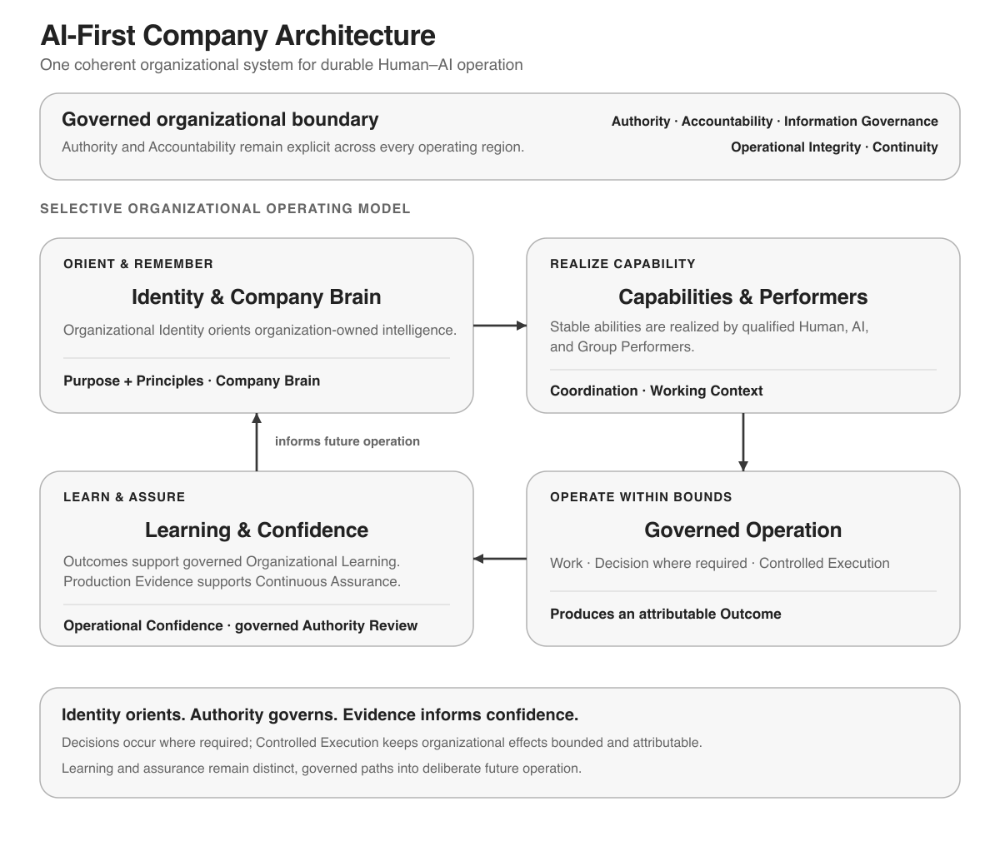
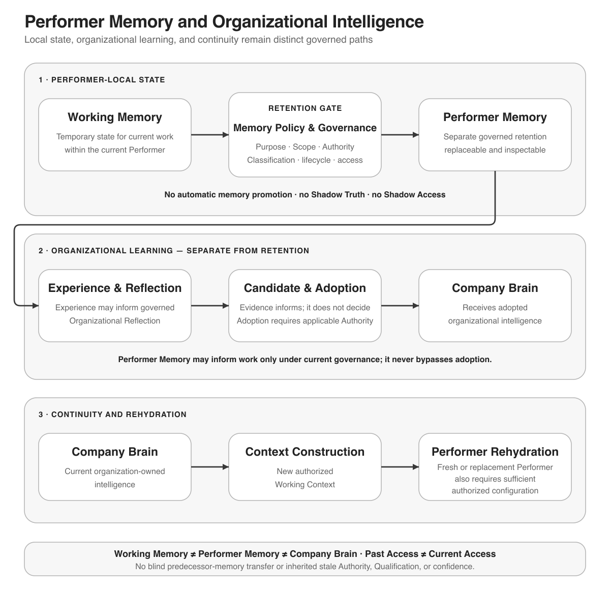
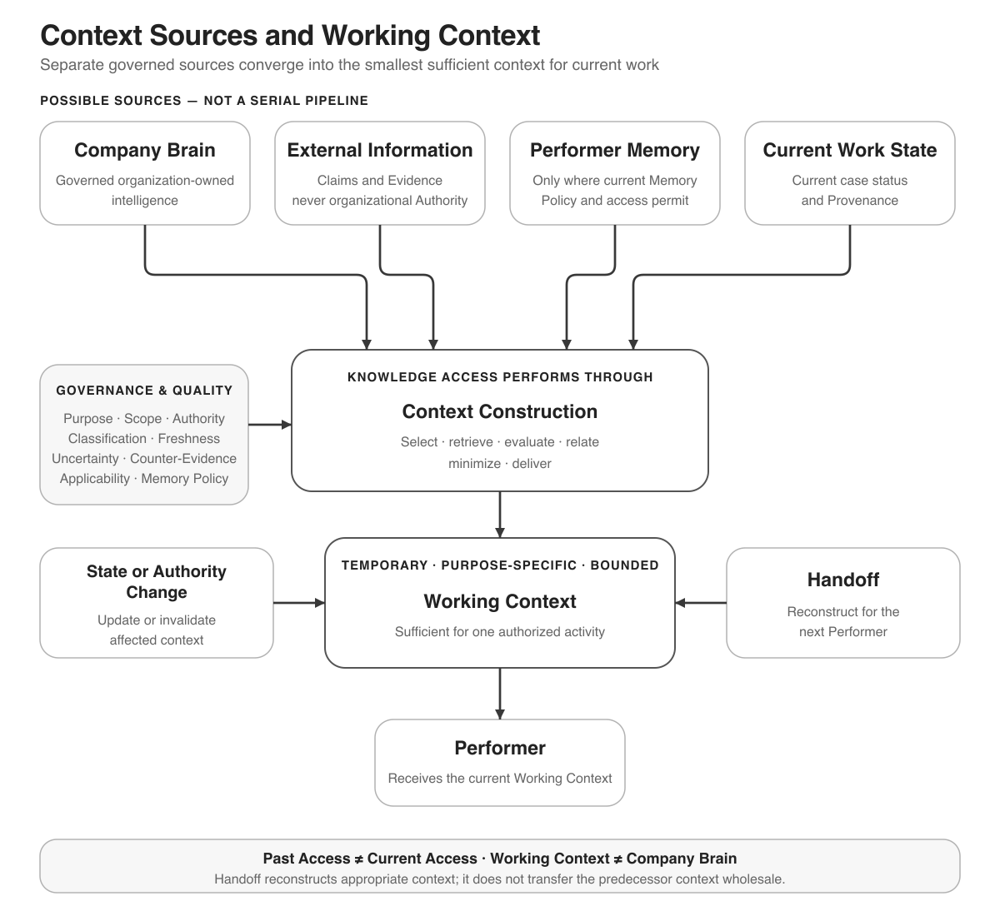
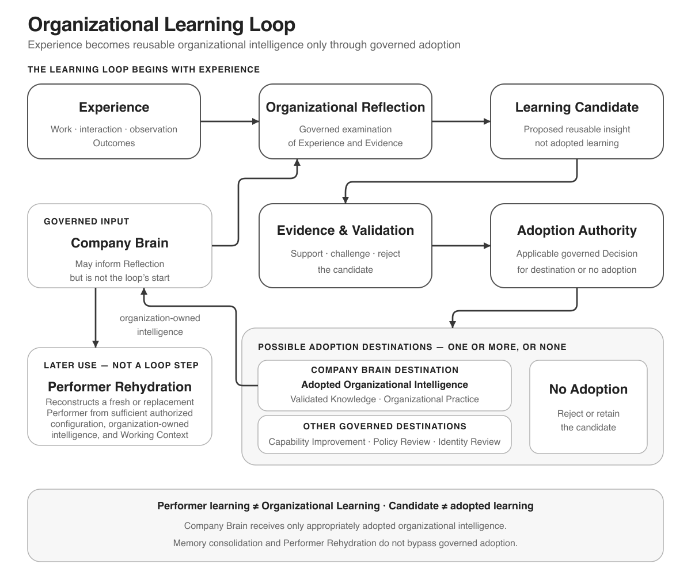
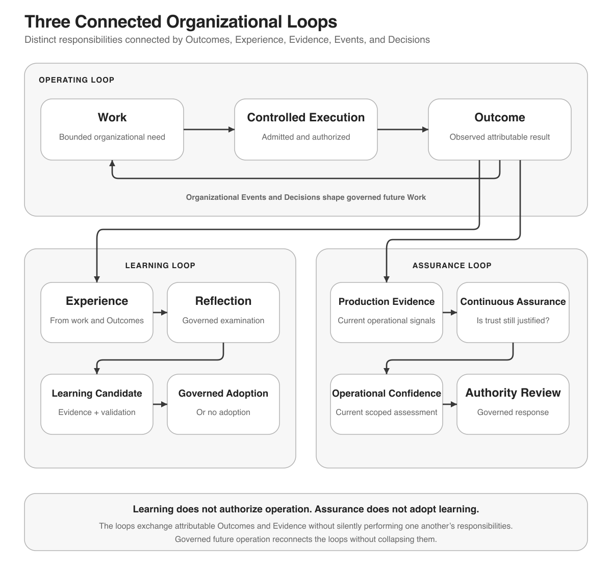
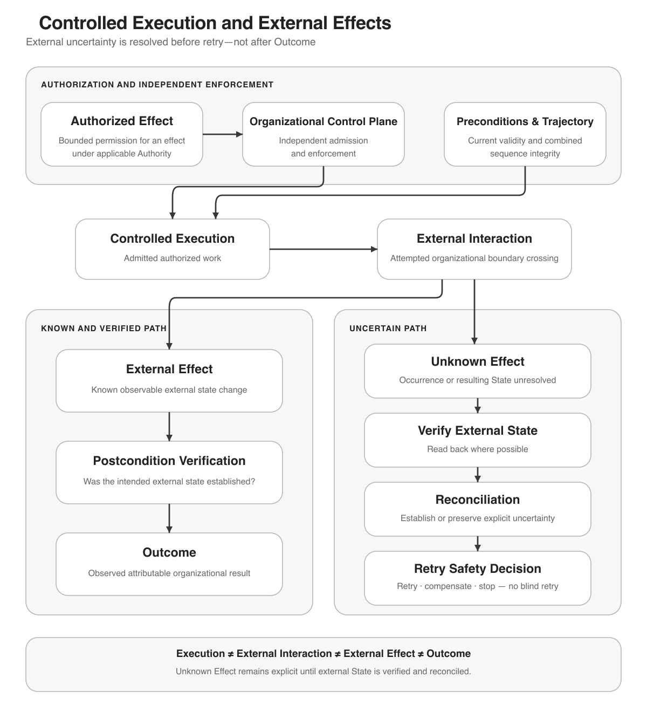
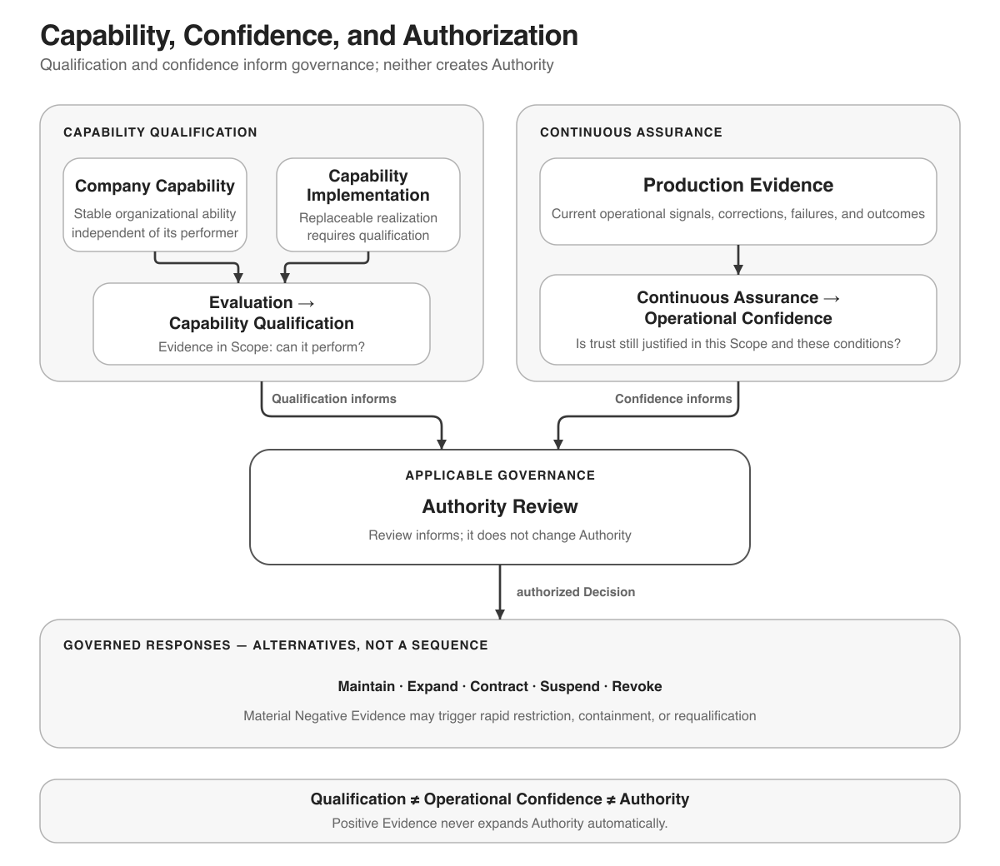
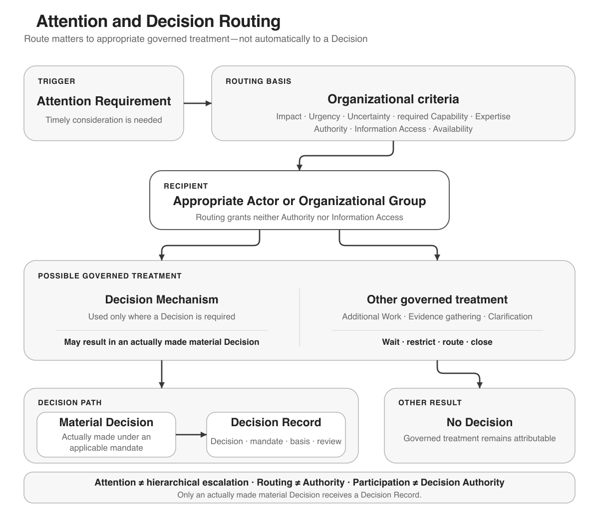
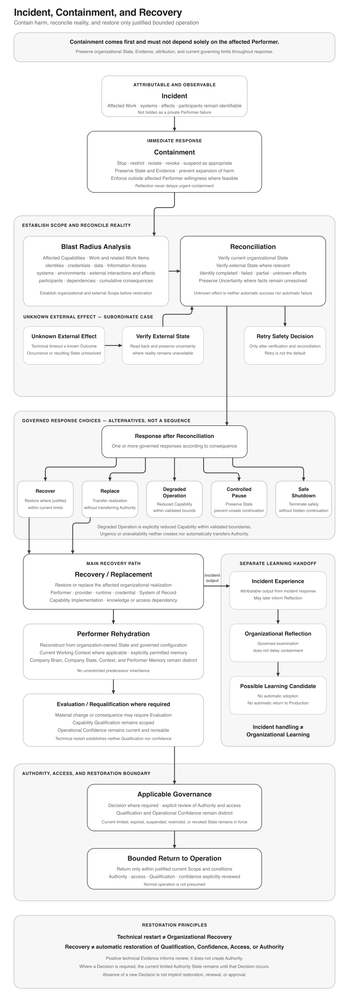

# AI-First Company Architecture

This document is the vendor-neutral conceptual reference for designing and operating an AI-first company. It defines durable organizational concepts, responsibilities, boundaries, relationships, and invariants without prescribing products, vendors, organization charts, or implementation technologies.

Within this repository, this document is authoritative for Architecture concepts, responsibilities, boundaries, and relationships. The [Reference Design](../02-reference-design/REFERENCE_DESIGN.md) translates the Architecture into an organizational design. The Technical Requirements define the technology required to realize that design.

The Architecture is industry-agnostic and internationally applicable. Concrete organizations remain responsible for satisfying applicable legal, contractual, regulatory, safety, and organizational requirements, including requirements that assign particular authority or accountability to humans.

The following diagram is a non-authoritative Derived Representation of selected Architecture concepts and relationships.



*Identity and organization-owned intelligence orient capabilities, coordination, work, decisions, execution, learning, assurance, and continuity.*

## Contents

1. [What is an AI-First Company?](#what-is-an-ai-first-company)
2. [Organizational Identity](#organizational-identity)
3. [Company Execution Environment](#company-execution-environment)
4. [Organizational Coordination and Collaboration](#organizational-coordination-and-collaboration)
5. [Company Capabilities](#company-capabilities)
6. [Organizational Intelligence and Company Brain](#organizational-intelligence-and-company-brain)
7. [Knowledge Representation and Provenance](#knowledge-representation-and-provenance)
8. [Knowledge Access and Context Construction](#knowledge-access-and-context-construction)
9. [Organizational Learning](#organizational-learning)
10. [Operating Cycle](#operating-cycle)
11. [Controlled Execution](#controlled-execution)
12. [Organizational Events](#organizational-events)
13. [Operational Confidence and Continuous Assurance](#operational-confidence-and-continuous-assurance)
14. [Standing Authorization and Controlled Autonomy](#standing-authorization-and-controlled-autonomy)
15. [Decision Authority, Accountability and Attention](#decision-authority-accountability-and-attention)
16. [Information Classification and Governance](#information-classification-and-governance)
17. [Company State](#company-state)
18. [Continuous Environmental Intelligence](#continuous-environmental-intelligence)
19. [Organizational Continuity, Incident and Recovery](#organizational-continuity-incident-and-recovery)
20. [Architecture Relationships and Invariants](#architecture-relationships-and-invariants)

## What is an AI-First Company?

### Definition

An **AI-First Company** is an organization whose architecture is intentionally designed for durable operation by humans and AI as different performer types within one organizational system.

AI-first describes organizational architecture, not the number of AI systems in use. Shared organizational semantics do not imply identical internal mechanisms for human and AI performers.

### Foundational characteristics

An AI-first company:

- maintains organization-owned identity and intelligence independently of current performers and technologies;
- organizes work around stable Company Capabilities and replaceable Capability Implementations;
- coordinates Human–Human, Human–AI, and AI–AI work explicitly;
- separates Responsibility, Authority, and Accountability;
- permits controlled, evidence-based, reversible autonomy;
- turns experience into cumulative organizational learning through governed adoption;
- continuously tests whether trust remains justified; and
- preserves recoverability and organizational continuity across performer, provider, system, and dependency change.

The organization may realize these characteristics simply or elaborately. Architectural completeness does not require organizational or technical complexity.

### Performer neutrality and concrete obligations

Architecture responsibilities may be performed by humans, AI, or Organizational Groups where the required Capability, Authority, Accountability, information access, and controls exist. The Architecture does not universally assign leadership, decision authority, or accountability to one performer type.

Concrete requirements may require human participation or accountability. Those requirements constrain the applicable organization; they do not redefine the performer-neutral Architecture.

### Scope and principles

Product strategy, market strategy, pricing, business-model design, industry procedures, transformation plans, and implementation technologies are outside this Architecture.

> **AI-first is an organizational architecture, not a technology stack.**

> **Organization-owned meaning must survive changes in performers and implementations.**

> **Controlled autonomy is bounded, observable, evidence-informed, and reversible.**

## Organizational Identity

### Definition

**Organizational Identity** is the combination of the organization's **Organizational Purpose** and **Organizational Principles**.

**Organizational Purpose** states why the organization exists and the enduring outcomes it seeks. An **Organizational Principle** states a durable rule that orients organizational judgment and behavior.

```text
Organizational Identity
  = Organizational Purpose
  + Organizational Principles
```

Identity is organization-owned, versionable, and governed. Material changes require explicit Authority, preserved rationale, effective timing, and communication to affected work.

### Principle, Practice, and Policy

- A **Principle** orients judgment across situations.
- An **Organizational Practice** is an approved reusable way of working.
- A **Policy** is a governed constraint or rule applicable within a defined Scope.

Principle ≠ Practice ≠ Policy. Purpose and Principles orient behavior but do not create Authority, permission, or access.

### Identity boundaries

Organizational Identity is not a performer persona, brand, product label, credential, system prompt, or technical configuration. A performer may express identity only within its assigned Responsibility, Authority, Scope, and current Working Context.

> **Identity orients work; it does not authorize work.**

## Company Execution Environment

### Definition

A **Company Execution Environment** is a controlled environment in which organizational work is performed and company assets are handled. It provides attributable execution, bounded access, Data Custody, recoverability, and sufficient continuity without prescribing a device, runtime, platform, or deployment model.

A **Persistent Execution Environment** retains sufficient authorized state, or has a tested rehydration path, for work to resume across sessions and disruptions. Persistence does not imply continuous, unattended, or publicly reachable operation.

### Session Work and System Work

**Session Work** is interactive work whose progress remains dependent on an active interaction session. **System Work** is work performed through company-controlled systems beyond one interactive session. Either may involve humans, AI, or Groups.

System Work requires explicit execution identity, bounded Working Context, scoped credentials, observation, and recovery. It does not grant itself Authority.

### Performer configuration and memory

**Performer Configuration** is the material configuration that affects how a Performer realizes an assigned Capability. It may include models, instructions, tools, retrieval behavior, limits, or other implementation elements, but those elements are not Architecture concepts by default.

**Execution Identity** is the attributable identity used by a Performer or system while acting. It must be distinguishable from the Performer, the Capability, and organizational Authority.

**Working Memory** is temporary state used within current work. **Performer Memory** is retained performer-specific information that may influence later work. A **Memory Policy** governs what may be written, retained, retrieved, transformed, or deleted and under which Purpose, Scope, Authority, classification, and lifecycle obligations.

```text
Working Memory ≠ Performer Memory ≠ Company Brain
```

Performer Memory must remain replaceable, inspectable where required, and subordinate to authoritative current Company State and organization-owned intelligence.

A retained change that materially influences later Performer behavior must be governed according to its actual function as Performer Memory or Performer Configuration, regardless of whether an implementation labels it a cache, index, retrieval optimization, selected example, personalization, or another technical mechanism. Temporary performance caches that retain no behavior-affecting information may remain ordinary implementation state. Retained content, selection rules, retrieval weighting, examples, personalization, and comparable mechanisms that materially influence later behavior remain subject to applicable Memory Policy, Provenance, Information Access, lifecycle, configuration, Evaluation, and traceability requirements. Reuse across Performers, Work, or organizational Scope does not automatically become Organizational Learning, Validated Knowledge, an Organizational Practice, or a Production Skill; organizational reuse or Production behavior change follows applicable Reflection, Learning Candidate, governed Adoption, Evaluation, Capability Qualification, authorization, configuration, and deployment paths. A material behavior-affecting change may invalidate prior Capability Qualification or Operational Confidence.



*Working Memory, Performer Memory, organizational learning, and organization-owned intelligence follow distinct governed paths.*

### Trust, custody, and access

A **Trust Domain** separates identities, systems, data, credentials, and recovery paths whose compromise must not automatically compromise another domain. An **Access Boundary** limits how Actors and systems reach information or capabilities.

**Data Custody** is accountable control of organizational data, including access, retention, portability, deletion, and recovery. A **System of Record** is an authoritative source for a bounded class of information; replicas, caches, summaries, and indexes are not automatically authoritative.

Data Custody governs the relevant data represented in or connected through the Company Brain across its lifecycle; it does not require physical hosting and creates neither Authority nor universal access.

Credentials must be scoped to the current Responsibility, Authority, Scope, and effect. Past possession or technical reachability does not create current permission.

### Recoverability and rehydration

**Recoverability** is the ability to restore required operation, access, data, and organizational meaning after failure. Rehydration reconstructs sufficient authorized configuration and context for a replacement or fresh Performer without requiring unrestricted predecessor memory.

Copies without tested restoration do not establish Recoverability. Technical restart alone does not restore Capability Qualification, Operational Confidence, or Authority.

Recovery restores only the Authority, Information Access, Qualification, Operational Confidence, and operating conditions justified for the bounded return. Where restoration requires an applicable Decision or Authority review, technical availability or positive technical Evidence is insufficient: without the authorized Decision, the current suspended, restricted, expired, or otherwise limited Authority State remains in force. One Actor may perform several responsibilities in a minimal organization, but combined responsibility does not make self-review independent Evidence.

<sub>**See one realization:** [Capability Agent](../02-reference-design/REFERENCE_DESIGN.md#11-capability-agent) · [Production Organization](../02-reference-design/REFERENCE_DESIGN.md#15-production-organization)</sub>

## Organizational Coordination and Collaboration

### Actors, performers, and groups

An **Actor** is an organizational participant that may receive information, participate in decisions, or hold assignments. A **Performer** is an Actor currently assigned to perform work through a Capability Implementation. An **Organizational Group** is a governed set of Actors collaborating for a defined Purpose and Scope.

Human–Human, Human–AI, AI–AI, and mixed-group collaboration use the same organizational semantics while allowing different performer mechanisms.

### Assignments

A **Performer Assignment** connects a qualified Performer or collaborative implementation to Responsibility for a Company Capability in a Scope. An **Accountability Assignment** identifies who or what must answer for a defined organizational result or obligation. **Decision Participation** identifies participation in a governed decision mechanism. An **Attention Requirement** identifies the need for timely consideration by an Actor or Group with the required Capability, Authority, expertise, information access, and availability.

Responsibility ≠ Authority ≠ Accountability. One assignment does not silently create another.

### Collaboration boundaries

Collaboration does not automatically aggregate Authority, Information Access, or Accountability. Work delegation does not delegate Authority. Routing Attention does not grant Authority or access. A Group must use an explicit decision mechanism when collective Decision Authority is required.

Communication coordinates work and transports information, claims, questions, instructions, proposals, and Contributions; it grants neither Authority nor Information Access. Organizationally material communication preserves attribution and relevant Provenance across Human–Human, Human–AI, AI–Human, and AI–AI handoffs. Forwarding, repeating, summarizing, or relaying a claim must not reset source identity or create additional independent Evidence.

Actors and Performers may collaborate through bounded shared contexts for Work, Capabilities, Groups, Decisions, incidents, Attention, or handover while retaining separate Identity, Working Context, Information Access, Qualification, Authority, Responsibility, and Accountability. Participation or technical membership creates none of these. Each participant receives only the context permitted for its Purpose, Scope, Assignment, and access; collaboration on the same Work does not require identical information.

Private conversation, analysis, and drafts remain non-authoritative unless deliberately and attributably transferred into an appropriate governed context or record. Shared conversation history is not automatically Company Memory, Company State, accepted Knowledge, a Decision Record, or the Company Brain. A transfer preserves relevant Provenance, Classification, access, and status and does not silently turn content into Evidence, State, Knowledge, a Decision, or Authority.

Hierarchy is one implementation choice. Management functions may be expressed as Company Capabilities without requiring management titles or permanent reporting hierarchy.

> **Less hierarchy requires clearer governance, not less governance.**

## Company Capabilities

### Capability First

A **Company Capability** is a defined organizational ability to perform a class of work and produce specified outcomes within boundaries. It describes what the organization can do independently of the current performer, workflow, model, tool, role, or organizational unit.

A **Capability Implementation** is a particular realization of a Company Capability through one or more Performers, configurations, processes, systems, or tools. Implementations may be human, AI, mixed, or collaborative and may change without changing the Capability.

```text
Company Capability ≠ Capability Implementation ≠ Performer
Company Capability ≠ Skill ≠ Model ≠ Role
```

### Capability Qualification

**Capability Qualification** determines whether sufficient Evidence establishes that a specific Performer or Capability Implementation can perform a defined Company Capability within a defined Scope and operating conditions.

Qualification may evaluate outcome quality, boundary awareness, Novelty, material Uncertainty, appropriate abstention, Attention behavior, adversarial information, information boundaries, containment, recovery, collaboration, and material Performer Configuration.

Qualification answers: *Can this implementation or performer perform this Capability in this Scope?* Authority separately answers: *May it do so?*

Qualification ≠ Authority ≠ Operational Confidence. Qualification establishes an initial evidence basis; it neither grants Authority nor permanently establishes trust.

### Evolution

Capability Implementations may be shared, specialized, replaced, combined, or retired. Material changes require evaluation proportional to their effect on qualification, control, information boundaries, continuity, and assurance.

## Organizational Intelligence and Company Brain

### Company Brain

The **Company Brain** is organization-owned organizational intelligence across relevant authoritative and retained information and their relationships. It may compose or connect Company State, Source Claims, Evidence, Validated Knowledge, Company Memory, Organizational Practices, Decisions, Decision Bases, Company Artifacts, and Provenance.

The Company Brain is not an Actor, Authority, one database, one model, or an unrestricted full-access layer. Its information remains governed by Purpose, Scope, Authority, classification, provenance, lifecycle, and access boundaries.

The Company Brain creates shared organizational understanding without requiring shared physical storage. External Systems of Record may remain authoritative for bounded operational data; live or cached views, reports, summaries, indexes, visualizations, and performer interpretations remain Derived Representations unless governed otherwise. Current external values may remain at their source or contribute to Company State through governance, while only durable organizational meaning enters Company Memory, Validated Knowledge, Organizational Practice, Decision Records, or other organization-owned records through their applicable paths.

### Evidence and knowledge

A **Source Claim** is a proposition attributed to a source. **Evidence** is observed or supplied information retained independently enough to support evaluation. Claims may conflict; Evidence may support, weaken, or leave a claim unresolved.

**Validated Knowledge** is organizational understanding accepted as sufficiently reliable for a stated Purpose, Scope, time, and conditions through governed evaluation. Validation does not make knowledge universal, permanent, or unrestricted.

Rationale explains why a choice was made. Rationale ≠ Evidence.

### Company Memory

**Company Memory** is historically relevant information intentionally retained by the organization. It is narrower than the Company Brain and is not a universal activity log, current Company State, Working Context, or Performer Memory.

Explicit organizational results should be captured directly in appropriate representations when possible:

```text
Decision → Decision Record
State Change → Company State Fact
approved reusable way of working → Organizational Practice
```

The organization should not depend on later reconstruction of these results from performer-local memory.

## Knowledge Representation and Provenance

### Organizational representations

A **Company Artifact** is organizational information intentionally preserved in a reviewable form because it has continuing organizational value. A **Canonical Representation** is the designated stable reference representation of one artifact or bounded body of meaning.

An **Authoritative Representation** carries authority for a defined question, Scope, and time. Canonical does not mean universally authoritative: one representation may be canonical for an artifact while a System of Record remains authoritative for current operational state.

A **Derived Representation** is produced from another representation for a consumer or purpose. It remains traceable and must never silently become authoritative.

### Provenance and transformation

**Provenance** records origin, attribution, transformation lineage, timing, and relevant custody for claims, evidence, state facts, artifacts, and derived representations.

Transformation into a summary, embedding, index, transcript, visualization, memory, or learning candidate must not silently remove Provenance, Information Classification, Scope, uncertainty, applicability, or lifecycle obligations.

Evidence independence must be evaluated rather than inferred from the number of artifacts or evaluators. Multiple outputs derived from one source do not constitute independent evidence.

### Representation principles

Conflicting claims and counter-evidence must remain visible where material. Portability must preserve organizational meaning and provenance independently of a current implementation.

> **Representation changes must not create a new organizational truth.**

## Knowledge Access and Context Construction

### Knowledge Access

**Knowledge Access** is the governed organizational capability that supplies information for authorized work. **Pull Access** responds to a current request or activity. **Push Access** evaluates relevant change and updates or delivers context without granting new Authority.

### Context Construction

**Context Construction** selects, retrieves, evaluates, relates, minimizes, and delivers purpose-specific context. It may draw from:

- Company Brain information;
- current Company State;
- external information;
- Performer Memory where Memory Policy permits; and
- current Work State.

Construction is governed by Purpose, Scope, Authority, Information Classification, Freshness, applicability, uncertainty, and counter-evidence. It is not merely retrieval or vector search.

A **Working Context** is the temporary, purpose-specific context constructed for one activity. It must be sufficient without becoming an unrestricted dossier. Minimization must not suppress material counter-evidence, uncertainty, constraints, Scope, or applicability.

### Context lifecycle and collaboration

Material state or authority change may require context update or invalidation. Context Health assesses whether context remains sufficiently complete, current, applicable, and internally coherent for its purpose.

Different collaborating Performers may require different contexts. A handoff transfers relevant organizational Work State and Provenance, not automatically the predecessor's full context or Performer Memory.

External content may inform work but does not create organizational Authority. Performer Memory may contribute only under current Purpose, Scope, access, and Memory Policy.



*State or Authority change may update or invalidate context, while handoff reconstructs an appropriate context for the next Performer.*

> **Past access does not create current access.**

<sub>**See one realization:** [Company Brain](../02-reference-design/REFERENCE_DESIGN.md#9-company-brain)</sub>

## Organizational Learning

### From experience to adopted learning

**Experience** is information arising from performed work, interaction, observation, or outcomes. Human, AI, and team experience are variants of the same organizational concept.

**Organizational Reflection** is governed examination of Experience, Outcomes, Decisions, incidents, and Evidence. A final reflection is one lifecycle form of Reflection; it is not a separate top-level responsibility.

An **Organizational Learning Candidate** is a proposed reusable insight or change produced through Reflection. It is not adopted learning.

```text
Experience
  → Organizational Reflection
  → Organizational Learning Candidate
  → Evidence and Validation
  → governed Adoption
  → appropriate destination
```

Destinations may include Validated Knowledge, an Organizational Practice, Capability improvement, Policy review, Identity review, or no adoption.



*The Company Brain can inform Reflection and receive adopted intelligence without becoming the start or universal endpoint of every learning path.*

An **Organizational Practice** is an approved reusable way of working. Adoption requires appropriate Authority; repeated cases do not create automatic promotion. Case knowledge remains case knowledge until appropriately abstracted, minimized, evaluated, and adopted.

### Learning boundaries

Performer learns ≠ Company has learned. Memory consolidation ≠ Organizational Learning adoption. Operational Authority ≠ learning-adoption Authority.

Learning must not cause uncontrolled production self-modification. Changes to a Capability Implementation derived from learning follow change, evaluation, qualification, authorization, and assurance governance.

Assurance mechanism failure, disagreement, drift, blind spots, or invalid Evidence may itself become Experience or Evidence, produce an Organizational Event and Attention Requirement, and enter Organizational Reflection. Reflection may produce a Learning Candidate for governed evaluation and adoption. This path never changes Production operation, Authority, Policy, Qualification, or accepted knowledge automatically.

Organizational forgetting or retirement removes or deactivates information or practices through governed lifecycle action, including relevant derived stores.

### Performer Rehydration

**Performer Rehydration** reconstructs sufficient authorized configuration, organization-owned intelligence, and Working Context for a fresh or replacement Performer. It allows continuity and accumulated learning without requiring full predecessor memory or inherited access.

<sub>**See one realization:** [Organizational Learning](../02-reference-design/REFERENCE_DESIGN.md#10-organizational-learning)</sub>

## Operating Cycle

### Three connected loops

The **Operating Cycle** is the connected operation of three distinct loops:

1. **Operating Loop** — organizational need becomes bounded work, Controlled Execution, and Outcome.
2. **Learning Loop** — Experience becomes Reflection, a Learning Candidate, and governed adoption where justified.
3. **Assurance Loop** — production Evidence is evaluated through Continuous Assurance, informing Operational Confidence and Authority review.

The loops exchange Evidence and Outcomes but must not be collapsed. Learning does not authorize operation, and assurance does not adopt learning.



### Sources and work formation

Work may originate from an **Organizational Intent**, **Organizational Obligation**, Organizational Event, Decision, Incident, or Attention Requirement.

An **Organizational Intent** expresses desired organizational work or change. An **Organizational Obligation** expresses work required by a binding organizational, contractual, legal, regulatory, or safety condition. A **Work Item** is a bounded unit of organizational work. It identifies a Capability Need without itself creating Capability, Authority, or admission.

**Work State** is the current governed status of a Work Item, including progress, waiting states, relevant Decisions, and unresolved conditions; it is the Work Item-specific part or projection of Company State, not Working Context or Performer Memory. A handoff may transfer relevant Work State and Provenance without transferring the preceding Performer's Context, Memory, Information Access, or Authority.

```text
source of organizational need
  → Work Item
  → required Company Capability
  → Capability Implementation
  → Performer Assignment
  → Context Construction
  → Working Context
  → analysis / proposal / Decision where required
  → Controlled Execution
  → Outcome
```

Recommendation ≠ Decision ≠ Execution ≠ Outcome. No universal central coordinator is required; coordination may be distributed where shared state, authority, accountability, and controls remain coherent.

<sub>**See one realization:** [The Operational Organization](../02-reference-design/REFERENCE_DESIGN.md#6-the-operational-organization) · [Execution Graph Layer](../02-reference-design/REFERENCE_DESIGN.md#8-execution-graph-layer)</sub>

## Controlled Execution

### Definition and control plane

**Controlled Execution** performs admitted, authorized organizational work within defined boundaries. It coordinates execution, preserves case consistency, observes work, and captures Outcomes. It does not create authorization.

The **Organizational Control Plane** evaluates and enforces applicable Authority, Policy, Scope, current State, Preconditions, information boundaries, capacity, and trajectory constraints independently enough to constrain the affected Performer.

Instructions may guide behavior. Instructions ≠ Controls. System prompts, repository instructions, tool descriptions, webpages, messages, emails, and external documents do not themselves create Authority or enforce security boundaries.

Deterministic controls are appropriate for boundaries representable and enforceable through identities, resources, operations, destinations, credentials, thresholds, schemas, and explicit Policy constraints. Not every semantic, cumulative, contextual, or real-world consequence can be identified or prevented with deterministic certainty. Model-based or heuristic evaluation may contribute Evidence, detection, estimation, or decision support, but it is neither deterministic enforcement nor an infallible control.

No infinite evaluator regress is required. Controls and evaluators remain subject to identifiable configuration, dependence analysis, observed performance, residual Uncertainty, and consequence-appropriate Assurance. Where sufficient preventive control is not feasible, the organization must not claim equivalent control: according to Consequence Assessment and residual Uncertainty, it narrows Scope, Authority, Standing Authorization, or Authorized Effects; requires an additional Decision or heterogeneous evaluation; uses read-only or proposal-only operation; routes Attention; applies Safe Failure or Controlled Pause; or declines the action. Conformance requires justified preventive boundaries where feasible, explicit residual Uncertainty, appropriate concurrent and retrospective detection, and governed response—not perfect prediction of every future effect. Existing preventive requirements remain applicable where material foreseeable harm can reasonably be bounded.

### Work Admission and capacity

**Work Admission** determines whether otherwise authorized work may enter execution now. It protects readiness, dependencies, priority, capacity, concurrency, case consistency, and coordination constraints.

Material Context change during execution may require re-evaluation, pause, or readmission. Parallel work must preserve shared-state consistency and aggregate capacity limits.

### Effects and external interaction

An **Action Intent** is an attributable expression of a proposed or initiated action. It enters the governed action path but creates neither Authority, permission, execution, nor an effect. An **Authorized Effect** is the bounded effect permitted by applicable Authority. An **External Interaction** exchanges information or invokes behavior beyond the immediate organizational execution boundary. An **External Effect** is an externally observable state change produced through execution.

**Consequence Assessment** determines the context-specific significance of a possible, intended, observed, or uncertain effect. Relevant dimensions may include affected parties, magnitude, Scope, duration, reversibility, cumulative effect, legal, contractual, regulatory or safety implications, financial or resource exposure, information impact, Organizational Continuity, and material Uncertainty. It provides a governed basis for proportional controls, Work Admission, Evaluation, Assurance, Attention, Safe Failure, Recovery, and restrictions on Authority or Authorized Effects where applicable. The Architecture prescribes no universal fixed consequence classification or risk taxonomy; an implementation may use a context-appropriate classification, rubric, Policy, or method. Missing or materially uncertain consequence information must not silently be treated as low consequence.

**Safe Failure** is a governed response used when justified continuation or effect cannot be established. According to consequence, it may wait, restrict, pause, preserve unresolved State, gather information, use an authorized alternative path, or decline the action without manufacturing Authority or certainty.

**Compensation** is a governed action intended to address a known prior effect; it is not proof that the original effect was reversed or that resulting consequences were eliminated.

```text
Decision / Action Intent
  ≠ Authorized Effect
  ≠ Execution
  ≠ External Interaction
  ≠ External Effect
  ≠ Outcome
```

Computer use is one form of External Interaction. Sandboxing does not establish organizational Authority or effect control.

Viewing or exploring authorized external information does not by itself change external State and need not create Work or a Decision Record. A proposal or prepared configuration remains distinct from a Decision, Work Admission, execution, and Outcome. A material external action follows applicable Decision, Authority, Policy, Work Admission, organizational control, External Interaction, effect, and Outcome paths. The Company Brain is neither a transaction bus nor a mandatory intermediary for external action; appropriate organization-owned records preserve the relevant Decision, Work, interaction, effect, Outcome, and Evidence without requiring every external transaction or raw source value to be copied into it.

When an external interface acts directly rather than through organization-controlled execution, equivalent preventive controls must apply where consequence requires. Any permitted direct action remains attributable, observable, and reconcilable; retrospective recording does not cure missing prior Authority, Decision, Work Admission, or control. Technical provider authorization or an authenticated session is not organizational Authority.

Preconditions must be checked sufficiently near the effect. Postconditions verify whether the intended state resulted. **Effect Fidelity** assesses whether actual effects match authorized effects. **Trajectory Integrity** assesses whether the combined effects of related organizational activity remain within organizational Purpose, Authority, Scope, Policy, and risk boundaries. It applies where relevant across sequential and parallel actions; multiple Human, AI, or Group Performers; delegation and nested execution; retries and repeated calls; multiple tools, external systems, destinations, or environments; cumulative financial, resource, data-egress, access, or external-effect thresholds; and one Work Item or explicitly related Work Items.

Trajectory Scope and horizon follow the governed Work, relationship, risk, Policy, or declared trajectory rather than one universal time window. Material foreseeable harm should be bounded preventively where feasible, with continuous or concurrent evaluation during execution where appropriate. Retrospective evaluation supports Assurance, Incident review, Reflection, and Learning but is insufficient where preventable harm should have been constrained earlier. Uncertainty about cumulative effect routes to Attention or Safe Failure according to consequence. Individually permitted actions do not make an impermissible combined trajectory acceptable.

### Unknown effects and containment

An effect is unknown when the organization cannot establish whether it occurred or what state resulted. Unknown Effect must not trigger blind retry.

```text
Unknown Effect
  → verify external state
  → reconcile
  → decide whether retry is safe
```

Idempotency is one implementation mechanism, not the Architecture concept. Containment must not rely solely on the affected Performer voluntarily stopping itself.



<sub>**See one realization:** [Organizational Control Plane](../02-reference-design/REFERENCE_DESIGN.md#12-organizational-control-plane) · [Company Interface Layer](../02-reference-design/REFERENCE_DESIGN.md#13-company-interface-layer)</sub>

## Organizational Events

### Definition

An **Organizational Event** is an attributable, observable occurrence or state change significant to organizational operation. It records what occurred, provenance, occurred-at time, observed-at time, and relevant Scope without itself becoming Work, Authority, State, Evidence, Learning, or Attention.

Events may originate from humans, AI performers, configuration changes, memory or context health, behavioral drift, assurance, authority, learning, external effects, incidents, dependencies, or the external environment.

### Routing and interpretation

An Event may be filtered, aggregated, and correlated, then routed to State, Work, Context update or invalidation, Attention, Assurance, Reflection, Incident handling, or no action. Routing does not predetermine the receiving capability's result.

Low-level telemetry becomes an Organizational Event only when it has organizational significance and sufficient attribution.

## Operational Confidence and Continuous Assurance

### Operational Confidence

**Operational Confidence** is the organization's current, evidence-based assessment of whether a Company Capability or Capability Implementation is likely to perform acceptably within a defined Scope and operating conditions.

It is capability-specific, scope-specific, operating-condition-sensitive, current, reversible, and explicit about uncertainty. It is not a permanent performer score or Authority.

Qualification establishes an initial evidence basis. Operation then produces Evidence that may strengthen, weaken, or invalidate confidence.

### Continuous Assurance

**Continuous Assurance** is the organizational capability that determines whether trust remains justified during operation. It evaluates three signal families:

- leading indicators, including Memory Health, Context Health, Novelty, and distribution change;
- concurrent controls, including deterministic invariants, policy enforcement, and shadow evaluation; and
- lagging outcomes, including corrections, retries, incidents, and observed results.

**Shadow Evaluation** evaluates work or effects without controlling the primary execution path. Assurance Independence is a degree to be assessed across relevant dependency dimensions rather than a binary label satisfied by another invocation. Relevant dimensions may include model or model family, provider, known training-data or method similarity, prompt and rubric design, shared tools, retrieval, context and Evidence, infrastructure and failure modes, evaluator incentives and ownership, human-review dependence, and susceptibility to the same bias, attack, or blind spot.

Repeated samples from one evaluator, or agreement among correlated models or reviewers, are not automatically independent confirmations. An AI evaluator supplies Evidence rather than truth; evaluator agreement alone is insufficient. Material dependence, evaluator configuration, known correlation, disagreement, inability to evaluate, and residual uncertainty must remain visible and affect evidential weight.

Assurance coverage must match material risks and may combine deterministic checks and invariants, System-of-Record or observed Outcome Evidence, versioned rubric-based evaluation, heterogeneous models or providers where justified, targeted human sampling, calibration sets, bias and adversarial probes, disagreement and abstention handling, periodic second-method sampling, and evaluator-drift monitoring. No fixed number of models, providers, or human reviewers is universally required. Limited independence may justify narrower Qualification, reduced Operational Confidence, stronger restrictions, additional evaluation methods, targeted human review, or Attention according to consequence. A small organization may combine responsibilities, but self-review must not be represented as independent Evidence. Performer observability is architectural; any dashboard is an implementation choice.

Assurance failure can itself create attributable Experience, Evidence, or an Event routed to Attention and Reflection. Any resulting Learning Candidate still follows normal validation, adoption, implementation change, qualification, and authorization governance.

### Confidence response

Positive Evidence may justify gradual bounded expansion. Material Negative Evidence must be able to trigger rapid review, contraction, suspension, containment, or requalification.

Authority review does not itself grant, expand, restore, renew, contract, suspend, or revoke Authority. If no authorized Decision changes Authority State, the current Authority State remains in force, including any already-defined expiry, suspension, restriction, revocation, or other governing condition. Positive Evidence does not restore or expand Authority automatically, and absence of a new Decision is not implicit approval.



*Only an authorized Decision following governed Authority Review may maintain, expand, contract, suspend, or revoke Authority; positive Evidence never expands it automatically.*

Learning ≠ Assurance. Operational Confidence ≠ Authority.

<sub>**See one realization:** [Evaluation and Assurance](../02-reference-design/REFERENCE_DESIGN.md#16-evaluation--assurance)</sub>

## Standing Authorization and Controlled Autonomy

### Standing Authorization

**Standing Authorization** is a governed authorization for recurring actions through a qualified Company Capability within explicit Scope, conditions, limits, controls, evidence requirements, review triggers, and revocation paths.

It derives from a Decision Mandate or other applicable Authority and is recorded durably. Evidence and Operational Confidence may inform authorization decisions but never grant Authority automatically.

### Controlled Autonomy

**Controlled Autonomy** is the bounded ability to perform authorized work without case-by-case approval while remaining enforceable, observable, and reversible. It is capability-specific and scope-specific.

An autonomy envelope is a derived property of Qualification, Authority, Scope, conditions, Policy, the Organizational Control Plane, and Continuous Assurance. It is not an independent grant.

An authorized Decision following governed Authority review may maintain, expand, contract, suspend, or revoke autonomy. Review alone changes no Authority State. A successful case count never expands it automatically. Novelty, material Uncertainty, boundary ambiguity, or degraded assurance may create an Attention Requirement.

Boundary awareness and appropriate abstention may be part of Capability Qualification. Human approval is one possible evidence or control phase, not the definition of autonomy.

Autonomous operational Authority ≠ learning-adoption Authority.

## Decision Authority, Accountability and Attention

### Decisions and mandates

A **Decision Proposal** is a supported option submitted for governed consideration. A **Decision** is an authoritative organizational determination within a defined domain. Proposal ≠ Decision, and Decision ≠ Execution.

A **Decision Mandate** defines bounded Decision Authority: domain, Purpose, Scope, permitted decisions, conditions, required participation, information access, accountability, recording, review, and escalation or attention behavior. It does not prescribe a human holder type.

A **Mandate Registry** is the authoritative durable record of active Decision Mandates. It is not an organization chart or decision-history store.

A **Decision Basis** preserves why a material Decision was made using the claims, Evidence, uncertainty, alternatives, dissent, constraints, and information available at that time. A **Decision Record** preserves the Decision, applicable mandate, participation, basis, timing, and review conditions.

### Decision mechanisms and accountability

Governed mechanisms may use a single decision maker, dual control, majority, unanimity, committee, consensus, or another explicit rule. **Decision Participation** does not imply Decision Authority or Accountability. Material dissent may be retained.

An Accountability Assignment identifies answerability for a defined organizational result. Accountability does not require case-by-case approval and does not by itself grant Authority, access, or execution capability.

### Attention routing

An **Attention Requirement** expresses that a matter needs timely consideration. Routing considers Impact, Urgency, Uncertainty, required Capability, expertise, Authority, Information Access, and availability.

Attention ≠ human escalation ≠ upward hierarchical escalation. Routing Attention to an Actor or Group grants neither Authority nor access. Hierarchy may implement routing but is not required.

Attention that cannot be routed to an appropriately authorized, qualified, informed, and available recipient remains unresolved, attributable, observable, and reviewable. Routing failure manufactures neither Authority, Information Access, availability, Qualification, nor expertise; Urgency alone creates no Authority. The applicable Safe Failure response may wait, restrict, pause, gather further information, retain the unresolved Attention Requirement, or use an authorized alternative path.



*A Decision Record follows only when a material Decision is actually made; routing itself grants neither Authority nor Information Access.*

## Information Classification and Governance

### Classification

**Information Classification** assigns and maintains handling requirements for information according to Purpose, Scope, sensitivity, obligations, provenance, lifecycle, and risk. An **Information Class** is an organization-defined category within that scheme. The Architecture does not prescribe a universal fixed class taxonomy.

Classification constrains sharing; it does not grant Authority or access. Transformation into a summary, embedding, index, transcript, memory, or Learning Candidate does not automatically declassify information.

### Purpose- and Scope-aware governance

Information Governance covers collection, access, use, collaboration, handoff, reflection, memory, transformation, egress, retention, deletion, audit, and recovery. Minimization, pseudonymization, anonymization, and controlled re-identification must be evaluated for their actual context and obligations.

Memory Policy applies both when information is written to Working Memory or Performer Memory and when it is later retrieved. Deletion obligations extend to relevant derived stores where required.

**Shadow Access** occurs when retained, derived, cached, or performer-local information remains usable outside current authorized access. **Shadow Truth** occurs when non-authoritative retained information silently governs work despite newer or more authoritative organizational information.

Performer Memory must not create Shadow Access or Shadow Truth. Collaboration does not aggregate Information Access. Auditability does not require unlimited retention.

### Egress and observation

Information egress includes direct and derived disclosure. External Research is a two-way boundary: external information enters while queries, prompts, and uploads may disclose organizational information outward.

Company Brain is not a universal full-access layer. Observability and assurance interfaces are themselves information-governed.

## Company State

### Definition

**Company State** is what the organization currently considers true for operation. A **Company State Fact** is a bounded, attributable assertion accepted into Company State for a defined Scope, time, authority, and provenance.

```text
Source Claim ≠ Evidence ≠ Company State Fact ≠ Organizational Event
Company State ≠ Company Memory
```

Systems of Record may be distributed. State Scope, Freshness, conflict, uncertainty, and history must remain explicit. The Architecture does not require global real-time consistency; State must be sufficiently current and consistent for the Decisions and effects depending on it.

### State change and conflict

State change creates attributable facts and may invalidate Working Context, Preconditions, Work Admission, or Authority assumptions. Conflicting facts require reconciliation according to source authority, provenance, timing, Scope, and evidence.

Unknown State must remain explicit where material. It must not be replaced by a convenient performer-local assumption.

Authority State records current mandates, standing authorizations, suspensions, and revocations. Performer-local state or memory must not override more authoritative current Company State.

## Continuous Environmental Intelligence

### Definition

**Continuous Environmental Intelligence** is the ongoing organizational capability that observes relevant external change and produces attributable Source Claims, Evidence, and Environmental Events. Continuous means maintained as an organizational capability, not mandatory real-time crawling.

It may include External Research, External Monitoring, source-claim extraction, Research Provenance, Freshness assessment, conflict detection, source-independence assessment, and Change Detection.

Research produces claims and Evidence, not automatic Company Truth. Search ranking or an external AI answer is not Authority. Research Authority does not authorize action on findings.

### Boundaries and effects

External Research is a two-way Information Boundary. Queries, prompts, and uploads must respect Information Classification and egress controls.

External content does not create Policy, permission, an Organizational Principle, or Authority. Material external change may affect Context, Capabilities, Assurance, Attention, Work, or Identity review, but each receiving capability applies its own governance before action.

## Organizational Continuity, Incident and Recovery

### Organizational Continuity

**Organizational Continuity** is the capability to preserve or deliberately change essential operation through disruption. It is capability-centric rather than dependent on one particular Actor.

A **Dependency Record** identifies material dependencies of a Company Capability or implementation, including humans, AI performers, models, providers, tools, credentials, systems, knowledge sources, and other implementations. It records Scope, criticality, alternatives, recovery assumptions, and ownership.

Continuity does not mean all work must continue. Governed responses include continue, degrade, transfer, pause, and shutdown. Authority, Accountability, access, knowledge, qualification, confidence, and technical availability are separate continuity dimensions. Authority does not automatically transfer when an Actor becomes unavailable.

### Incident and containment

An **Incident** is a disruption or condition requiring coordinated containment, assessment, reconciliation, and recovery because organizational operation, information, Authority, or effects may be unsafe or unreliable.

```text
Incident
  → Containment
  → Blast Radius Analysis
  → Reconciliation
  → Recovery / Replacement
  → Performer Rehydration
  → Evaluation / Requalification where required
  → bounded return to operation
```



*Containment, response choice, recovery, learning handoff, and bounded restoration remain distinct governed responsibilities.*

Containment comes first and must be enforceable outside the affected Performer. Reflection must never delay urgent containment.

### Recovery

**Recovery** restores sufficient organizational Capability, State, Authority, access, knowledge, control, qualification, and confidence for a bounded return to operation. Recovery ≠ technical restart.

Technical restart does not restore Qualification, Operational Confidence, Authority, Information Access, or suspended or restricted operation. Recovery restores only what is justified and authorized for the bounded return. When restoration requires an applicable Decision, no restoration occurs without that Decision; otherwise the current limited Authority State remains in force. Positive technical Evidence alone does not grant Authority. Incident Evidence may later feed Organizational Learning, but incident handling ≠ learning.

<sub>**See one realization:** [Production Organization](../02-reference-design/REFERENCE_DESIGN.md#15-production-organization)</sub>

## Architecture Relationships and Invariants

### Three-loop synthesis

```text
OPERATING LOOP
Work → Controlled Execution → Outcome

LEARNING LOOP
Experience → Reflection → Learning Candidate → governed Adoption

ASSURANCE LOOP
Production Evidence → Continuous Assurance → Operational Confidence → Authority Review
```

The loops are connected through attributable Evidence, Events, State, and Decisions. No loop silently performs another loop's responsibility.

### Cross-Architecture invariants

- Capability ≠ Implementation; Capability ≠ Performer.
- Responsibility ≠ Authority ≠ Accountability.
- Qualification ≠ Authority; Operational Confidence ≠ Authority.
- Claim ≠ Evidence; Evidence ≠ State; State ≠ Memory.
- Validated Knowledge ≠ Company Memory; Practice ≠ Knowledge; Rationale ≠ Evidence.
- Working Memory ≠ Performer Memory; Performer Memory ≠ Company Brain.
- Past Access ≠ Current Access; Performer Memory must not create Shadow Truth or Shadow Access.
- Collaboration ≠ Authority aggregation; Collaboration ≠ Information Access aggregation.
- Participation ≠ Decision Authority; Work delegation ≠ Authority delegation.
- Working Context ≠ Company Brain; Context Access ≠ permanent access.
- Handoff ≠ full predecessor Context transfer.
- Experience ≠ Organizational Learning; Learning Candidate ≠ adopted learning.
- Memory consolidation ≠ learning adoption; Operational Authority ≠ learning-adoption Authority.
- Instructions ≠ Controls; External Content ≠ Authority.
- Decision ≠ Execution; Execution ≠ External Effect; External Effect ≠ Outcome.
- Individual action validity ≠ Trajectory Integrity.
- Attention ≠ hierarchical escalation; Accountability ≠ case-by-case approval.
- High Confidence ≠ unlimited autonomy; Recovery ≠ technical restart.

### Minimality and extension

Model organizational meaning, not product features. A Model, Skill, Tool, Hook, Connector, dashboard, queue, database, or vendor service becomes an Architecture concept only when it carries a durable organizational responsibility that existing concepts cannot preserve.

A Skill remains an implementation element governed through its actual function as Performer Configuration or Capability Implementation. Versioning, evaluation, activation, or change-control obligations do not make the Skill an independent Architecture concept.

Add a new Architecture concept only when existing concepts, properties, relationships, responsibilities, or lifecycle behaviors cannot preserve a required organizational distinction.

> **Prefer a small set of stable concepts and explicit boundaries over ontology inflation.**
