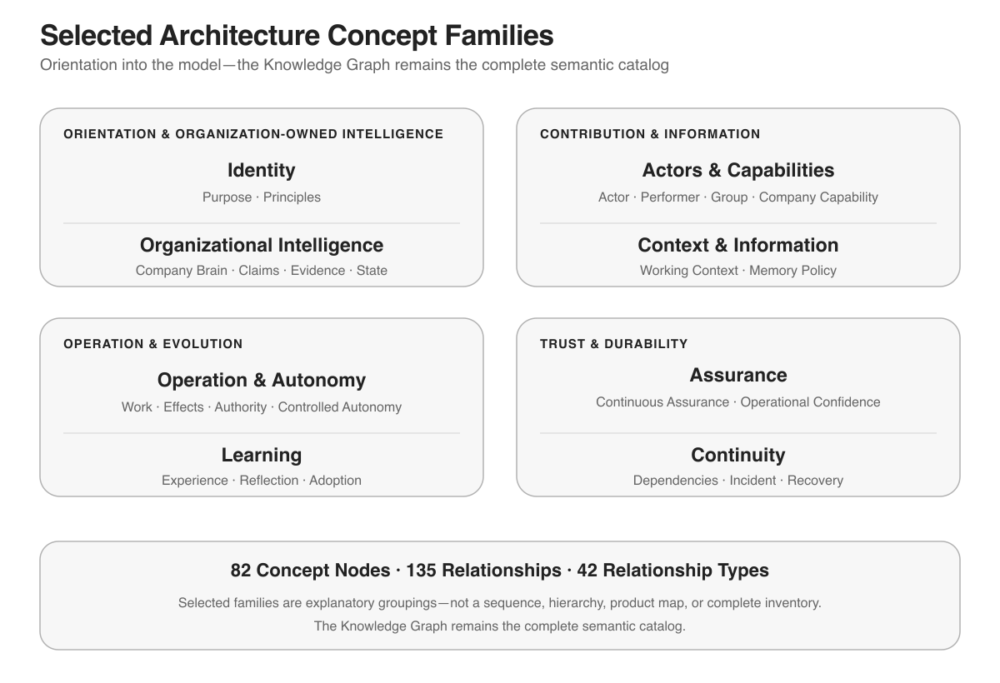

# Architecture Knowledge Graph

## Purpose

This document is a derived semantic representation of the validated concepts and relationships in the AI-First Company Architecture. It supports navigation, traceability, impact analysis, glossary generation, diagram review, and validation without becoming a competing source of truth.

## Authority and Source-of-Truth Rule

[ARCHITECTURE.md](ARCHITECTURE.md) is authoritative. This graph cannot add, redefine, preserve, or override Architecture meaning. [PROJECT.md](../PROJECT.md) governs repository evolution.

## Graph Model

The graph contains Concept Nodes, directional Relationship Edges, and validated attributes or responsibilities. Only Explicit and narrowly justified Derived relationships are included in the validated catalog.

- **Explicit** — stated directly by the Architecture.
- **Derived** — required to connect explicit statements without changing their meaning.
- **Illustrative** — explanatory only and excluded from the catalog.

Current validated inventory: **82 Concept Nodes**, **130 Explicit relationships**, **5 Derived relationships**, and **42 controlled relationship types**.



*This navigation view groups selected concepts for orientation; the catalogs below remain the complete semantic representation.*

## Concept Catalog

### Architecture

| Concept | Concise definition | Boundary | Architecture source |
|---|---|---|---|
| AI-First Company | An organization architected for durable Human–AI operation. | Not defined by technology count or one performer type. | [Source](ARCHITECTURE.md#what-is-an-ai-first-company) |

### Identity

| Concept | Concise definition | Boundary | Architecture source |
|---|---|---|---|
| Organizational Identity | Organization-owned Purpose plus Principles. | Orients behavior but creates no Authority. | [Source](ARCHITECTURE.md#organizational-identity) |
| Organizational Purpose | The enduring reason the organization exists. | Does not authorize work. | [Source](ARCHITECTURE.md#organizational-identity) |
| Organizational Principle | A durable rule orienting organizational judgment. | Distinct from Practice and Policy. | [Source](ARCHITECTURE.md#principle-practice-and-policy) |

### Execution Environment

| Concept | Concise definition | Boundary | Architecture source |
|---|---|---|---|
| Company Execution Environment | A controlled environment for organizational work and assets. | Implementation-independent. | [Source](ARCHITECTURE.md#company-execution-environment) |
| Persistent Execution Environment | An execution environment with retained state or tested rehydration. | Does not imply unattended or public operation. | [Source](ARCHITECTURE.md#company-execution-environment) |
| Trust Domain | A boundary separating identities, systems, data, credentials, and recovery paths. | Does not prescribe physical isolation. | [Source](ARCHITECTURE.md#trust-custody-and-access) |
| Access Boundary | A boundary limiting routes to information and capabilities. | Reachability is not permission. | [Source](ARCHITECTURE.md#trust-custody-and-access) |
| Data Custody | Accountable control of data across its lifecycle. | Does not require physical hosting. | [Source](ARCHITECTURE.md#trust-custody-and-access) |
| System of Record | An authoritative source for a bounded information class. | Replicas are not automatically authoritative. | [Source](ARCHITECTURE.md#trust-custody-and-access) |
| Recoverability | The ability to restore required operation, access, data, and meaning. | Copies or restart alone are insufficient. | [Source](ARCHITECTURE.md#recoverability-and-rehydration) |
| Session Work | Interactive work dependent on an active session. | Not inherently human-only. | [Source](ARCHITECTURE.md#session-work-and-system-work) |
| System Work | Work continuing through company systems beyond one session. | Does not grant itself Authority. | [Source](ARCHITECTURE.md#session-work-and-system-work) |
| Performer Configuration | Material configuration affecting a Performer's capability realization. | Product features are not concepts by default. | [Source](ARCHITECTURE.md#performer-configuration-and-memory) |
| Execution Identity | The attributable identity used while acting. | Distinct from Performer, Capability, and Authority. | [Source](ARCHITECTURE.md#performer-configuration-and-memory) |
| Working Memory | Temporary state used within current work. | Not Performer Memory or Company Brain. | [Source](ARCHITECTURE.md#performer-configuration-and-memory) |
| Performer Memory | Retained performer-specific information influencing later work. | Must not create Shadow Access or Shadow Truth. | [Source](ARCHITECTURE.md#performer-configuration-and-memory) |

### Information Governance

| Concept | Concise definition | Boundary | Architecture source |
|---|---|---|---|
| Memory Policy | Rules for writing, retaining, retrieving, transforming, and deleting memory. | Applies at write and retrieval time. | [Source](ARCHITECTURE.md#performer-configuration-and-memory) |
| Information Classification | Assignment and maintenance of purpose- and scope-aware handling requirements. | Does not grant Authority or access. | [Source](ARCHITECTURE.md#classification) |
| Information Class | An organization-defined handling category. | No universal fixed taxonomy is prescribed. | [Source](ARCHITECTURE.md#classification) |
| Shadow Access | Information usable outside current authorized access. | Past access does not create current access. | [Source](ARCHITECTURE.md#purpose--and-scope-aware-governance) |
| Shadow Truth | Non-authoritative information silently governing work. | Local memory must not override authoritative State. | [Source](ARCHITECTURE.md#purpose--and-scope-aware-governance) |

### Actors and Coordination

| Concept | Concise definition | Boundary | Architecture source |
|---|---|---|---|
| Actor | An organizational participant able to receive information or assignments. | Actor status grants no Authority or access. | [Source](ARCHITECTURE.md#actors-performers-and-groups) |
| Performer | An Actor assigned to perform work through an implementation. | Not the Capability or its Authority. | [Source](ARCHITECTURE.md#actors-performers-and-groups) |
| Organizational Group | A governed set of collaborating Actors. | Membership aggregates no Authority, access, or Accountability. | [Source](ARCHITECTURE.md#actors-performers-and-groups) |
| Performer Assignment | Assignment of qualified realization to Capability responsibility in Scope. | Does not silently grant Authority or Accountability. | [Source](ARCHITECTURE.md#assignments) |
| Accountability Assignment | Assignment of answerability for a defined result or obligation. | Does not grant Authority, access, or capability. | [Source](ARCHITECTURE.md#assignments) |
| Decision Participation | Participation in a governed decision mechanism. | Does not imply Authority or Accountability. | [Source](ARCHITECTURE.md#decision-mechanisms-and-accountability) |
| Attention Requirement | A need for timely consideration by a suitably situated Actor or Group. | Not necessarily human or hierarchical escalation. | [Source](ARCHITECTURE.md#attention-routing) |

### Capabilities

| Concept | Concise definition | Boundary | Architecture source |
|---|---|---|---|
| Company Capability | A defined organizational ability to perform a class of work. | Not implementation, performer, skill, model, role, team, or organizational unit. | [Source](ARCHITECTURE.md#capability-first) |
| Capability Implementation | A particular realization of a Company Capability. | Does not inherit Authority from the Capability. | [Source](ARCHITECTURE.md#capability-first) |
| Capability Qualification | Evidence that a Performer or implementation can perform a Capability in Scope. | Does not grant Authority or permanent confidence. | [Source](ARCHITECTURE.md#capability-qualification) |

### Organizational Intelligence

| Concept | Concise definition | Boundary | Architecture source |
|---|---|---|---|
| Company Brain | Organization-owned intelligence across authoritative and retained information. | Not Actor, Authority, one database, or universal access. | [Source](ARCHITECTURE.md#company-brain) |
| Source Claim | A proposition attributed to a source. | Not Evidence, State, or organizational truth. | [Source](ARCHITECTURE.md#evidence-and-knowledge) |
| Evidence | Information retained independently enough to support evaluation. | Not automatically Knowledge, State, Memory, or Authority. | [Source](ARCHITECTURE.md#evidence-and-knowledge) |
| Validated Knowledge | Understanding accepted for stated Purpose, Scope, time, and conditions. | Not universal, permanent, or automatically retained. | [Source](ARCHITECTURE.md#evidence-and-knowledge) |
| Company Memory | Historically relevant information intentionally retained. | Narrower than Company Brain; not current State or Context. | [Source](ARCHITECTURE.md#company-memory) |

### Learning

| Concept | Concise definition | Boundary | Architecture source |
|---|---|---|---|
| Organizational Practice | An approved reusable way of working. | Distinct from Principle, Policy, and Knowledge. | [Source](ARCHITECTURE.md#from-experience-to-adopted-learning) |
| Experience | Information arising from work, interaction, observation, or outcomes. | Performer learning is not organizational learning. | [Source](ARCHITECTURE.md#from-experience-to-adopted-learning) |
| Organizational Reflection | Governed examination of Experience and organizational results. | Does not adopt learning or delay containment. | [Source](ARCHITECTURE.md#from-experience-to-adopted-learning) |
| Organizational Learning Candidate | A proposed reusable insight or change produced through Reflection. | Not adopted learning. | [Source](ARCHITECTURE.md#from-experience-to-adopted-learning) |
| Performer Rehydration | Reconstruction of sufficient authorized configuration, intelligence, and context. | Does not inherit stale access, Authority, or confidence. | [Source](ARCHITECTURE.md#performer-rehydration) |

### Knowledge Representation

| Concept | Concise definition | Boundary | Architecture source |
|---|---|---|---|
| Company Artifact | Organizational information preserved in reviewable form for continuing value. | Not every record or observation qualifies. | [Source](ARCHITECTURE.md#organizational-representations) |
| Canonical Representation | The stable reference representation of bounded meaning. | Not universally authoritative. | [Source](ARCHITECTURE.md#organizational-representations) |
| Authoritative Representation | A representation authoritative for a defined question, Scope, and time. | Authority is bounded. | [Source](ARCHITECTURE.md#organizational-representations) |
| Derived Representation | A representation produced from another for a consumer or purpose. | Must not silently become authoritative. | [Source](ARCHITECTURE.md#organizational-representations) |
| Provenance | Origin, attribution, lineage, timing, and relevant custody. | Must survive material transformation. | [Source](ARCHITECTURE.md#provenance-and-transformation) |

### Decision Governance

| Concept | Concise definition | Boundary | Architecture source |
|---|---|---|---|
| Decision | An authoritative organizational determination within a domain. | Not proposal, execution, effect, or outcome. | [Source](ARCHITECTURE.md#decisions-and-mandates) |
| Decision Proposal | A supported option submitted for governed consideration. | Does not become a Decision automatically. | [Source](ARCHITECTURE.md#decisions-and-mandates) |
| Decision Record | A durable record of a material Decision and its governance. | Not the Mandate Registry. | [Source](ARCHITECTURE.md#decisions-and-mandates) |
| Decision Basis | The information, uncertainty, alternatives, and dissent supporting a Decision. | Rationale is not Evidence. | [Source](ARCHITECTURE.md#decisions-and-mandates) |
| Decision Mandate | A bounded definition of Decision Authority and its governance. | Does not prescribe a human holder. | [Source](ARCHITECTURE.md#decisions-and-mandates) |
| Mandate Registry | The authoritative durable record of active Decision Mandates. | Not an organization chart or decision history. | [Source](ARCHITECTURE.md#decisions-and-mandates) |

### Context and Access

| Concept | Concise definition | Boundary | Architecture source |
|---|---|---|---|
| Knowledge Access | The governed capability supplying information for authorized work. | Not unrestricted browsing. | [Source](ARCHITECTURE.md#knowledge-access) |
| Context Construction | Selection, evaluation, relation, minimization, and delivery of context. | Not merely retrieval or vector search. | [Source](ARCHITECTURE.md#context-construction) |
| Working Context | Temporary purpose-specific context for one activity. | Not Company Brain or permanent access. | [Source](ARCHITECTURE.md#context-construction) |
| Pull Access | Knowledge Access initiated by current work or request. | Does not permit unrestricted access. | [Source](ARCHITECTURE.md#knowledge-access) |
| Push Access | Knowledge Access triggered by relevant change. | Does not grant Authority or wider access. | [Source](ARCHITECTURE.md#knowledge-access) |

### Operation

| Concept | Concise definition | Boundary | Architecture source |
|---|---|---|---|
| Operating Cycle | Connected but distinct Operating, Learning, and Assurance loops. | The loops must not collapse. | [Source](ARCHITECTURE.md#three-connected-loops) |
| Organizational Intent | An expression of desired organizational work or change. | Does not create Authority, admission, or execution. | [Source](ARCHITECTURE.md#sources-and-work-formation) |
| Organizational Obligation | Work required by a binding organizational or external condition. | Does not bypass controls. | [Source](ARCHITECTURE.md#sources-and-work-formation) |
| Work Item | A bounded unit of organizational work. | Does not create Capability, Authority, or admission. | [Source](ARCHITECTURE.md#sources-and-work-formation) |
| Organizational Event | An attributable occurrence significant to operation. | Not automatically Work, Authority, State, Evidence, Learning, or Attention. | [Source](ARCHITECTURE.md#organizational-events) |

### Controlled Execution

| Concept | Concise definition | Boundary | Architecture source |
|---|---|---|---|
| Controlled Execution | Performance of admitted authorized work within boundaries. | Does not create authorization. | [Source](ARCHITECTURE.md#definition-and-control-plane) |
| Work Admission | The boundary deciding whether authorized work may execute now. | Authorization does not guarantee admission. | [Source](ARCHITECTURE.md#work-admission-and-capacity) |
| Organizational Control Plane | The capability enforcing operational constraints. | Instructions or sandboxing alone are insufficient. | [Source](ARCHITECTURE.md#definition-and-control-plane) |
| Authorized Effect | The bounded effect permitted by applicable Authority. | Distinct from intent, execution, interaction, and outcome. | [Source](ARCHITECTURE.md#effects-and-external-interaction) |
| External Interaction | Exchange or invocation beyond the immediate execution boundary. | Not itself Authority or External Effect. | [Source](ARCHITECTURE.md#effects-and-external-interaction) |
| External Effect | An externally observable state change produced through execution. | Distinct from execution and outcome. | [Source](ARCHITECTURE.md#effects-and-external-interaction) |
| Outcome | The observed result of organizational work. | Does not automatically create State, Memory, or learning. | [Source](ARCHITECTURE.md#effects-and-external-interaction) |

### Assurance and Autonomy

| Concept | Concise definition | Boundary | Architecture source |
|---|---|---|---|
| Continuous Assurance | The capability determining whether trust remains justified during operation. | Distinct from learning and grants no Authority. | [Source](ARCHITECTURE.md#continuous-assurance) |
| Operational Confidence | A current scoped evidence-based assessment of acceptable capability performance. | Not Authority or a permanent performer score. | [Source](ARCHITECTURE.md#operational-confidence) |
| Shadow Evaluation | Evaluation outside the primary execution control path. | Not automatically independent or authorizing. | [Source](ARCHITECTURE.md#continuous-assurance) |
| Standing Authorization | Governed authorization for recurring action within explicit boundaries. | Evidence and confidence do not create it. | [Source](ARCHITECTURE.md#standing-authorization) |
| Controlled Autonomy | Bounded action without case-by-case approval that remains enforceable and reversible. | Not unlimited or automatically expanding. | [Source](ARCHITECTURE.md#controlled-autonomy) |

### State

| Concept | Concise definition | Boundary | Architecture source |
|---|---|---|---|
| Company State | What the organization currently considers true for operation. | Not Company Memory or performer-local state. | [Source](ARCHITECTURE.md#company-state) |
| Company State Fact | An attributable assertion accepted into State for bounded Scope and time. | Distinct from Claim, Evidence, and Event. | [Source](ARCHITECTURE.md#company-state) |

### Environmental Intelligence

| Concept | Concise definition | Boundary | Architecture source |
|---|---|---|---|
| Continuous Environmental Intelligence | Ongoing observation of relevant external change into claims, evidence, and events. | Creates no truth, policy, Authority, or automatic action. | [Source](ARCHITECTURE.md#continuous-environmental-intelligence) |

### Continuity and Recovery

| Concept | Concise definition | Boundary | Architecture source |
|---|---|---|---|
| Organizational Continuity | Preservation or deliberate change of essential operation through disruption. | Does not mean all work continues. | [Source](ARCHITECTURE.md#organizational-continuity) |
| Incident | A disruption requiring containment, assessment, reconciliation, and recovery. | Incident handling is not learning. | [Source](ARCHITECTURE.md#incident-and-containment) |
| Recovery | Restoration of sufficient organizational conditions for bounded operation. | Not technical restart. | [Source](ARCHITECTURE.md#recovery) |
| Dependency Record | A governed record of material dependencies and alternatives. | Recording does not make a dependency reliable. | [Source](ARCHITECTURE.md#organizational-continuity) |

## Relationship Vocabulary

| Relationship | Meaning |
|---|---|
| `is composed of` | Source consists of target as an essential part. |
| `maintains` | Source keeps target current and governed. |
| `is specialization of` | Source is a narrower validated form of target. |
| `constrains` | Source limits target scope or behavior. |
| `governs` | Source establishes rules and lifecycle obligations for target. |
| `provides authoritative input to` | Source supplies authoritative input within a bounded domain. |
| `configures` | Source materially shapes target operation. |
| `acts through` | Source uses target identity for attributable action. |
| `uses` | Source applies target without absorbing its authority. |
| `contains` | Source intentionally includes target. |
| `assigns` | Source establishes a bounded assignment involving target. |
| `routes to` | Source directs a matter to target without granting Authority. |
| `is implemented by` | Source Capability is realized through target. |
| `qualifies` | Source establishes bounded evidence of target capability. |
| `is supported or challenged by` | Target Evidence may support, weaken, or leave source unresolved. |
| `informs` | Source contributes without determining target. |
| `retains` | Source intentionally preserves target. |
| `is represented by` | Source meaning is carried by target. |
| `has canonical representation` | Source uses target as its stable reference representation. |
| `is authoritative for` | Source governs target within defined Scope and time. |
| `is derived from` | Source is produced from and traceable to target. |
| `performs through` | Source responsibility is carried out through target. |
| `constructs` | Source assembles target for a bounded purpose. |
| `delivers to` | Source supplies governed information to target. |
| `invalidates` | Source change requires target review or reconstruction. |
| `produces` | Source results in target subject to governance. |
| `supports` | Source supplies evidence or governance needed by target. |
| `may become` | Source can become target only through governed evaluation. |
| `may improve` | Source can motivate governed target change. |
| `may produce` | Source can result in target but not automatically. |
| `requires` | Source is valid or operable only with target. |
| `controls` | Source enforces boundaries on target. |
| `authorizes` | Source grants bounded Authority for target. |
| `executes` | Source performs target effect. |
| `interacts through` | Source crosses its boundary through target. |
| `records` | Source durably captures target. |
| `participates in` | Source contributes without acquiring target Authority. |
| `may create` | Source can cause target failure condition and must be governed. |
| `is contained in` | Source is a bounded element of target. |
| `documents` | Source records material dependency information for the target. |
| `observes` | Source evaluates target operation without acquiring its Authority. |
| `restores` | Source returns target to bounded justified operation. |

## Relationship Catalog

Relationship IDs are stable local identifiers rather than ordinal positions. They are not required to form a contiguous sequence.

The limitation column is normative. Cardinality is stated only where the Architecture makes it conceptually clear.

| ID | Edge | Status | Semantics and limitation | Traceability |
|---|---|---|---|---|
| R001 | Organizational Identity `is composed of` Organizational Purpose | Explicit | Source consists of target as an essential part. The relationship creates no broader Authority, access, promotion, or inheritance than its source states. | [Source](ARCHITECTURE.md#organizational-identity) |
| R002 | Organizational Identity `is composed of` Organizational Principle | Explicit | Source consists of target as an essential part. The relationship creates no broader Authority, access, promotion, or inheritance than its source states. | [Source](ARCHITECTURE.md#organizational-identity) |
| R003 | AI-First Company `maintains` Organizational Identity | Explicit | Source keeps target current and governed. The relationship creates no broader Authority, access, promotion, or inheritance than its source states. | [Source](ARCHITECTURE.md#foundational-characteristics) |
| R004 | AI-First Company `maintains` Company Brain | Explicit | Source keeps target current and governed. The relationship creates no broader Authority, access, promotion, or inheritance than its source states. | [Source](ARCHITECTURE.md#foundational-characteristics) |
| R005 | Persistent Execution Environment `is specialization of` Company Execution Environment | Explicit | Source is a narrower validated form of target. The relationship creates no broader Authority, access, promotion, or inheritance than its source states. | [Source](ARCHITECTURE.md#company-execution-environment) |
| R006 | Trust Domain `constrains` Company Execution Environment | Derived | Source limits target scope or behavior. The relationship creates no broader Authority, access, promotion, or inheritance than its source states. | [Source](ARCHITECTURE.md#trust-custody-and-access) |
| R007 | Access Boundary `constrains` Company Execution Environment | Explicit | Source limits target scope or behavior. The relationship creates no broader Authority, access, promotion, or inheritance than its source states. | [Source](ARCHITECTURE.md#trust-custody-and-access) |
| R008 | Data Custody `governs` Company Brain | Explicit | Source establishes rules and lifecycle obligations for target. The relationship creates no broader Authority, access, promotion, or inheritance than its source states. | [Source](ARCHITECTURE.md#trust-custody-and-access) |
| R009 | System of Record `provides authoritative input to` Company State | Explicit | Source supplies authoritative input within a bounded domain. The relationship creates no broader Authority, access, promotion, or inheritance than its source states. | [Source](ARCHITECTURE.md#trust-custody-and-access) |
| R010 | Recoverability `constrains` Company Execution Environment | Derived | Source limits target scope or behavior. The relationship creates no broader Authority, access, promotion, or inheritance than its source states. | [Source](ARCHITECTURE.md#recoverability-and-rehydration) |
| R011 | Session Work `is specialization of` Work Item | Derived | Source is a narrower validated form of target. The relationship creates no broader Authority, access, promotion, or inheritance than its source states. | [Source](ARCHITECTURE.md#session-work-and-system-work) |
| R012 | System Work `is specialization of` Work Item | Derived | Source is a narrower validated form of target. The relationship creates no broader Authority, access, promotion, or inheritance than its source states. | [Source](ARCHITECTURE.md#session-work-and-system-work) |
| R013 | Performer Configuration `configures` Performer | Explicit | Source materially shapes target operation. The relationship creates no broader Authority, access, promotion, or inheritance than its source states. | [Source](ARCHITECTURE.md#performer-configuration-and-memory) |
| R014 | Performer `acts through` Execution Identity | Explicit | Source uses target identity for attributable action. The relationship creates no broader Authority, access, promotion, or inheritance than its source states. | [Source](ARCHITECTURE.md#performer-configuration-and-memory) |
| R015 | Performer `uses` Working Memory | Explicit | Source applies target without absorbing its authority. The relationship creates no broader Authority, access, promotion, or inheritance than its source states. | [Source](ARCHITECTURE.md#performer-configuration-and-memory) |
| R016 | Performer `uses` Performer Memory | Explicit | Source applies target without absorbing its authority. The relationship creates no broader Authority, access, promotion, or inheritance than its source states. | [Source](ARCHITECTURE.md#performer-configuration-and-memory) |
| R017 | Memory Policy `governs` Working Memory | Explicit | Source establishes rules and lifecycle obligations for target. The relationship creates no broader Authority, access, promotion, or inheritance than its source states. | [Source](ARCHITECTURE.md#performer-configuration-and-memory) |
| R018 | Memory Policy `governs` Performer Memory | Explicit | Source establishes rules and lifecycle obligations for target. The relationship creates no broader Authority, access, promotion, or inheritance than its source states. | [Source](ARCHITECTURE.md#performer-configuration-and-memory) |
| R019 | Performer `is specialization of` Actor | Explicit | Source is a narrower validated form of target. The relationship creates no broader Authority, access, promotion, or inheritance than its source states. | [Source](ARCHITECTURE.md#actors-performers-and-groups) |
| R020 | Organizational Group `contains` Actor | Explicit | Source intentionally includes target. The relationship creates no broader Authority, access, promotion, or inheritance than its source states. | [Source](ARCHITECTURE.md#actors-performers-and-groups) |
| R021 | Performer Assignment `assigns` Performer | Explicit | Source establishes a bounded assignment involving target. The relationship creates no broader Authority, access, promotion, or inheritance than its source states. | [Source](ARCHITECTURE.md#assignments) |
| R022 | Performer Assignment `assigns` Company Capability | Explicit | Source establishes a bounded assignment involving target. The relationship creates no broader Authority, access, promotion, or inheritance than its source states. | [Source](ARCHITECTURE.md#assignments) |
| R023 | Accountability Assignment `assigns` Actor | Explicit | Source establishes a bounded assignment involving target. The relationship creates no broader Authority, access, promotion, or inheritance than its source states. | [Source](ARCHITECTURE.md#assignments) |
| R024 | Decision Participation `assigns` Actor | Explicit | Source establishes a bounded assignment involving target. The relationship creates no broader Authority, access, promotion, or inheritance than its source states. | [Source](ARCHITECTURE.md#decision-mechanisms-and-accountability) |
| R025 | Attention Requirement `routes to` Actor | Explicit | Source directs a matter to target without granting Authority. The relationship creates no broader Authority, access, promotion, or inheritance than its source states. | [Source](ARCHITECTURE.md#attention-routing) |
| R026 | Attention Requirement `routes to` Organizational Group | Explicit | Source directs a matter to target without granting Authority. The relationship creates no broader Authority, access, promotion, or inheritance than its source states. | [Source](ARCHITECTURE.md#attention-routing) |
| R027 | Company Capability `is implemented by` Capability Implementation | Explicit | Source Capability is realized through target. The relationship creates no broader Authority, access, promotion, or inheritance than its source states. | [Source](ARCHITECTURE.md#capability-first) |
| R028 | Capability Qualification `qualifies` Capability Implementation | Explicit | Source establishes bounded evidence of target capability. The relationship creates no broader Authority, access, promotion, or inheritance than its source states. | [Source](ARCHITECTURE.md#capability-qualification) |
| R029 | Capability Qualification `qualifies` Performer | Explicit | Source establishes bounded evidence of target capability. The relationship creates no broader Authority, access, promotion, or inheritance than its source states. | [Source](ARCHITECTURE.md#capability-qualification) |
| R030 | Capability Implementation `uses` Performer | Explicit | Source applies target without absorbing its authority. The relationship creates no broader Authority, access, promotion, or inheritance than its source states. | [Source](ARCHITECTURE.md#capability-first) |
| R031 | Company Brain `contains` Source Claim | Explicit | Source intentionally includes target. The relationship creates no broader Authority, access, promotion, or inheritance than its source states. | [Source](ARCHITECTURE.md#company-brain) |
| R032 | Company Brain `contains` Evidence | Explicit | Source intentionally includes target. The relationship creates no broader Authority, access, promotion, or inheritance than its source states. | [Source](ARCHITECTURE.md#company-brain) |
| R033 | Company Brain `contains` Validated Knowledge | Explicit | Source intentionally includes target. The relationship creates no broader Authority, access, promotion, or inheritance than its source states. | [Source](ARCHITECTURE.md#company-brain) |
| R034 | Company Brain `contains` Company Memory | Explicit | Source intentionally includes target. The relationship creates no broader Authority, access, promotion, or inheritance than its source states. | [Source](ARCHITECTURE.md#company-memory) |
| R035 | Company Brain `contains` Organizational Practice | Explicit | Source intentionally includes target. The relationship creates no broader Authority, access, promotion, or inheritance than its source states. | [Source](ARCHITECTURE.md#company-brain) |
| R036 | Company Brain `contains` Company State | Explicit | Inclusion means logical composition or connection, not required physical storage. An external System of Record may remain authoritative for bounded operational State. The relationship creates no broader Authority or access. | [Source](ARCHITECTURE.md#company-brain) |
| R037 | Source Claim `is supported or challenged by` Evidence | Explicit | Target Evidence may support, weaken, or leave source unresolved. The relationship creates no broader Authority, access, promotion, or inheritance than its source states. | [Source](ARCHITECTURE.md#evidence-and-knowledge) |
| R038 | Evidence `informs` Validated Knowledge | Explicit | Source contributes without determining target. The relationship creates no broader Authority, access, promotion, or inheritance than its source states. | [Source](ARCHITECTURE.md#evidence-and-knowledge) |
| R039 | Company Memory `retains` Company Artifact | Explicit | Source intentionally preserves target. The relationship creates no broader Authority, access, promotion, or inheritance than its source states. | [Source](ARCHITECTURE.md#company-memory) |
| R040 | Decision Record `is specialization of` Company Artifact | Explicit | Source is a narrower validated form of target. The relationship creates no broader Authority, access, promotion, or inheritance than its source states. | [Source](ARCHITECTURE.md#company-memory) |
| R041 | Organizational Practice `is represented by` Company Artifact | Explicit | Source meaning is carried by target. The relationship creates no broader Authority, access, promotion, or inheritance than its source states. | [Source](ARCHITECTURE.md#from-experience-to-adopted-learning) |
| R042 | Company Artifact `has canonical representation` Canonical Representation | Explicit | Source uses target as its stable reference representation. The relationship creates no broader Authority, access, promotion, or inheritance than its source states. | [Source](ARCHITECTURE.md#organizational-representations) |
| R043 | Authoritative Representation `is authoritative for` Company State | Explicit | Source governs target within defined Scope and time. The relationship creates no broader Authority, access, promotion, or inheritance than its source states. | [Source](ARCHITECTURE.md#organizational-representations) |
| R044 | Derived Representation `is derived from` Canonical Representation | Explicit | Source is produced from and traceable to target. The relationship creates no broader Authority, access, promotion, or inheritance than its source states. | [Source](ARCHITECTURE.md#organizational-representations) |
| R045 | Provenance `governs` Source Claim | Explicit | Source establishes rules and lifecycle obligations for target. The relationship creates no broader Authority, access, promotion, or inheritance than its source states. | [Source](ARCHITECTURE.md#provenance-and-transformation) |
| R046 | Provenance `governs` Evidence | Explicit | Source establishes rules and lifecycle obligations for target. The relationship creates no broader Authority, access, promotion, or inheritance than its source states. | [Source](ARCHITECTURE.md#provenance-and-transformation) |
| R047 | Provenance `governs` Derived Representation | Explicit | Source establishes rules and lifecycle obligations for target. The relationship creates no broader Authority, access, promotion, or inheritance than its source states. | [Source](ARCHITECTURE.md#provenance-and-transformation) |
| R048 | Knowledge Access `performs through` Context Construction | Explicit | Source responsibility is carried out through target. The relationship creates no broader Authority, access, promotion, or inheritance than its source states. | [Source](ARCHITECTURE.md#knowledge-access) |
| R049 | Context Construction `constructs` Working Context | Explicit | Source assembles target for a bounded purpose. The relationship creates no broader Authority, access, promotion, or inheritance than its source states. | [Source](ARCHITECTURE.md#context-construction) |
| R050 | Context Construction `uses` Company Brain | Explicit | Source applies target without absorbing its authority. The relationship creates no broader Authority, access, promotion, or inheritance than its source states. | [Source](ARCHITECTURE.md#context-construction) |
| R051 | Context Construction `uses` Company State | Explicit | Source applies target without absorbing its authority. The relationship creates no broader Authority, access, promotion, or inheritance than its source states. | [Source](ARCHITECTURE.md#context-construction) |
| R052 | Context Construction `uses` Performer Memory | Explicit | Source applies target without absorbing its authority. The relationship creates no broader Authority, access, promotion, or inheritance than its source states. | [Source](ARCHITECTURE.md#context-construction) |
| R053 | Pull Access `is specialization of` Knowledge Access | Explicit | Source is a narrower validated form of target. The relationship creates no broader Authority, access, promotion, or inheritance than its source states. | [Source](ARCHITECTURE.md#knowledge-access) |
| R054 | Push Access `is specialization of` Knowledge Access | Explicit | Source is a narrower validated form of target. The relationship creates no broader Authority, access, promotion, or inheritance than its source states. | [Source](ARCHITECTURE.md#knowledge-access) |
| R055 | Working Context `delivers to` Performer | Explicit | Source supplies governed information to target. The relationship creates no broader Authority, access, promotion, or inheritance than its source states. | [Source](ARCHITECTURE.md#context-lifecycle-and-collaboration) |
| R056 | Company State `invalidates` Working Context | Explicit | Source change requires target review or reconstruction. The relationship creates no broader Authority, access, promotion, or inheritance than its source states. | [Source](ARCHITECTURE.md#context-lifecycle-and-collaboration) |
| R057 | Outcome `produces` Experience | Explicit | Source results in target subject to governance. The relationship creates no broader Authority, access, promotion, or inheritance than its source states. | [Source](ARCHITECTURE.md#from-experience-to-adopted-learning) |
| R058 | Experience `informs` Organizational Reflection | Explicit | Source contributes without determining target. The relationship creates no broader Authority, access, promotion, or inheritance than its source states. | [Source](ARCHITECTURE.md#from-experience-to-adopted-learning) |
| R059 | Organizational Reflection `produces` Organizational Learning Candidate | Explicit | Source results in target subject to governance. The relationship creates no broader Authority, access, promotion, or inheritance than its source states. | [Source](ARCHITECTURE.md#from-experience-to-adopted-learning) |
| R060 | Evidence `supports` Organizational Learning Candidate | Explicit | Source supplies evidence or governance needed by target. The relationship creates no broader Authority, access, promotion, or inheritance than its source states. | [Source](ARCHITECTURE.md#from-experience-to-adopted-learning) |
| R061 | Organizational Learning Candidate `may become` Validated Knowledge | Explicit | Source can become target only through governed evaluation. The relationship creates no broader Authority, access, promotion, or inheritance than its source states. | [Source](ARCHITECTURE.md#from-experience-to-adopted-learning) |
| R062 | Organizational Learning Candidate `may become` Organizational Practice | Explicit | Source can become target only through governed evaluation. The relationship creates no broader Authority, access, promotion, or inheritance than its source states. | [Source](ARCHITECTURE.md#from-experience-to-adopted-learning) |
| R063 | Organizational Learning Candidate `may improve` Capability Implementation | Explicit | Source can motivate governed target change. The relationship creates no broader Authority, access, promotion, or inheritance than its source states. | [Source](ARCHITECTURE.md#learning-boundaries) |
| R064 | Performer Rehydration `uses` Company Brain | Explicit | Source applies target without absorbing its authority. The relationship creates no broader Authority, access, promotion, or inheritance than its source states. | [Source](ARCHITECTURE.md#performer-rehydration) |
| R065 | Performer Rehydration `configures` Performer | Explicit | Source materially shapes target operation. The relationship creates no broader Authority, access, promotion, or inheritance than its source states. | [Source](ARCHITECTURE.md#performer-rehydration) |
| R066 | Operating Cycle `contains` Controlled Execution | Explicit | Source intentionally includes target. The relationship creates no broader Authority, access, promotion, or inheritance than its source states. | [Source](ARCHITECTURE.md#three-connected-loops) |
| R067 | Operating Cycle `contains` Organizational Reflection | Explicit | Source intentionally includes target. The relationship creates no broader Authority, access, promotion, or inheritance than its source states. | [Source](ARCHITECTURE.md#three-connected-loops) |
| R068 | Operating Cycle `contains` Continuous Assurance | Explicit | Source intentionally includes target. The relationship creates no broader Authority, access, promotion, or inheritance than its source states. | [Source](ARCHITECTURE.md#three-connected-loops) |
| R069 | Organizational Intent `produces` Work Item | Explicit | Source results in target subject to governance. The relationship creates no broader Authority, access, promotion, or inheritance than its source states. | [Source](ARCHITECTURE.md#sources-and-work-formation) |
| R070 | Organizational Obligation `produces` Work Item | Explicit | Source results in target subject to governance. The relationship creates no broader Authority, access, promotion, or inheritance than its source states. | [Source](ARCHITECTURE.md#sources-and-work-formation) |
| R071 | Organizational Event `may produce` Work Item | Explicit | Source can result in target but not automatically. The relationship creates no broader Authority, access, promotion, or inheritance than its source states. | [Source](ARCHITECTURE.md#sources-and-work-formation) |
| R072 | Decision `may produce` Work Item | Explicit | Source can result in target but not automatically. The relationship creates no broader Authority, access, promotion, or inheritance than its source states. | [Source](ARCHITECTURE.md#sources-and-work-formation) |
| R073 | Incident `may produce` Work Item | Explicit | Source can result in target but not automatically. The relationship creates no broader Authority, access, promotion, or inheritance than its source states. | [Source](ARCHITECTURE.md#sources-and-work-formation) |
| R074 | Work Item `requires` Company Capability | Explicit | Source is valid or operable only with target. The relationship creates no broader Authority, access, promotion, or inheritance than its source states. | [Source](ARCHITECTURE.md#sources-and-work-formation) |
| R075 | Work Item `requires` Performer Assignment | Explicit | Source is valid or operable only with target. The relationship creates no broader Authority, access, promotion, or inheritance than its source states. | [Source](ARCHITECTURE.md#sources-and-work-formation) |
| R076 | Work Item `requires` Working Context | Explicit | Source is valid or operable only with target. The relationship creates no broader Authority, access, promotion, or inheritance than its source states. | [Source](ARCHITECTURE.md#sources-and-work-formation) |
| R077 | Controlled Execution `requires` Work Admission | Explicit | Source is valid or operable only with target. The relationship creates no broader Authority, access, promotion, or inheritance than its source states. | [Source](ARCHITECTURE.md#work-admission-and-capacity) |
| R078 | Organizational Control Plane `controls` Controlled Execution | Explicit | Source enforces boundaries on target. The relationship creates no broader Authority, access, promotion, or inheritance than its source states. | [Source](ARCHITECTURE.md#definition-and-control-plane) |
| R079 | Standing Authorization `authorizes` Authorized Effect | Explicit | Source grants bounded Authority for target. The relationship creates no broader Authority, access, promotion, or inheritance than its source states. | [Source](ARCHITECTURE.md#standing-authorization) |
| R080 | Controlled Execution `executes` Authorized Effect | Explicit | Source performs target effect. The relationship creates no broader Authority, access, promotion, or inheritance than its source states. | [Source](ARCHITECTURE.md#effects-and-external-interaction) |
| R081 | Controlled Execution `interacts through` External Interaction | Explicit | Source crosses its boundary through target. The relationship creates no broader Authority, access, promotion, or inheritance than its source states. | [Source](ARCHITECTURE.md#effects-and-external-interaction) |
| R082 | External Interaction `may produce` External Effect | Explicit | Source can result in target but not automatically. The relationship creates no broader Authority, access, promotion, or inheritance than its source states. | [Source](ARCHITECTURE.md#effects-and-external-interaction) |
| R083 | External Effect `produces` Outcome | Explicit | Source results in target subject to governance. The relationship creates no broader Authority, access, promotion, or inheritance than its source states. | [Source](ARCHITECTURE.md#effects-and-external-interaction) |
| R084 | Organizational Control Plane `constrains` External Effect | Explicit | Source limits target scope or behavior. The relationship creates no broader Authority, access, promotion, or inheritance than its source states. | [Source](ARCHITECTURE.md#definition-and-control-plane) |
| R085 | Organizational Event `informs` Company State | Explicit | Source contributes without determining target. The relationship creates no broader Authority, access, promotion, or inheritance than its source states. | [Source](ARCHITECTURE.md#routing-and-interpretation) |
| R086 | Organizational Event `routes to` Attention Requirement | Explicit | Source directs a matter to target without granting Authority. The relationship creates no broader Authority, access, promotion, or inheritance than its source states. | [Source](ARCHITECTURE.md#routing-and-interpretation) |
| R087 | Organizational Event `routes to` Continuous Assurance | Explicit | Source directs a matter to target without granting Authority. The relationship creates no broader Authority, access, promotion, or inheritance than its source states. | [Source](ARCHITECTURE.md#routing-and-interpretation) |
| R088 | Organizational Event `routes to` Organizational Reflection | Explicit | Source directs a matter to target without granting Authority. The relationship creates no broader Authority, access, promotion, or inheritance than its source states. | [Source](ARCHITECTURE.md#routing-and-interpretation) |
| R089 | Organizational Event `routes to` Incident | Explicit | Source directs a matter to target without granting Authority. The relationship creates no broader Authority, access, promotion, or inheritance than its source states. | [Source](ARCHITECTURE.md#routing-and-interpretation) |
| R090 | Continuous Assurance `informs` Operational Confidence | Explicit | Source contributes without determining target. The relationship creates no broader Authority, access, promotion, or inheritance than its source states. | [Source](ARCHITECTURE.md#continuous-assurance) |
| R091 | Shadow Evaluation `supports` Continuous Assurance | Explicit | Source supplies evidence or governance needed by target. The relationship creates no broader Authority, access, promotion, or inheritance than its source states. | [Source](ARCHITECTURE.md#continuous-assurance) |
| R092 | Operational Confidence `informs` Standing Authorization | Explicit | Source contributes without determining target. The relationship creates no broader Authority, access, promotion, or inheritance than its source states. | [Source](ARCHITECTURE.md#standing-authorization) |
| R093 | Capability Qualification `informs` Operational Confidence | Explicit | Source contributes without determining target. The relationship creates no broader Authority, access, promotion, or inheritance than its source states. | [Source](ARCHITECTURE.md#operational-confidence) |
| R094 | Standing Authorization `supports` Controlled Autonomy | Explicit | Source supplies evidence or governance needed by target. The relationship creates no broader Authority, access, promotion, or inheritance than its source states. | [Source](ARCHITECTURE.md#controlled-autonomy) |
| R095 | Continuous Assurance `constrains` Controlled Autonomy | Explicit | Source limits target scope or behavior. The relationship creates no broader Authority, access, promotion, or inheritance than its source states. | [Source](ARCHITECTURE.md#controlled-autonomy) |
| R096 | Decision Mandate `authorizes` Decision | Explicit | Source grants bounded Authority for target. The relationship creates no broader Authority, access, promotion, or inheritance than its source states. | [Source](ARCHITECTURE.md#decisions-and-mandates) |
| R097 | Mandate Registry `records` Decision Mandate | Explicit | Source durably captures target. The relationship creates no broader Authority, access, promotion, or inheritance than its source states. | [Source](ARCHITECTURE.md#decisions-and-mandates) |
| R098 | Decision Proposal `informs` Decision | Explicit | Source contributes without determining target. The relationship creates no broader Authority, access, promotion, or inheritance than its source states. | [Source](ARCHITECTURE.md#decisions-and-mandates) |
| R099 | Decision Basis `supports` Decision | Explicit | Source supplies evidence or governance needed by target. The relationship creates no broader Authority, access, promotion, or inheritance than its source states. | [Source](ARCHITECTURE.md#decisions-and-mandates) |
| R100 | Decision Record `records` Decision | Explicit | Source durably captures target. The relationship creates no broader Authority, access, promotion, or inheritance than its source states. | [Source](ARCHITECTURE.md#decisions-and-mandates) |
| R101 | Decision Record `records` Decision Basis | Explicit | Source durably captures target. The relationship creates no broader Authority, access, promotion, or inheritance than its source states. | [Source](ARCHITECTURE.md#decisions-and-mandates) |
| R102 | Decision Participation `participates in` Decision | Explicit | Source contributes without acquiring target Authority. The relationship creates no broader Authority, access, promotion, or inheritance than its source states. | [Source](ARCHITECTURE.md#decision-mechanisms-and-accountability) |
| R103 | Decision Mandate `requires` Accountability Assignment | Explicit | Source is valid or operable only with target. The relationship creates no broader Authority, access, promotion, or inheritance than its source states. | [Source](ARCHITECTURE.md#decisions-and-mandates) |
| R104 | Attention Requirement `informs` Decision Proposal | Explicit | Source contributes without determining target. The relationship creates no broader Authority, access, promotion, or inheritance than its source states. | [Source](ARCHITECTURE.md#attention-routing) |
| R105 | Information Classification `assigns` Information Class | Explicit | Source establishes a bounded assignment involving target. The relationship creates no broader Authority, access, promotion, or inheritance than its source states. | [Source](ARCHITECTURE.md#classification) |
| R106 | Information Classification `constrains` Working Context | Explicit | Source limits target scope or behavior. The relationship creates no broader Authority, access, promotion, or inheritance than its source states. | [Source](ARCHITECTURE.md#classification) |
| R107 | Memory Policy `constrains` Shadow Access | Explicit | Source limits target scope or behavior. The relationship creates no broader Authority, access, promotion, or inheritance than its source states. | [Source](ARCHITECTURE.md#purpose--and-scope-aware-governance) |
| R108 | Performer Memory `may create` Shadow Truth | Explicit | Source can cause target failure condition and must be governed. The relationship creates no broader Authority, access, promotion, or inheritance than its source states. | [Source](ARCHITECTURE.md#purpose--and-scope-aware-governance) |
| R109 | Company State Fact `is contained in` Company State | Explicit | Source is a bounded element of target. The relationship creates no broader Authority, access, promotion, or inheritance than its source states. | [Source](ARCHITECTURE.md#company-state) |
| R110 | System of Record `provides authoritative input to` Company State Fact | Explicit | Source supplies authoritative input within a bounded domain. The relationship creates no broader Authority, access, promotion, or inheritance than its source states. | [Source](ARCHITECTURE.md#company-state) |
| R111 | Source Claim `informs` Company State Fact | Explicit | Source contributes without determining target. The relationship creates no broader Authority, access, promotion, or inheritance than its source states. | [Source](ARCHITECTURE.md#company-state) |
| R112 | Continuous Environmental Intelligence `produces` Source Claim | Explicit | Source results in target subject to governance. The relationship creates no broader Authority, access, promotion, or inheritance than its source states. | [Source](ARCHITECTURE.md#continuous-environmental-intelligence) |
| R113 | Continuous Environmental Intelligence `produces` Evidence | Explicit | Source results in target subject to governance. The relationship creates no broader Authority, access, promotion, or inheritance than its source states. | [Source](ARCHITECTURE.md#continuous-environmental-intelligence) |
| R114 | Continuous Environmental Intelligence `produces` Organizational Event | Explicit | Source results in target subject to governance. The relationship creates no broader Authority, access, promotion, or inheritance than its source states. | [Source](ARCHITECTURE.md#continuous-environmental-intelligence) |
| R115 | Organizational Continuity `uses` Dependency Record | Explicit | Continuity decisions use current dependency, criticality, alternative, and recovery information; recording does not make a dependency reliable. | [Source](ARCHITECTURE.md#organizational-continuity) |
| R116 | Dependency Record `documents` Company Capability | Explicit | The record documents material dependencies for the Capability without becoming one of those dependencies. | [Source](ARCHITECTURE.md#organizational-continuity) |
| R117 | Incident `requires` Recovery | Explicit | Source is valid or operable only with target. The relationship creates no broader Authority, access, promotion, or inheritance than its source states. | [Source](ARCHITECTURE.md#incident-and-containment) |
| R118 | Recovery `uses` Performer Rehydration | Explicit | Source applies target without absorbing its authority. The relationship creates no broader Authority, access, promotion, or inheritance than its source states. | [Source](ARCHITECTURE.md#recovery) |
| R119 | Recovery `restores` Company Capability | Explicit | Source returns target to bounded justified operation. The relationship creates no broader Authority, access, promotion, or inheritance than its source states. | [Source](ARCHITECTURE.md#recovery) |
| R120 | Organizational Continuity `constrains` Controlled Execution | Derived | Source limits target scope or behavior. The relationship creates no broader Authority, access, promotion, or inheritance than its source states. | [Source](ARCHITECTURE.md#organizational-continuity) |
| R121 | Performer Assignment `requires` Capability Qualification | Explicit | Assignment requires sufficient current qualification for the Performer or collaborative implementation in the applicable Scope; qualification does not grant Authority. | [Source](ARCHITECTURE.md#assignments) |
| R122 | Capability Implementation `uses` Organizational Group | Explicit | A collaborative implementation may use a governed Group without aggregating member Authority, access, or Accountability. | [Source](ARCHITECTURE.md#capability-first) |
| R123 | Accountability Assignment `assigns` Organizational Group | Explicit | A Group may receive explicit bounded Accountability; membership alone does not create it. | [Source](ARCHITECTURE.md#assignments) |
| R124 | Decision Participation `assigns` Organizational Group | Explicit | A Group may participate through an explicit mechanism; participation remains distinct from Decision Authority. | [Source](ARCHITECTURE.md#decision-mechanisms-and-accountability) |
| R125 | Company Brain `contains` Company Artifact | Explicit | Artifacts contribute organization-owned intelligence subject to Provenance, classification, Scope, and lifecycle governance. | [Source](ARCHITECTURE.md#company-brain) |
| R126 | Company Brain `contains` Decision | Explicit | Decisions contribute organizational intelligence without making the Company Brain an Actor or Authority. | [Source](ARCHITECTURE.md#company-brain) |
| R127 | Company Brain `contains` Decision Basis | Explicit | Decision Bases preserve time-bounded information and rationale without converting rationale into Evidence. | [Source](ARCHITECTURE.md#company-brain) |
| R128 | Provenance `governs` Company State Fact | Explicit | A State Fact remains attributable to origin, timing, authority, Scope, and relevant transformation lineage. | [Source](ARCHITECTURE.md#company-state) |
| R129 | Continuous Assurance `observes` Controlled Execution | Explicit | Assurance evaluates operational signals without taking over execution or creating Authority. | [Source](ARCHITECTURE.md#continuous-assurance) |
| R130 | Controlled Autonomy `requires` Organizational Control Plane | Explicit | Autonomy must remain enforceable and containable independently enough to constrain the affected Performer. | [Source](ARCHITECTURE.md#controlled-autonomy) |
| R131 | Information Classification `constrains` Performer Memory | Explicit | Classification and lifecycle obligations apply when memory is written and when it is retrieved. | [Source](ARCHITECTURE.md#purpose--and-scope-aware-governance) |
| R132 | Information Classification `constrains` Derived Representation | Explicit | Transformation does not automatically declassify information or remove lifecycle obligations. | [Source](ARCHITECTURE.md#classification) |
| R133 | Information Classification `constrains` External Interaction | Explicit | Queries, prompts, uploads, and other egress remain governed by current handling requirements. | [Source](ARCHITECTURE.md#egress-and-observation) |
| R134 | Company State `invalidates` Work Admission | Explicit | Material State change may invalidate readiness, Preconditions, or admission assumptions. | [Source](ARCHITECTURE.md#state-change-and-conflict) |
| R135 | Continuous Environmental Intelligence `interacts through` External Interaction | Explicit | Research crosses a two-way Information Boundary and creates no Authority to act on findings. | [Source](ARCHITECTURE.md#boundaries-and-effects) |

## Validated Attributes, Dimensions, and Responsibilities

Responsibility, Authority, Accountability, Authority State, Information Access, Scope, Purpose, Policy, Impact, Urgency, Uncertainty, Freshness, Applicability, Novelty, Context Health, Memory Health, Behavioral Drift, Assurance Independence, assurance coverage, autonomy envelope, Consequence Assessment, Action Intent, Effect Fidelity, Trajectory Integrity, Preconditions, Unknown Effect, postcondition verification, reconciliation, containment, Safe Failure, Compensation, Blast Radius Analysis, Degraded Operation, Controlled Pause, Final Reflection, organizational forgetting, Research Provenance, source independence, and Work State are significant Architecture semantics but do not carry independent Concept Nodes.

Model, Skill, Tool, Hook, Connector, prompt, dashboard, database, queue, and vendor service remain implementation elements unless the Architecture later assigns one a distinct organizational responsibility. A Skill is governed through its actual function as Performer Configuration or Capability Implementation; those obligations do not make it an independent Concept Node.

## Cross-Cutting Constraints

1. Responsibility, Authority, and Accountability remain separate.
2. Capability, implementation, Performer, Qualification, Operational Confidence, and Authority remain separate.
3. Claim, Evidence, State, Memory, Context, Practice, and learning remain separate.
4. Collaboration and delegation never aggregate Authority, access, or Accountability implicitly.
5. External content and instructions never create Authority or enforce controls.
6. Context, memory, and transformations preserve governance and Provenance.
7. Decisions, execution, effects, and outcomes remain distinct and attributable.
8. Learning, assurance, authorization, and incident handling remain separate governance paths.
9. Continuity and Recovery preserve explicit State, Authority, access, Qualification, confidence, and dependency boundaries.

## Traceability Model

Every node and edge links to the Architecture section that establishes its meaning. A link proves source support; it does not broaden the stated limitation.

## Validation Rules

1. Markdown and YAML node IDs and labels must match exactly.
2. Markdown and YAML relationship IDs, endpoints, predicates, and statuses must match exactly.
3. Every endpoint and Architecture trace must resolve.
4. Counts are computed from the current catalogs.
5. Derived edges remain narrowly justified.
6. No edge implies automatic Authority, access, promotion, execution, confidence, or recovery.
7. Deleted or implementation-specific concepts do not survive as aliases.

## Derived Representation

```yaml
architecture_knowledge_graph:
  authority: ARCHITECTURE.md
  status: derived
  counts:
    concepts: 82
    explicit_relationships: 130
    derived_relationships: 5
    total_relationships: 135
    relationship_types: 42
  concepts:
    - { id: ai_first_company, label: "AI-First Company", trace: "ARCHITECTURE.md#what-is-an-ai-first-company" }
    - { id: organizational_identity, label: "Organizational Identity", trace: "ARCHITECTURE.md#organizational-identity" }
    - { id: organizational_purpose, label: "Organizational Purpose", trace: "ARCHITECTURE.md#organizational-identity" }
    - { id: organizational_principle, label: "Organizational Principle", trace: "ARCHITECTURE.md#principle-practice-and-policy" }
    - { id: company_execution_environment, label: "Company Execution Environment", trace: "ARCHITECTURE.md#company-execution-environment" }
    - { id: persistent_execution_environment, label: "Persistent Execution Environment", trace: "ARCHITECTURE.md#company-execution-environment" }
    - { id: trust_domain, label: "Trust Domain", trace: "ARCHITECTURE.md#trust-custody-and-access" }
    - { id: access_boundary, label: "Access Boundary", trace: "ARCHITECTURE.md#trust-custody-and-access" }
    - { id: data_custody, label: "Data Custody", trace: "ARCHITECTURE.md#trust-custody-and-access" }
    - { id: system_of_record, label: "System of Record", trace: "ARCHITECTURE.md#trust-custody-and-access" }
    - { id: recoverability, label: "Recoverability", trace: "ARCHITECTURE.md#recoverability-and-rehydration" }
    - { id: session_work, label: "Session Work", trace: "ARCHITECTURE.md#session-work-and-system-work" }
    - { id: system_work, label: "System Work", trace: "ARCHITECTURE.md#session-work-and-system-work" }
    - { id: performer_configuration, label: "Performer Configuration", trace: "ARCHITECTURE.md#performer-configuration-and-memory" }
    - { id: execution_identity, label: "Execution Identity", trace: "ARCHITECTURE.md#performer-configuration-and-memory" }
    - { id: working_memory, label: "Working Memory", trace: "ARCHITECTURE.md#performer-configuration-and-memory" }
    - { id: performer_memory, label: "Performer Memory", trace: "ARCHITECTURE.md#performer-configuration-and-memory" }
    - { id: memory_policy, label: "Memory Policy", trace: "ARCHITECTURE.md#performer-configuration-and-memory" }
    - { id: actor, label: "Actor", trace: "ARCHITECTURE.md#actors-performers-and-groups" }
    - { id: performer, label: "Performer", trace: "ARCHITECTURE.md#actors-performers-and-groups" }
    - { id: organizational_group, label: "Organizational Group", trace: "ARCHITECTURE.md#actors-performers-and-groups" }
    - { id: performer_assignment, label: "Performer Assignment", trace: "ARCHITECTURE.md#assignments" }
    - { id: accountability_assignment, label: "Accountability Assignment", trace: "ARCHITECTURE.md#assignments" }
    - { id: decision_participation, label: "Decision Participation", trace: "ARCHITECTURE.md#decision-mechanisms-and-accountability" }
    - { id: attention_requirement, label: "Attention Requirement", trace: "ARCHITECTURE.md#attention-routing" }
    - { id: company_capability, label: "Company Capability", trace: "ARCHITECTURE.md#capability-first" }
    - { id: capability_implementation, label: "Capability Implementation", trace: "ARCHITECTURE.md#capability-first" }
    - { id: capability_qualification, label: "Capability Qualification", trace: "ARCHITECTURE.md#capability-qualification" }
    - { id: company_brain, label: "Company Brain", trace: "ARCHITECTURE.md#company-brain" }
    - { id: source_claim, label: "Source Claim", trace: "ARCHITECTURE.md#evidence-and-knowledge" }
    - { id: evidence, label: "Evidence", trace: "ARCHITECTURE.md#evidence-and-knowledge" }
    - { id: validated_knowledge, label: "Validated Knowledge", trace: "ARCHITECTURE.md#evidence-and-knowledge" }
    - { id: company_memory, label: "Company Memory", trace: "ARCHITECTURE.md#company-memory" }
    - { id: organizational_practice, label: "Organizational Practice", trace: "ARCHITECTURE.md#from-experience-to-adopted-learning" }
    - { id: company_artifact, label: "Company Artifact", trace: "ARCHITECTURE.md#organizational-representations" }
    - { id: decision, label: "Decision", trace: "ARCHITECTURE.md#decisions-and-mandates" }
    - { id: decision_proposal, label: "Decision Proposal", trace: "ARCHITECTURE.md#decisions-and-mandates" }
    - { id: decision_record, label: "Decision Record", trace: "ARCHITECTURE.md#decisions-and-mandates" }
    - { id: decision_basis, label: "Decision Basis", trace: "ARCHITECTURE.md#decisions-and-mandates" }
    - { id: canonical_representation, label: "Canonical Representation", trace: "ARCHITECTURE.md#organizational-representations" }
    - { id: authoritative_representation, label: "Authoritative Representation", trace: "ARCHITECTURE.md#organizational-representations" }
    - { id: derived_representation, label: "Derived Representation", trace: "ARCHITECTURE.md#organizational-representations" }
    - { id: provenance, label: "Provenance", trace: "ARCHITECTURE.md#provenance-and-transformation" }
    - { id: knowledge_access, label: "Knowledge Access", trace: "ARCHITECTURE.md#knowledge-access" }
    - { id: context_construction, label: "Context Construction", trace: "ARCHITECTURE.md#context-construction" }
    - { id: working_context, label: "Working Context", trace: "ARCHITECTURE.md#context-construction" }
    - { id: pull_access, label: "Pull Access", trace: "ARCHITECTURE.md#knowledge-access" }
    - { id: push_access, label: "Push Access", trace: "ARCHITECTURE.md#knowledge-access" }
    - { id: experience, label: "Experience", trace: "ARCHITECTURE.md#from-experience-to-adopted-learning" }
    - { id: organizational_reflection, label: "Organizational Reflection", trace: "ARCHITECTURE.md#from-experience-to-adopted-learning" }
    - { id: organizational_learning_candidate, label: "Organizational Learning Candidate", trace: "ARCHITECTURE.md#from-experience-to-adopted-learning" }
    - { id: performer_rehydration, label: "Performer Rehydration", trace: "ARCHITECTURE.md#performer-rehydration" }
    - { id: operating_cycle, label: "Operating Cycle", trace: "ARCHITECTURE.md#three-connected-loops" }
    - { id: organizational_intent, label: "Organizational Intent", trace: "ARCHITECTURE.md#sources-and-work-formation" }
    - { id: organizational_obligation, label: "Organizational Obligation", trace: "ARCHITECTURE.md#sources-and-work-formation" }
    - { id: work_item, label: "Work Item", trace: "ARCHITECTURE.md#sources-and-work-formation" }
    - { id: controlled_execution, label: "Controlled Execution", trace: "ARCHITECTURE.md#definition-and-control-plane" }
    - { id: work_admission, label: "Work Admission", trace: "ARCHITECTURE.md#work-admission-and-capacity" }
    - { id: organizational_control_plane, label: "Organizational Control Plane", trace: "ARCHITECTURE.md#definition-and-control-plane" }
    - { id: authorized_effect, label: "Authorized Effect", trace: "ARCHITECTURE.md#effects-and-external-interaction" }
    - { id: external_interaction, label: "External Interaction", trace: "ARCHITECTURE.md#effects-and-external-interaction" }
    - { id: external_effect, label: "External Effect", trace: "ARCHITECTURE.md#effects-and-external-interaction" }
    - { id: outcome, label: "Outcome", trace: "ARCHITECTURE.md#effects-and-external-interaction" }
    - { id: organizational_event, label: "Organizational Event", trace: "ARCHITECTURE.md#organizational-events" }
    - { id: continuous_assurance, label: "Continuous Assurance", trace: "ARCHITECTURE.md#continuous-assurance" }
    - { id: operational_confidence, label: "Operational Confidence", trace: "ARCHITECTURE.md#operational-confidence" }
    - { id: shadow_evaluation, label: "Shadow Evaluation", trace: "ARCHITECTURE.md#continuous-assurance" }
    - { id: standing_authorization, label: "Standing Authorization", trace: "ARCHITECTURE.md#standing-authorization" }
    - { id: controlled_autonomy, label: "Controlled Autonomy", trace: "ARCHITECTURE.md#controlled-autonomy" }
    - { id: decision_mandate, label: "Decision Mandate", trace: "ARCHITECTURE.md#decisions-and-mandates" }
    - { id: mandate_registry, label: "Mandate Registry", trace: "ARCHITECTURE.md#decisions-and-mandates" }
    - { id: information_classification, label: "Information Classification", trace: "ARCHITECTURE.md#classification" }
    - { id: information_class, label: "Information Class", trace: "ARCHITECTURE.md#classification" }
    - { id: shadow_access, label: "Shadow Access", trace: "ARCHITECTURE.md#purpose--and-scope-aware-governance" }
    - { id: shadow_truth, label: "Shadow Truth", trace: "ARCHITECTURE.md#purpose--and-scope-aware-governance" }
    - { id: company_state, label: "Company State", trace: "ARCHITECTURE.md#company-state" }
    - { id: company_state_fact, label: "Company State Fact", trace: "ARCHITECTURE.md#company-state" }
    - { id: continuous_environmental_intelligence, label: "Continuous Environmental Intelligence", trace: "ARCHITECTURE.md#continuous-environmental-intelligence" }
    - { id: organizational_continuity, label: "Organizational Continuity", trace: "ARCHITECTURE.md#organizational-continuity" }
    - { id: incident, label: "Incident", trace: "ARCHITECTURE.md#incident-and-containment" }
    - { id: recovery, label: "Recovery", trace: "ARCHITECTURE.md#recovery" }
    - { id: dependency_record, label: "Dependency Record", trace: "ARCHITECTURE.md#organizational-continuity" }
  relationships:
    - { id: R001, source: organizational_identity, relation: "is composed of", target: organizational_purpose, status: explicit, trace: "ARCHITECTURE.md#organizational-identity" }
    - { id: R002, source: organizational_identity, relation: "is composed of", target: organizational_principle, status: explicit, trace: "ARCHITECTURE.md#organizational-identity" }
    - { id: R003, source: ai_first_company, relation: "maintains", target: organizational_identity, status: explicit, trace: "ARCHITECTURE.md#foundational-characteristics" }
    - { id: R004, source: ai_first_company, relation: "maintains", target: company_brain, status: explicit, trace: "ARCHITECTURE.md#foundational-characteristics" }
    - { id: R005, source: persistent_execution_environment, relation: "is specialization of", target: company_execution_environment, status: explicit, trace: "ARCHITECTURE.md#company-execution-environment" }
    - { id: R006, source: trust_domain, relation: "constrains", target: company_execution_environment, status: derived, trace: "ARCHITECTURE.md#trust-custody-and-access" }
    - { id: R007, source: access_boundary, relation: "constrains", target: company_execution_environment, status: explicit, trace: "ARCHITECTURE.md#trust-custody-and-access" }
    - { id: R008, source: data_custody, relation: "governs", target: company_brain, status: explicit, trace: "ARCHITECTURE.md#trust-custody-and-access" }
    - { id: R009, source: system_of_record, relation: "provides authoritative input to", target: company_state, status: explicit, trace: "ARCHITECTURE.md#trust-custody-and-access" }
    - { id: R010, source: recoverability, relation: "constrains", target: company_execution_environment, status: derived, trace: "ARCHITECTURE.md#recoverability-and-rehydration" }
    - { id: R011, source: session_work, relation: "is specialization of", target: work_item, status: derived, trace: "ARCHITECTURE.md#session-work-and-system-work" }
    - { id: R012, source: system_work, relation: "is specialization of", target: work_item, status: derived, trace: "ARCHITECTURE.md#session-work-and-system-work" }
    - { id: R013, source: performer_configuration, relation: "configures", target: performer, status: explicit, trace: "ARCHITECTURE.md#performer-configuration-and-memory" }
    - { id: R014, source: performer, relation: "acts through", target: execution_identity, status: explicit, trace: "ARCHITECTURE.md#performer-configuration-and-memory" }
    - { id: R015, source: performer, relation: "uses", target: working_memory, status: explicit, trace: "ARCHITECTURE.md#performer-configuration-and-memory" }
    - { id: R016, source: performer, relation: "uses", target: performer_memory, status: explicit, trace: "ARCHITECTURE.md#performer-configuration-and-memory" }
    - { id: R017, source: memory_policy, relation: "governs", target: working_memory, status: explicit, trace: "ARCHITECTURE.md#performer-configuration-and-memory" }
    - { id: R018, source: memory_policy, relation: "governs", target: performer_memory, status: explicit, trace: "ARCHITECTURE.md#performer-configuration-and-memory" }
    - { id: R019, source: performer, relation: "is specialization of", target: actor, status: explicit, trace: "ARCHITECTURE.md#actors-performers-and-groups" }
    - { id: R020, source: organizational_group, relation: "contains", target: actor, status: explicit, trace: "ARCHITECTURE.md#actors-performers-and-groups" }
    - { id: R021, source: performer_assignment, relation: "assigns", target: performer, status: explicit, trace: "ARCHITECTURE.md#assignments" }
    - { id: R022, source: performer_assignment, relation: "assigns", target: company_capability, status: explicit, trace: "ARCHITECTURE.md#assignments" }
    - { id: R023, source: accountability_assignment, relation: "assigns", target: actor, status: explicit, trace: "ARCHITECTURE.md#assignments" }
    - { id: R024, source: decision_participation, relation: "assigns", target: actor, status: explicit, trace: "ARCHITECTURE.md#decision-mechanisms-and-accountability" }
    - { id: R025, source: attention_requirement, relation: "routes to", target: actor, status: explicit, trace: "ARCHITECTURE.md#attention-routing" }
    - { id: R026, source: attention_requirement, relation: "routes to", target: organizational_group, status: explicit, trace: "ARCHITECTURE.md#attention-routing" }
    - { id: R027, source: company_capability, relation: "is implemented by", target: capability_implementation, status: explicit, trace: "ARCHITECTURE.md#capability-first" }
    - { id: R028, source: capability_qualification, relation: "qualifies", target: capability_implementation, status: explicit, trace: "ARCHITECTURE.md#capability-qualification" }
    - { id: R029, source: capability_qualification, relation: "qualifies", target: performer, status: explicit, trace: "ARCHITECTURE.md#capability-qualification" }
    - { id: R030, source: capability_implementation, relation: "uses", target: performer, status: explicit, trace: "ARCHITECTURE.md#capability-first" }
    - { id: R031, source: company_brain, relation: "contains", target: source_claim, status: explicit, trace: "ARCHITECTURE.md#company-brain" }
    - { id: R032, source: company_brain, relation: "contains", target: evidence, status: explicit, trace: "ARCHITECTURE.md#company-brain" }
    - { id: R033, source: company_brain, relation: "contains", target: validated_knowledge, status: explicit, trace: "ARCHITECTURE.md#company-brain" }
    - { id: R034, source: company_brain, relation: "contains", target: company_memory, status: explicit, trace: "ARCHITECTURE.md#company-memory" }
    - { id: R035, source: company_brain, relation: "contains", target: organizational_practice, status: explicit, trace: "ARCHITECTURE.md#company-brain" }
    - { id: R036, source: company_brain, relation: "contains", target: company_state, status: explicit, trace: "ARCHITECTURE.md#company-brain" }
    - { id: R037, source: source_claim, relation: "is supported or challenged by", target: evidence, status: explicit, trace: "ARCHITECTURE.md#evidence-and-knowledge" }
    - { id: R038, source: evidence, relation: "informs", target: validated_knowledge, status: explicit, trace: "ARCHITECTURE.md#evidence-and-knowledge" }
    - { id: R039, source: company_memory, relation: "retains", target: company_artifact, status: explicit, trace: "ARCHITECTURE.md#company-memory" }
    - { id: R040, source: decision_record, relation: "is specialization of", target: company_artifact, status: explicit, trace: "ARCHITECTURE.md#company-memory" }
    - { id: R041, source: organizational_practice, relation: "is represented by", target: company_artifact, status: explicit, trace: "ARCHITECTURE.md#from-experience-to-adopted-learning" }
    - { id: R042, source: company_artifact, relation: "has canonical representation", target: canonical_representation, status: explicit, trace: "ARCHITECTURE.md#organizational-representations" }
    - { id: R043, source: authoritative_representation, relation: "is authoritative for", target: company_state, status: explicit, trace: "ARCHITECTURE.md#organizational-representations" }
    - { id: R044, source: derived_representation, relation: "is derived from", target: canonical_representation, status: explicit, trace: "ARCHITECTURE.md#organizational-representations" }
    - { id: R045, source: provenance, relation: "governs", target: source_claim, status: explicit, trace: "ARCHITECTURE.md#provenance-and-transformation" }
    - { id: R046, source: provenance, relation: "governs", target: evidence, status: explicit, trace: "ARCHITECTURE.md#provenance-and-transformation" }
    - { id: R047, source: provenance, relation: "governs", target: derived_representation, status: explicit, trace: "ARCHITECTURE.md#provenance-and-transformation" }
    - { id: R048, source: knowledge_access, relation: "performs through", target: context_construction, status: explicit, trace: "ARCHITECTURE.md#knowledge-access" }
    - { id: R049, source: context_construction, relation: "constructs", target: working_context, status: explicit, trace: "ARCHITECTURE.md#context-construction" }
    - { id: R050, source: context_construction, relation: "uses", target: company_brain, status: explicit, trace: "ARCHITECTURE.md#context-construction" }
    - { id: R051, source: context_construction, relation: "uses", target: company_state, status: explicit, trace: "ARCHITECTURE.md#context-construction" }
    - { id: R052, source: context_construction, relation: "uses", target: performer_memory, status: explicit, trace: "ARCHITECTURE.md#context-construction" }
    - { id: R053, source: pull_access, relation: "is specialization of", target: knowledge_access, status: explicit, trace: "ARCHITECTURE.md#knowledge-access" }
    - { id: R054, source: push_access, relation: "is specialization of", target: knowledge_access, status: explicit, trace: "ARCHITECTURE.md#knowledge-access" }
    - { id: R055, source: working_context, relation: "delivers to", target: performer, status: explicit, trace: "ARCHITECTURE.md#context-lifecycle-and-collaboration" }
    - { id: R056, source: company_state, relation: "invalidates", target: working_context, status: explicit, trace: "ARCHITECTURE.md#context-lifecycle-and-collaboration" }
    - { id: R057, source: outcome, relation: "produces", target: experience, status: explicit, trace: "ARCHITECTURE.md#from-experience-to-adopted-learning" }
    - { id: R058, source: experience, relation: "informs", target: organizational_reflection, status: explicit, trace: "ARCHITECTURE.md#from-experience-to-adopted-learning" }
    - { id: R059, source: organizational_reflection, relation: "produces", target: organizational_learning_candidate, status: explicit, trace: "ARCHITECTURE.md#from-experience-to-adopted-learning" }
    - { id: R060, source: evidence, relation: "supports", target: organizational_learning_candidate, status: explicit, trace: "ARCHITECTURE.md#from-experience-to-adopted-learning" }
    - { id: R061, source: organizational_learning_candidate, relation: "may become", target: validated_knowledge, status: explicit, trace: "ARCHITECTURE.md#from-experience-to-adopted-learning" }
    - { id: R062, source: organizational_learning_candidate, relation: "may become", target: organizational_practice, status: explicit, trace: "ARCHITECTURE.md#from-experience-to-adopted-learning" }
    - { id: R063, source: organizational_learning_candidate, relation: "may improve", target: capability_implementation, status: explicit, trace: "ARCHITECTURE.md#learning-boundaries" }
    - { id: R064, source: performer_rehydration, relation: "uses", target: company_brain, status: explicit, trace: "ARCHITECTURE.md#performer-rehydration" }
    - { id: R065, source: performer_rehydration, relation: "configures", target: performer, status: explicit, trace: "ARCHITECTURE.md#performer-rehydration" }
    - { id: R066, source: operating_cycle, relation: "contains", target: controlled_execution, status: explicit, trace: "ARCHITECTURE.md#three-connected-loops" }
    - { id: R067, source: operating_cycle, relation: "contains", target: organizational_reflection, status: explicit, trace: "ARCHITECTURE.md#three-connected-loops" }
    - { id: R068, source: operating_cycle, relation: "contains", target: continuous_assurance, status: explicit, trace: "ARCHITECTURE.md#three-connected-loops" }
    - { id: R069, source: organizational_intent, relation: "produces", target: work_item, status: explicit, trace: "ARCHITECTURE.md#sources-and-work-formation" }
    - { id: R070, source: organizational_obligation, relation: "produces", target: work_item, status: explicit, trace: "ARCHITECTURE.md#sources-and-work-formation" }
    - { id: R071, source: organizational_event, relation: "may produce", target: work_item, status: explicit, trace: "ARCHITECTURE.md#sources-and-work-formation" }
    - { id: R072, source: decision, relation: "may produce", target: work_item, status: explicit, trace: "ARCHITECTURE.md#sources-and-work-formation" }
    - { id: R073, source: incident, relation: "may produce", target: work_item, status: explicit, trace: "ARCHITECTURE.md#sources-and-work-formation" }
    - { id: R074, source: work_item, relation: "requires", target: company_capability, status: explicit, trace: "ARCHITECTURE.md#sources-and-work-formation" }
    - { id: R075, source: work_item, relation: "requires", target: performer_assignment, status: explicit, trace: "ARCHITECTURE.md#sources-and-work-formation" }
    - { id: R076, source: work_item, relation: "requires", target: working_context, status: explicit, trace: "ARCHITECTURE.md#sources-and-work-formation" }
    - { id: R077, source: controlled_execution, relation: "requires", target: work_admission, status: explicit, trace: "ARCHITECTURE.md#work-admission-and-capacity" }
    - { id: R078, source: organizational_control_plane, relation: "controls", target: controlled_execution, status: explicit, trace: "ARCHITECTURE.md#definition-and-control-plane" }
    - { id: R079, source: standing_authorization, relation: "authorizes", target: authorized_effect, status: explicit, trace: "ARCHITECTURE.md#standing-authorization" }
    - { id: R080, source: controlled_execution, relation: "executes", target: authorized_effect, status: explicit, trace: "ARCHITECTURE.md#effects-and-external-interaction" }
    - { id: R081, source: controlled_execution, relation: "interacts through", target: external_interaction, status: explicit, trace: "ARCHITECTURE.md#effects-and-external-interaction" }
    - { id: R082, source: external_interaction, relation: "may produce", target: external_effect, status: explicit, trace: "ARCHITECTURE.md#effects-and-external-interaction" }
    - { id: R083, source: external_effect, relation: "produces", target: outcome, status: explicit, trace: "ARCHITECTURE.md#effects-and-external-interaction" }
    - { id: R084, source: organizational_control_plane, relation: "constrains", target: external_effect, status: explicit, trace: "ARCHITECTURE.md#definition-and-control-plane" }
    - { id: R085, source: organizational_event, relation: "informs", target: company_state, status: explicit, trace: "ARCHITECTURE.md#routing-and-interpretation" }
    - { id: R086, source: organizational_event, relation: "routes to", target: attention_requirement, status: explicit, trace: "ARCHITECTURE.md#routing-and-interpretation" }
    - { id: R087, source: organizational_event, relation: "routes to", target: continuous_assurance, status: explicit, trace: "ARCHITECTURE.md#routing-and-interpretation" }
    - { id: R088, source: organizational_event, relation: "routes to", target: organizational_reflection, status: explicit, trace: "ARCHITECTURE.md#routing-and-interpretation" }
    - { id: R089, source: organizational_event, relation: "routes to", target: incident, status: explicit, trace: "ARCHITECTURE.md#routing-and-interpretation" }
    - { id: R090, source: continuous_assurance, relation: "informs", target: operational_confidence, status: explicit, trace: "ARCHITECTURE.md#continuous-assurance" }
    - { id: R091, source: shadow_evaluation, relation: "supports", target: continuous_assurance, status: explicit, trace: "ARCHITECTURE.md#continuous-assurance" }
    - { id: R092, source: operational_confidence, relation: "informs", target: standing_authorization, status: explicit, trace: "ARCHITECTURE.md#standing-authorization" }
    - { id: R093, source: capability_qualification, relation: "informs", target: operational_confidence, status: explicit, trace: "ARCHITECTURE.md#operational-confidence" }
    - { id: R094, source: standing_authorization, relation: "supports", target: controlled_autonomy, status: explicit, trace: "ARCHITECTURE.md#controlled-autonomy" }
    - { id: R095, source: continuous_assurance, relation: "constrains", target: controlled_autonomy, status: explicit, trace: "ARCHITECTURE.md#controlled-autonomy" }
    - { id: R096, source: decision_mandate, relation: "authorizes", target: decision, status: explicit, trace: "ARCHITECTURE.md#decisions-and-mandates" }
    - { id: R097, source: mandate_registry, relation: "records", target: decision_mandate, status: explicit, trace: "ARCHITECTURE.md#decisions-and-mandates" }
    - { id: R098, source: decision_proposal, relation: "informs", target: decision, status: explicit, trace: "ARCHITECTURE.md#decisions-and-mandates" }
    - { id: R099, source: decision_basis, relation: "supports", target: decision, status: explicit, trace: "ARCHITECTURE.md#decisions-and-mandates" }
    - { id: R100, source: decision_record, relation: "records", target: decision, status: explicit, trace: "ARCHITECTURE.md#decisions-and-mandates" }
    - { id: R101, source: decision_record, relation: "records", target: decision_basis, status: explicit, trace: "ARCHITECTURE.md#decisions-and-mandates" }
    - { id: R102, source: decision_participation, relation: "participates in", target: decision, status: explicit, trace: "ARCHITECTURE.md#decision-mechanisms-and-accountability" }
    - { id: R103, source: decision_mandate, relation: "requires", target: accountability_assignment, status: explicit, trace: "ARCHITECTURE.md#decisions-and-mandates" }
    - { id: R104, source: attention_requirement, relation: "informs", target: decision_proposal, status: explicit, trace: "ARCHITECTURE.md#attention-routing" }
    - { id: R105, source: information_classification, relation: "assigns", target: information_class, status: explicit, trace: "ARCHITECTURE.md#classification" }
    - { id: R106, source: information_classification, relation: "constrains", target: working_context, status: explicit, trace: "ARCHITECTURE.md#classification" }
    - { id: R107, source: memory_policy, relation: "constrains", target: shadow_access, status: explicit, trace: "ARCHITECTURE.md#purpose--and-scope-aware-governance" }
    - { id: R108, source: performer_memory, relation: "may create", target: shadow_truth, status: explicit, trace: "ARCHITECTURE.md#purpose--and-scope-aware-governance" }
    - { id: R109, source: company_state_fact, relation: "is contained in", target: company_state, status: explicit, trace: "ARCHITECTURE.md#company-state" }
    - { id: R110, source: system_of_record, relation: "provides authoritative input to", target: company_state_fact, status: explicit, trace: "ARCHITECTURE.md#company-state" }
    - { id: R111, source: source_claim, relation: "informs", target: company_state_fact, status: explicit, trace: "ARCHITECTURE.md#company-state" }
    - { id: R112, source: continuous_environmental_intelligence, relation: "produces", target: source_claim, status: explicit, trace: "ARCHITECTURE.md#continuous-environmental-intelligence" }
    - { id: R113, source: continuous_environmental_intelligence, relation: "produces", target: evidence, status: explicit, trace: "ARCHITECTURE.md#continuous-environmental-intelligence" }
    - { id: R114, source: continuous_environmental_intelligence, relation: "produces", target: organizational_event, status: explicit, trace: "ARCHITECTURE.md#continuous-environmental-intelligence" }
    - { id: R115, source: organizational_continuity, relation: "uses", target: dependency_record, status: explicit, trace: "ARCHITECTURE.md#organizational-continuity" }
    - { id: R116, source: dependency_record, relation: "documents", target: company_capability, status: explicit, trace: "ARCHITECTURE.md#organizational-continuity" }
    - { id: R117, source: incident, relation: "requires", target: recovery, status: explicit, trace: "ARCHITECTURE.md#incident-and-containment" }
    - { id: R118, source: recovery, relation: "uses", target: performer_rehydration, status: explicit, trace: "ARCHITECTURE.md#recovery" }
    - { id: R119, source: recovery, relation: "restores", target: company_capability, status: explicit, trace: "ARCHITECTURE.md#recovery" }
    - { id: R120, source: organizational_continuity, relation: "constrains", target: controlled_execution, status: derived, trace: "ARCHITECTURE.md#organizational-continuity" }
    - { id: R121, source: performer_assignment, relation: "requires", target: capability_qualification, status: explicit, trace: "ARCHITECTURE.md#assignments" }
    - { id: R122, source: capability_implementation, relation: "uses", target: organizational_group, status: explicit, trace: "ARCHITECTURE.md#capability-first" }
    - { id: R123, source: accountability_assignment, relation: "assigns", target: organizational_group, status: explicit, trace: "ARCHITECTURE.md#assignments" }
    - { id: R124, source: decision_participation, relation: "assigns", target: organizational_group, status: explicit, trace: "ARCHITECTURE.md#decision-mechanisms-and-accountability" }
    - { id: R125, source: company_brain, relation: "contains", target: company_artifact, status: explicit, trace: "ARCHITECTURE.md#company-brain" }
    - { id: R126, source: company_brain, relation: "contains", target: decision, status: explicit, trace: "ARCHITECTURE.md#company-brain" }
    - { id: R127, source: company_brain, relation: "contains", target: decision_basis, status: explicit, trace: "ARCHITECTURE.md#company-brain" }
    - { id: R128, source: provenance, relation: "governs", target: company_state_fact, status: explicit, trace: "ARCHITECTURE.md#company-state" }
    - { id: R129, source: continuous_assurance, relation: "observes", target: controlled_execution, status: explicit, trace: "ARCHITECTURE.md#continuous-assurance" }
    - { id: R130, source: controlled_autonomy, relation: "requires", target: organizational_control_plane, status: explicit, trace: "ARCHITECTURE.md#controlled-autonomy" }
    - { id: R131, source: information_classification, relation: "constrains", target: performer_memory, status: explicit, trace: "ARCHITECTURE.md#purpose--and-scope-aware-governance" }
    - { id: R132, source: information_classification, relation: "constrains", target: derived_representation, status: explicit, trace: "ARCHITECTURE.md#classification" }
    - { id: R133, source: information_classification, relation: "constrains", target: external_interaction, status: explicit, trace: "ARCHITECTURE.md#egress-and-observation" }
    - { id: R134, source: company_state, relation: "invalidates", target: work_admission, status: explicit, trace: "ARCHITECTURE.md#state-change-and-conflict" }
    - { id: R135, source: continuous_environmental_intelligence, relation: "interacts through", target: external_interaction, status: explicit, trace: "ARCHITECTURE.md#boundaries-and-effects" }
```

## Relationship to Downstream Artifacts

The Glossary, Validation, diagrams, Reference Design, and Technical Requirements may consume this graph. They cannot add, remove, or distort Architecture meaning.

## Change Governance

Validate meaning in `ARCHITECTURE.md` first, then update this graph, the Glossary, Validation, and diagrams. Prefer refining existing semantics over adding a node.

## Failure Modes

- The graph becomes a competing source of truth.
- Product features become Architecture concepts.
- Governance paths collapse into an automatic pipeline.
- Evidence becomes Authority or learning becomes self-authorization.
- Performer-local information becomes Shadow Truth or Shadow Access.
- Structured and explanatory catalogs drift.

## Architecture Principles

1. The Architecture is authoritative; the graph is derived.
2. Preserve distinctions before implementation convenience.
3. Model organizational meaning, not products.
4. Keep performer types neutral while preserving concrete obligations.
5. Keep organizational intelligence portable, governed, and attributable.
6. Make autonomy bounded, observable, enforceable, and reversible.
7. Add a node only when no existing semantic form preserves the distinction.
