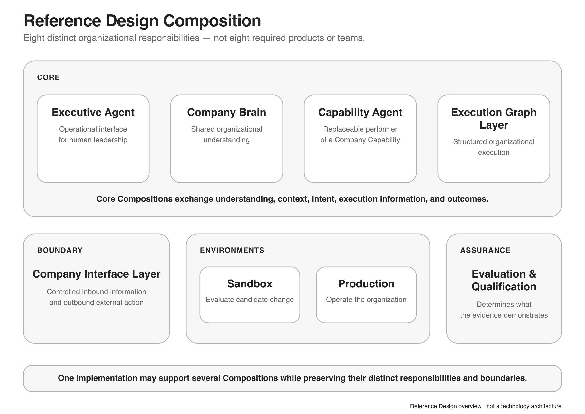
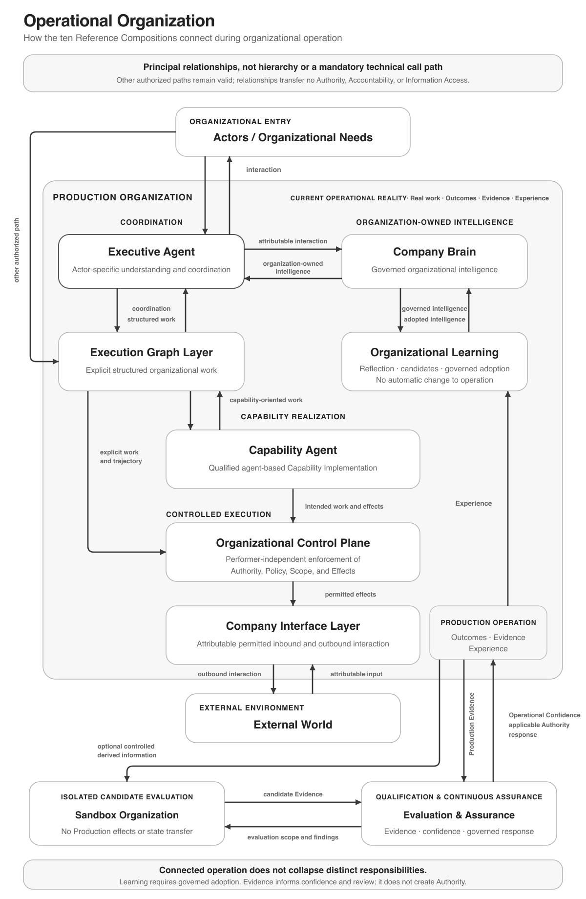
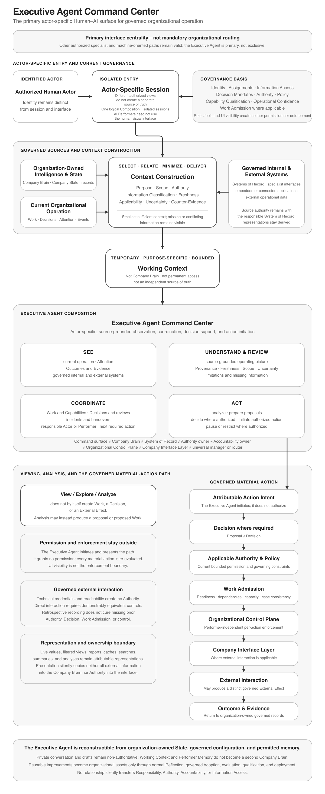
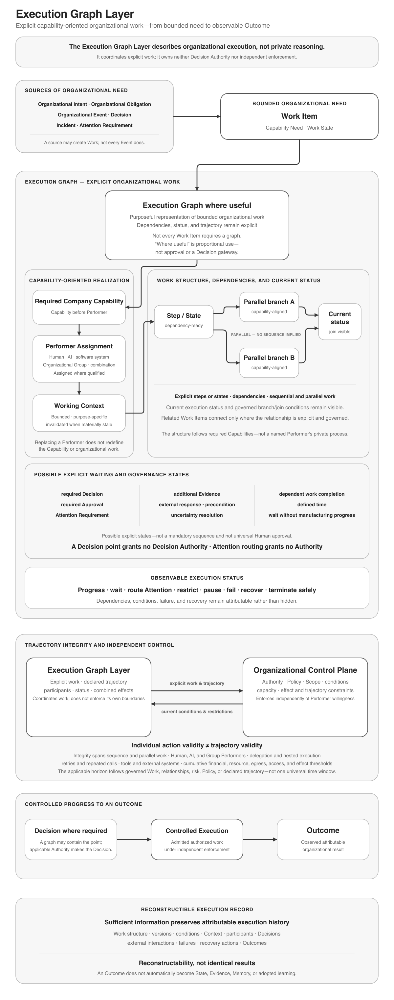
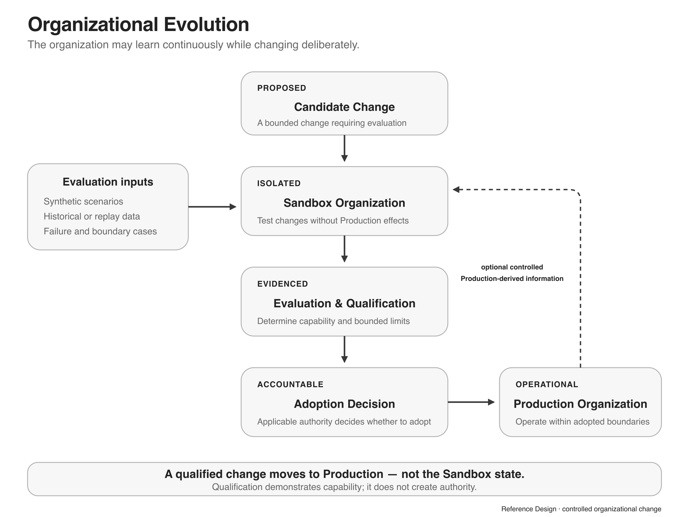

# AI-First Company Reference Design

## Contents

1. [Purpose](#1-purpose)
2. [From Architecture to Reference](#2-from-architecture-to-reference)
3. [A Living Organization](#3-a-living-organization)
4. [Reference Principles](#4-reference-principles)
5. [Composition Overview](#5-composition-overview)
6. [The Operational Organization](#6-the-operational-organization)
7. [Executive Agent](#7-executive-agent)
8. [Execution Graph Layer](#8-execution-graph-layer)
9. [Company Brain](#9-company-brain)
10. [Organizational Learning](#10-organizational-learning)
11. [Capability Agent](#11-capability-agent)
12. [Organizational Control Plane](#12-organizational-control-plane)
13. [Company Interface Layer](#13-company-interface-layer)
14. [Sandbox Organization](#14-sandbox-organization)
15. [Production Organization](#15-production-organization)
16. [Evaluation & Assurance](#16-evaluation--assurance)
17. [Composition Relationships](#17-composition-relationships)
18. [Operational Flows](#18-operational-flows)
19. [Organizational Evolution](#19-organizational-evolution)
20. [Architecture Traceability](#20-architecture-traceability)
21. [Failure Modes](#21-failure-modes)
22. [Future Evolution](#22-future-evolution)

## 1. Purpose

> **The Reference Design translates the Architecture into an organizational design.**

The AI-First Company Reference Design presents one practical composition of the [AI-First Company Architecture](../01-architecture/ARCHITECTURE.md).

It shows how architectural concepts can work together as an operational organization while remaining independent of specific technologies, products, providers, and runtimes.

The Reference Design is intentionally opinionated. It presents one design, not the only possible design. Other designs may realize the same Architecture differently.

This document composes existing Architecture concepts and responsibilities; it does not add, redefine, or override organizational meaning established by the Architecture.

---

## 2. From Architecture to Reference

The AI-First Company is described through three layers:

> **The Architecture explains what an AI-First Company is.**  
> **The Reference Design translates the Architecture into an organizational design.**  
> **The [Technical Requirements](../03-technical-requirements/TECHNICAL_REQUIREMENTS.md) define the technology required to realize that design.**

```text
Architecture
     │
     ▼
Reference Design
     │
     ▼
Technical Requirements
```

| Layer | Question |
|---|---|
| **Architecture** | What is an AI-First Company? |
| **Reference Design** | How can the Architecture be composed into an organizational design? |
| **Technical Requirements** | What technology is required to realize that design? |

The Reference Design remains organizational rather than technological. Concrete databases, models, runtimes, protocols, frameworks, and infrastructure belong to the Technical Requirements.

---

## 3. A Living Organization

An AI-First Company can be understood, for a moment, through the analogy of a living system.

It requires connected organizational functions that perceive, understand, remember, coordinate, act, observe, learn, assure, and recover. These functions exchange information, context, intent, evidence, and outcomes; they do not form one mandatory linear lifecycle.

```text
Perceive ─ Understand ─ Remember ─ Coordinate ─ Act
    ↖              connected functions              ↘
Recover ───────── Assure ─ Learn ─ Observe ──────────┘
```

The analogy is intentionally limited. The Reference Design does not reproduce human biology or model an organization as a human being.

> **An AI-First Company is a connected organizational system whose parts continuously exchange information, context, intent, evidence, and outcomes.**

From this point forward, the Reference uses organizational rather than biological terminology.

---

## 4. Reference Principles

### Architecture Grounded

Every organizational responsibility in the Reference Design remains traceable to the Architecture.

### One Reference Design

The Reference presents one complete organizational design rather than a catalogue of alternatives.

### Proportional Realization

Completeness does not require a separate person, team, process, or system for every Composition. A minimal realization may use few Performers, shared implementations, compact artifacts, and multiple responsibilities per Actor where the distinctions and boundaries remain explicit.

Proportional realization and consequence-dependent operation use an explicit, governed, context-appropriate Consequence Assessment rather than an unstated assumption. No universal risk taxonomy or scoring model is required.

### Capability before Implementation

Organizational capabilities remain stable while their performers and implementations may change.

### Performer Neutrality

Responsibilities may be realized by Humans, AI Performers, software systems, Organizational Groups, or combinations. Applicable law, contract, regulation, safety, or company governance may require human participation in a concrete organization, but the Reference Design does not impose it universally.

### Explicit Governance

Responsibility, Authority, and Accountability remain explicit and distinct. Participation, technical ability, and information access do not silently transfer any of them.

### Shared Organizational Intelligence

Actors should operate from compatible organizational intelligence and current State rather than isolated conversations or private representations.

### Bounded Context

Work receives the smallest sufficient Working Context for its Purpose, Scope, Authority, and information boundaries.

### Controlled Effects

Decisions, execution, external interactions, effects, and outcomes remain distinguishable. Consequential effects pass through independently enforceable organizational controls.

### Continuous Assurance

Operational trust is continuously supported or challenged by current Evidence and remains specific to capability, scope, and conditions.

### Organizational Learning

Relevant Experience becomes reusable organizational intelligence only through reflection, evidence, and governed adoption.

### Controlled Autonomy

Bounded action without case-by-case approval remains enforceable, observable, reversible, and subject to Attention routing.

### Recoverability and Continuity

The organization prepares to contain disruption, preserve meaning, recover sufficient operation, and rehydrate replacement Performers without silently restoring stale trust or Authority.

### Replaceability, Observable Execution, and Deliberate Evolution

Implementations remain replaceable; work remains attributable and reviewable; and the organization may learn continuously while changing deliberately.

---

## 5. Composition Overview

The Architecture is built from **Concepts**. The Reference Design is built from **Compositions**. A Composition combines Architecture Concepts into a distinct operational responsibility.

The Reference Design contains ten top-level Compositions:

```text
COORDINATION                  INTELLIGENCE
├── Executive Agent          ├── Company Brain
└── Execution Graph Layer    └── Organizational Learning

CAPABILITY                    CONTROL
└── Capability Agent         ├── Organizational Control Plane
                             └── Company Interface Layer

ENVIRONMENTS                 ASSURANCE
├── Sandbox Organization     └── Evaluation & Assurance
└── Production Organization
```



*The Compositions define distinct organizational responsibilities rather than required products, teams, or technical services.*

The term **Agent** describes a logical implementation pattern. It does not require a single model, runtime, process, or agent instance. One implementation may support several Compositions where it preserves their complete responsibilities and boundaries.

The design may be realized progressively. Existing sources, Authority, and Accountability retain their established status until an explicit, validated transition occurs.

---

## 6. The Operational Organization

```text
Actors / Organizational Needs
              ↕
        Executive Agent ←→ Company Brain
              ↕              ↕
      Attention / Coordination
              ↓
      Execution Graph Layer ←→ Capability Agents
              ↓                       ↓
          Organizational Control Plane
              ↓
          Company Interface Layer
              ↕
          External World

Experience → Organizational Learning → Company Brain
Production → Evaluation & Assurance → Operational Confidence / Authority Review
```

This is neither a hierarchy nor a mandatory sequence of technical calls. It shows principal relationships while allowing other direct, authorized interaction paths.

The Executive Agent provides the primary actor-specific organizational command center and coordination surface. The Company Brain provides organization-owned intelligence. Execution Graphs structure work. Capability Agents provide agent-based Capability Implementations. The Control Plane enforces execution boundaries. The Interface Layer realizes permitted external interaction. Sandbox evaluates candidate change, Production operates real work, Organizational Learning governs reusable learning, and Evaluation & Assurance qualifies candidates and continuously assesses operation.

Responsibility, Authority, and Accountability do not collapse into the performer that happens to coordinate an activity.



*The Compositions connect without collapsing organizational intelligence, coordination, control, environments, learning, assurance, Authority, or Accountability.*

---

## 7. Executive Agent

> **The Executive Agent is the primary actor-specific organizational command center: the principal Human–AI surface for seeing, understanding, reviewing, coordinating, deciding, and initiating authorized action across internal operation and governed external relationships.**

It is the principal Human–AI and Human–Organization interface and the primary human-facing point for understanding and operating the company. It provides an eye into internal operation and toward governed external systems and relationships. It is a command surface supporting observation and authorized action—not merely a dashboard, monitoring interface, conversational assistant, universal manager, or universal decision-maker.

The Executive Agent is primary but neither mandatory nor exclusive. Organizational activity need not originate in or transit through it; other authorized specialist and machine-oriented interfaces remain valid. It is not the Company Brain, an organizational-intelligence owner, a System of Record, an Authority or Accountability owner, the Organizational Control Plane, the Company Interface Layer, a mandatory universal router, or a universal execution choke point.



*The command surface provides authorized views and action initiation without owning organization-owned intelligence, source authority, Accountability, or enforcement.*

<sub>**Trace this composition:** [Architecture basis](../01-architecture/ARCHITECTURE.md#knowledge-access-and-context-construction) · [Technical realization](../03-technical-requirements/TECHNICAL_REQUIREMENTS.md#61-executive-agent)</sub>

### 7.1 Organization Understanding

The Executive Agent provides an actor-specific, source-grounded operating picture assembled from current organization-owned information. It may relate Company State, organizational intelligence, Work Items and Execution Graphs, Decisions and current Authority State, Outcomes and Evidence, Attention Requirements and Events, Assurance and Operational Confidence, and relevant internal or governed external systems.

Different Actors may receive different authorized views of the same organization; the Executive Agent must not manufacture different organizational truths. For material information, the surface preserves or exposes where relevant Provenance, Freshness, applicable Scope, Uncertainty, current status, and the source or responsible System of Record. Private summaries, caches, search results, and conversational interpretations remain derived views rather than a second source of truth.

External operational data may remain authoritative in its responsible System of Record. The Executive Agent may present a live or recently retrieved value, actor-specific filtered projection, derived analysis, report, cached view, or specialist interpretation without copying the raw source into the Company Brain. Each representation retains relevant source authority, Provenance, Freshness, Scope, Uncertainty, and derived status.

The command surface makes material operating and responsibility state understandable. Where relevant, it distinguishes observing, analyzing, proposing, awaiting a Decision, executing, paused, degraded, recovering, or incident operation; identifies whether a Human Performer, AI Performer, Group Performer, or organizational mechanism is expected to act next; and exposes limitations, missing information, inability to proceed, or changes of mode and responsibility. These are views of existing Work, State, Event, Attention, execution, and incident semantics—not a new authoritative state machine.

### 7.2 Context Orchestration

The Executive Agent may orchestrate Context Construction:

```text
Company Brain
+ External Information
+ Performer Memory where permitted
+ current Work State
        ↓
Context Construction
        ↓
Working Context
```

Context Construction evaluates Purpose, Scope, Authority, Classification, Freshness, Applicability, Uncertainty, and Counter-Evidence. It delivers the smallest sufficient purpose-specific context while keeping missing, conflicting, or uncertain information visible.

Working Context is temporary and bounded. It is not part of the Company Brain and does not create permanent access.

One logical Executive Agent Composition may provide multiple isolated actor-specific sessions, views, and Working Contexts. What an Actor may see, analyze, propose, decide, approve, configure, initiate, pause, or otherwise control derives from current Actor identity, Assignments, Capability Qualification, Information Access, Decision Mandates, Authority, Policy, Company State, Operational Confidence, and Work Admission as applicable.

Practical role labels such as chief executive, administrator, employee, or temporary worker may serve as assignment or access templates; the label itself creates no Information Access, Authority, Qualification, or Decision Mandate. Organizational Authority, Information Access, and technical administration remain distinct even when one person holds several in a minimal organization. Hiding a control may improve clarity, but UI visibility is never the enforcement boundary.

Isolation applies across search, summaries, caches, Working Context, Working Memory, Performer Memory, conversation state, embedded applications, credentials, and tool access where applicable. Actor-specific views must not leak information or action access across those boundaries.

Actor-specific sessions may participate in bounded shared collaboration for Work, projects, Company Capabilities, Organizational Groups, Decisions and reviews, incidents, Attention, and handovers. Humans, Executive Agent sessions, Capability Agents, other AI Performers, Group Performers, and authorized specialist interfaces may contribute without merging their identities, access, memory, Qualification, Authority, Responsibility, or Accountability. Each contribution remains attributable to its actual Actor or Performer, each participant receives only its permitted Working Context, and shared infrastructure preserves the distinction among an Actor, that Actor's Executive Agent session, another AI Performer, and an Organizational Group.

Private conversation, analysis, drafts, and provisional suggestions remain private and non-authoritative until deliberately transferred. An attributable transfer may share a Contribution with governed Work, submit a Decision Proposal, create or update Work, raise Attention, record an Event or Outcome, or submit Experience or a Learning Candidate. It preserves relevant Provenance, Information Classification, access, and the content's existing status; entry into shared collaboration does not silently make it a Decision, Evidence, Company State, accepted Knowledge, or Authority. Actions initiated from shared collaboration follow the same governed path as private initiation.

### 7.3 Capability Coordination and Decision Support

The Executive Agent identifies required Company Capabilities, coordinates work, and may prepare Decision Proposals and Decision Basis. Performer Assignment, Decision Authority, Work Admission, and Controlled Execution remain separate responsibilities.

An actor-specific interaction may provide no visibility, read-only visibility, analysis without execution, preparation of a proposal or Decision Proposal, execution after an additional Decision or approval, direct bounded execution under valid Standing Authorization, separately governed technical administration, or emergency action with explicit attribution, restriction, and review. These are implementation patterns built from existing governance, not a fixed Architecture taxonomy.

For a material action, the Executive Agent produces an attributable Action Intent and follows the existing organizational path:

```text
Actor
  → Executive Agent interaction
  → attributable Action Intent
  → applicable Decision where required
  → applicable Authority and Policy
  → Work Admission
  → Organizational Control Plane
  → Company Interface Layer where applicable
  → External Interaction where applicable
  → External Effect where applicable
  → Outcome
```

The Executive Agent presents controls but grants no permission. Embedded interfaces, provider credentials, technical accounts, and technical reachability create neither Information Access nor organizational Authority. Material action remains subject to per-action enforcement; Decisions occur where required; and Controlled Execution and external-effect governance remain outside the Executive Agent. Outcomes and Evidence return to organization-owned governed records.

Before consequential action, the command surface can present an understandable preview of intended action, target and Scope, responsible Performer, applicable Authority or missing Decision, information and credentials to be used, expected effect, material Uncertainty or risk, reversibility or Compensation, and relevant Recovery path. Authorized Actors can follow material work through proposal, Decision, admission, execution, waiting, restriction, failure, completion, Compensation, Recovery, and review using the existing lifecycle records.

### 7.4 Attention Routing

In this Reference Design, the Executive Agent may act as a central coordination point for Attention Requirements:

```text
Attention Requirement
        ↓
Executive Agent
        ↓
evaluate required Capability / Expertise / Authority /
Information Access / Availability
        ↓
appropriate Actor / Organizational Group / Performer
```

This is an opinionated Reference choice, not an Architecture requirement that every organization use one router.

The Executive Agent provides a prioritized Attention workspace rather than an undifferentiated notification stream. It can expose urgency, Impact, age, Uncertainty, required Capability, intended recipient, and unresolved status, and support actor-authorized acknowledgement, transfer, restriction, or deferral without deleting the underlying Event or Attention Requirement.

If no appropriate authorized, qualified, informed, and available recipient exists, Attention remains unresolved and attributable. The surface supports Safe Failure—wait, restrict, pause, gather information, retain the requirement, or use an authorized alternative path—without manufacturing Authority from Urgency.

An incident-oriented workspace can assemble a shared operating picture, explicit responsibilities, current actions and communications, a timeline, Decisions, affected systems, and Recovery conditions. Continuity and handover views show what changed, what remains open, which Decisions were made, what is waiting, and what requires Attention. Material incident information, Decisions, Events, Outcomes, and learning reside in organization-owned records rather than only in a private conversation.

> **Routing ≠ Authority**
> **Attention ≠ hierarchical escalation**
> **Participation ≠ Decision Authority**

### 7.5 Organizational Interaction and Boundary

Interaction may use conversation, dashboards, notifications, reports, visual exploration, voice, or specialist interfaces. Humans, AI Performers, Organizational Groups, and other authorized interfaces may interact directly where appropriate.

The Executive Agent may compose or embed governed specialist interfaces and interactive applications supplied by internal or external systems. Embedded modules receive only bounded information and action access; their identity, provider, material configuration, and version remain observable where relevant; and compromise or failure has a bounded blast radius.

> **Embedded applications and specialist interfaces may expose information and controls through the Executive Agent, but presentation, technical reachability, or provider credentials create neither Information Access nor Authority. Every material action remains attributable and subject to applicable Authority, Work Admission, organizational controls, and external-effect governance.**

Actions initiated through an embedded UI follow the same controls as other actions. Isolation covers data, session state, caches, summaries, search, memory, credentials, and tool access where applicable. Loss of rich UI need not eliminate the underlying authorized Capability: specialist or degraded interfaces may provide continuity.

> **The Executive Agent may be accessed through multiple authorized local or remote command surfaces. A client, host, embedded application, rendering mechanism, or UI protocol does not inherit organizational trust, Information Access, or Authority merely by presenting the Executive Agent.**

One logical Composition may use organization-operated, embedded, local, remote, mobile, voice, high-security, read-only, proposal-only, approval-capable, bounded-execution, or degraded surfaces without creating different organizational truths. A remote or externally operated host receives only actor-, Purpose-, Scope-, and session-appropriate information. Restricted information is filtered before disclosure rather than sent in full and hidden by the client; access to presentation data grants no access to underlying Company Brain information, Company State, Systems of Record, tools, or credentials.

Organization-controlled enforcement re-evaluates material actions regardless of the initiating surface. Session compromise, revocation, expiry, device loss, and host failure have a bounded blast radius. Continuity through another surface does not silently inherit the former surface's memory, credentials, or session state, so remote access can remain limited rather than all-or-nothing.

> **Executive Agent ≠ Authority owner ≠ Company Brain ≠ universal manager**

The Executive Agent is primary, not mandatory or exclusive.

### 7.6 State, Memory, Skills, and Learning

The Executive Agent command surface is reconstructible from organization-owned intelligence, current organizational State, governed configuration, and explicitly permitted memory. It does not own the company information it presents.

> **The Executive Agent presents and acts upon organization-owned intelligence and current organizational State; it does not become an independent System of Record or a second Company Brain.**

As an AI Performer, it may use bounded Working Context, governed Performer Memory, versioned Skills, tools and integrations, identifiable configuration, Capability Qualification, and Operational Confidence. Conversation history is not automatically organizational truth; private drafts remain distinguishable from organizational records; and material work is transferable into governed Work, Decision, Event, Outcome, or other appropriate records.

> **As an AI Performer, the Executive Agent may use bounded Working Context, governed Performer Memory, and versioned Skills. Reusable knowledge, procedures, and capability improvements become organizational assets only through the normal Reflection, Learning Candidate, governed Adoption, evaluation, qualification, and deployment paths.**

It must not silently modify its Skills, Authority, Qualification, or governing procedures. Replacement and Recovery do not depend on unrestricted predecessor memory; personal preferences and interaction continuity remain bounded by Purpose, Scope, access, and Memory Policy. AI Performers generally need not use the visual human interface and may use existing machine-oriented mechanisms while preserving the same organizational semantics.

### 7.7 Resilience and Bounded Centrality

The Executive Agent's centrality is intentional interface centrality, not uncontrolled architectural concentration. Its health, configuration, version, and material dependencies are observable; material dependencies appear in a Dependency Record where appropriate. Compromise or malfunction has a bounded blast radius because Authority enforcement, Work Admission, containment, external-effect controls, Company State, and Systems of Record remain outside the command surface.

Alternative authorized specialist interfaces and Attention paths support safe degradation. When the Executive Agent is unavailable or unreliable, the organization can wait, restrict, transfer, pause, or use an alternate interface according to consequence. Recovery or replacement reconstructs the Composition from organization-owned State and governed configuration and may require evaluation, requalification, or revised Operational Confidence after material change. Organizational continuity does not require every operation to traverse the Executive Agent.

---

## 8. Execution Graph Layer

> **The Execution Graph Layer describes organizational execution, not private reasoning.**

Work may originate from Organizational Intent, Organizational Obligation, Organizational Event, Decision, Incident, or Attention Requirement.

```text
source of organizational need
        ↓
Work Item
        ↓
Execution Graph where useful
        ↓
required Company Capability
        ↓
Performer Assignment
        ↓
Working Context
        ↓
Decision / Controlled Execution
        ↓
Outcome
```



*Execution Graphs describe observable organizational execution where useful; they do not model private reasoning or independently grant Authority or enforcement.*

<sub>**Trace this composition:** [Architecture basis](../01-architecture/ARCHITECTURE.md#operating-cycle) · [Technical realization](../03-technical-requirements/TECHNICAL_REQUIREMENTS.md#62-execution-graph-layer)</sub>

### 8.1 Capability before Performer

Graphs remain capability-oriented rather than performer-oriented. A performer may be Human, AI Performer, software system, Organizational Group, or combination. Replacing it does not require redefining the organizational work.

### 8.2 Waiting, Decisions, and Attention

A graph may explicitly wait for a required Decision, required Approval, Attention Requirement, additional Evidence, external response, precondition, uncertainty resolution, completion of other work, or defined time. Human approval may be one concrete case but is not the default.

The graph can contain a decision point without acquiring Authority to make that Decision. Attention routing may be represented as an explicit execution state.

### 8.3 Observable and Reproducible Execution

Execution preserves sufficient information to reconstruct relevant work structure, versions, conditions, context, participants, Decisions, external interactions, failures, recovery actions, and Outcomes. Reproducibility means reconstructability, not identical results.

### 8.4 Trajectory Integrity

The Execution Graph and Organizational Control Plane jointly evaluate combined effects across sequential and parallel actions, Human, AI, and Group Performers, delegation and nested execution, retries and repeated calls, multiple tools and external systems, destinations and environments, cumulative financial/resource/data-egress/access/external-effect thresholds, and one or explicitly related Work Items.

The governed Work, relationship, risk, Policy, or declared trajectory determines the applicable horizon; no universal time window is required. Preventive enforcement is used where feasible for foreseeable material harm, continuous or concurrent evaluation is used where appropriate during execution, and retrospective evaluation supports Assurance, Incident review, Reflection, and Learning. Uncertain cumulative effect routes to Attention or Safe Failure according to consequence.

> **Individual action validity ≠ trajectory validity**

---

## 9. Company Brain

> **The Company Brain is the organization-owned intelligence substrate of this Reference Design.**

It makes organizational intelligence usable together while preserving distinct meaning, Authority, lifecycle, information boundaries, and provenance. Relevant intelligence may include Company State, Source Claims, Evidence, Validated Knowledge, Company Memory, Organizational Practices, Decision Records, Decision Basis, capability information, organizational relationships, and authoritative sources or references.

### 9.1 Shared Organizational Understanding

The Company Brain creates shared organizational understanding, not shared storage. Different Actors may use different interfaces while operating from compatible facts, Decisions, State, relationships, and boundaries.

It is not a transaction bus or mandatory intermediary for external action. Raw external data may remain in its responsible System of Record; caches, dashboards, summaries, indexes, visualizations, and specialist interpretations remain Derived Representations unless explicitly governed otherwise. Current external values may contribute to Company State where governed, while durable organizational meaning enters Company Memory, Validated Knowledge, Organizational Practice, Decision Records, or other organization-owned records only through their applicable governance.

### 9.2 Distinctions and Sources

Company Memory preserves historically relevant information intentionally retained. Company State represents what the organization currently considers true. Working Context contains what one activity requires. Performer Memory is local performer state. These are not interchangeable.

Different Systems of Record may remain authoritative for bounded information classes. Known provenance does not itself establish reliability, truth, or permission. Instruction-like content remains information rather than Authority.

### 9.3 Curation and Access

Raw information may remain in Systems of Record, evidence stores, archives, or evaluation datasets. Information becomes Validated Knowledge, Company Memory, Organizational Practice, or another durable form only through its applicable governance—not through one universal linear lifecycle.

The Company Brain is not a universal full-access layer. Knowledge Access and Context Construction preserve Purpose, Scope, Classification, source, uncertainty, and access boundaries.

> **Company Brain ≠ Actor ≠ Authority ≠ one database ≠ universal full-access layer**

<sub>**Trace this composition:** [Architecture basis](../01-architecture/ARCHITECTURE.md#organizational-intelligence-and-company-brain) · [Technical realization](../03-technical-requirements/TECHNICAL_REQUIREMENTS.md#63-company-brain)</sub>

---

## 10. Organizational Learning

> **Organizational Learning converts relevant organizational Experience into governed reusable organizational intelligence.**

```text
Experience
    ↓
Organizational Reflection
    ↓
Organizational Learning Candidate
    ↓
Evidence / Validation
    ↓
applicable Adoption Authority
    ↓
Validated Knowledge / Organizational Practice / Capability Improvement /
Policy review / Identity review / no adoption
```

Experience may arise from Humans, AI Performers, teams, software systems, work, interaction, observation, or Outcomes. Final Reflection is one form of reflection lifecycle, not a mandatory universal endpoint.

Organizational Learning also governs retirement or forgetting where retained intelligence is no longer applicable and supports Performer Rehydration from current authorized organizational intelligence.

> **Performer learning ≠ Organizational Learning**
> **Learning Candidate ≠ adopted learning**
> **Memory consolidation ≠ learning adoption**
> **Operational Authority ≠ learning adoption Authority**

Experience does not directly self-modify Production behavior. Performer Memory does not become organizational learning automatically. Material learning passes through this Composition.

Assurance mechanism failure, disagreement, drift, blind spots, or invalid Evidence may become attributable Experience or Evidence, generate an Organizational Event and Attention Requirement, and enter Organizational Reflection. Reflection may produce a Learning Candidate, but no assurance-originated finding automatically changes Production, Authority, Policy, Qualification, or accepted Knowledge. Adopted improvement continues through normal evaluation, governance, qualification, and deployment.

Sandbox may provide Evidence about an implementation change; it is not the home of Organizational Learning. No Production Skill modifies itself without governed adoption.

<sub>**Trace this composition:** [Architecture basis](../01-architecture/ARCHITECTURE.md#organizational-learning) · [Technical realization](../03-technical-requirements/TECHNICAL_REQUIREMENTS.md#64-organizational-learning)</sub>

---

## 11. Capability Agent

> **A Capability Agent is an agent-based Capability Implementation pattern in this Reference Design.**

A Company Capability is not a Capability Agent. The capability remains stable while its current implementation and Performer may change.

### 11.1 Capability Alignment and Context

A Capability Agent derives responsibility from the Company Capability it implements, not from everything its model or runtime can technically do. It receives bounded Working Context rather than unrestricted access to the Company Brain. Retrieved content cannot grant tools, access, delegation, or Authority.

### 11.2 Performer Replaceability

Work may be performed by a Human, AI Performer, software system, Organizational Group, or combination. Replacement remains subject to qualification and assignment.

> **The capability belongs to the organization. Its current performer does not.**

### 11.3 Performer State

The implementation explicitly governs:

- **Performer Configuration** — material configuration affecting behavior;
- **Execution Identity** — the attributable identity used while acting;
- **Working Memory** — temporary state for current work;
- **Performer Memory** — retained local state influencing later work; and
- **Memory Policy** — rules governing write, retention, retrieval, transformation, and deletion.

> **Working Memory ≠ Performer Memory ≠ Company Brain**

Performer Memory remains local performer state. It does not become organizational truth automatically, must not create Shadow Access or Shadow Truth, and remains subject to current Purpose, Scope, Access, and Memory Policy. A materially changed Performer Configuration may invalidate prior Capability Qualification.

Governance follows actual behavior-affecting function rather than implementation labels. Retained caches, indexes, retrieval weighting, selected examples, personalization, or comparable mechanisms that materially influence later behavior are governed as applicable Performer Memory or Performer Configuration; temporary caches without retained behavior-affecting information may remain ordinary implementation state. Cross-Performer, cross-Work, or organizational reuse does not become Organizational Learning or a Production Skill without the applicable Reflection, Learning Candidate, Adoption, Evaluation, Qualification, authorization, configuration, and deployment path, and material change may require review of Operational Confidence.

### 11.4 Experience and Learning

```text
Capability Agent operation
        ↓
Experience
        ↓
Organizational Reflection
        ↓
Organizational Learning Candidate
```

Experience cannot directly self-modify Production behavior, and Performer Memory cannot bypass Organizational Learning.

A specialized Capability Agent may monitor or analyze an external operational domain and produce relevant filtered reports, Source Claims, Evidence, Events, Attention Requirements, Experience, Work or Decision Proposals, Learning Candidates, or Outcomes as applicable. It neither makes all source data Company Brain content nor turns relevance or interpretation into truth, Evidence, Company State, or adopted learning automatically. Material outputs retain source links; repeated summaries or relays do not multiply independent Evidence; and specialist Skills follow normal governed Skills and Organizational Learning paths.

### 11.5 Delegated and Adversarial Operation

Delegation preserves Company Capability, context, information, action, resource, and authorization boundaries. Combined privileges must not exceed the originating Authorized Effect. Capability Agents rely on externally enforceable controls rather than Performer compliance alone.

<sub>**Trace this composition:** [Architecture basis](../01-architecture/ARCHITECTURE.md#company-capabilities) · [Technical realization](../03-technical-requirements/TECHNICAL_REQUIREMENTS.md#65-capability-agent)</sub>

---

## 12. Organizational Control Plane

> **The Organizational Control Plane enforces organizational execution boundaries outside the affected Performer.**

Responsibilities include Authority, Policy, Scope, precondition and current Company State enforcement; scoped credentials; tool, action, effect, and trajectory boundaries; containment; and revocation or suspension enforcement.

> **Instructions ≠ Controls**

System prompts, Skills, agent instructions, webpages, documents, emails, tool output, and model reasoning do not enforce organizational Authority. The Control Plane must be able to limit or stop execution independently of Performer willingness.

Deterministic enforcement applies where boundaries can be represented through identities, resources, operations, destinations, credentials, thresholds, schemas, and explicit Policy. Semantic, cumulative, contextual, or real-world consequences may not be preventable with deterministic certainty; model-based or heuristic evaluation supplies Evidence or estimation rather than deterministic control. When sufficient preventive control is infeasible, the design exposes residual Uncertainty and uses Consequence Assessment to narrow Scope, Authority, Standing Authorization, or Authorized Effects; require another Decision or heterogeneous evaluation; use read-only or proposal-only operation; route Attention; apply Safe Failure or Controlled Pause; or decline the action. It does not claim equivalent control, while preserving feasible preventive boundaries.

### 12.1 Effect Path

```text
Decision / Action Intent
        ↓
Authorized Effect
        ↓
Organizational Control Plane
        ↓
Controlled Execution
        ↓
Company Interface Layer
        ↓
External Interaction
        ↓
External Effect
        ↓
Verification / Reconciliation / Outcome
```

The Control Plane asks: **May this Effect occur under these conditions?**

The Company Interface Layer asks: **How is the permitted interaction technically realized?**

The Capability Agent and Execution Graph ask: **What organizational work is being performed?**

Decision, execution, external interaction, external effect, and Outcome remain distinct.

### 12.2 Controlled Autonomy

```text
Capability Qualification
+ bounded Authority
+ Organizational Control Plane
+ Continuous Assurance
+ Attention routing
        ↓
Controlled Autonomy
```

Authority may be maintained, expanded, contracted, suspended, or revoked. Positive Evidence does not automatically expand Authority. Material Negative Evidence can trigger rapid contraction or suspension. Autonomy remains capability- and scope-specific.

<sub>**Trace this composition:** [Architecture basis](../01-architecture/ARCHITECTURE.md#controlled-execution) · [Technical realization](../03-technical-requirements/TECHNICAL_REQUIREMENTS.md#66-organizational-control-plane)</sub>

---

## 13. Company Interface Layer

> **The Company Interface Layer is the controlled boundary between the organization and the External World.**

It separates what the organization is permitted to do from how an external system technically realizes the interaction.

### 13.1 Inbound Information

```text
External World
      ↓
Company Interface Layer
      ↓
Attributable Input
      ↓
Source Claim / Organizational Event / Evidence / Working Context input
```

Arrival does not make input organizational knowledge, Company Memory, Evidence, State, or Authority. External content may be incorrect, manipulated, or adversarial. External content ≠ Authority.

### 13.2 Outbound Interaction

```text
Authorized Effect
      ↓
Organizational Control Plane
      ↓
Company Interface Layer
      ↓
External Interaction
      ↓
External Effect
```

The Interface Layer may possess technical credentials but does not own Authority. Connectors expose only operations, resources, destinations, and flows required for authorized use.

### 13.3 Systems of Record, Identity, and Provenance

Systems of Record retain bounded authority. External interaction preserves initiating participant, Capability, execution, technical identity, material delegation, external system, and Outcome where relevant. Shared infrastructure must not erase attribution.

### 13.4 Unknown Effects and Failure

External systems may be unavailable, delayed, inconsistent, compromised, or return an uncertain result.

```text
Unknown External Effect
        ↓
verify external state
        ↓
reconcile
        ↓
only then decide whether retry is safe
```

Retry is not the default. The uncertainty remains visible to execution, assurance, and Attention routing.

<sub>**Trace this composition:** [Architecture basis](../01-architecture/ARCHITECTURE.md#effects-and-external-interaction) · [Technical realization](../03-technical-requirements/TECHNICAL_REQUIREMENTS.md#67-company-interface-layer)</sub>

---

## 14. Sandbox Organization

> **The Sandbox Organization isolates evaluation of candidate implementation, configuration, or behavior change from Production effects.**

It may reproduce only the organizational parts needed for the evaluation and use synthetic, historical, replay, or controlled Production-derived information. Evaluation information retains origin, Classification, minimization, isolation, and provenance.

Sandbox activity, credentials, State, Company Memory, external actions, traces, and Outcomes remain distinguishable from Production. Candidate change is exercised realistically but within scope.

The Sandbox does not decide Production suitability; Evaluation & Assurance does. It is not the Organizational Learning system. A Learning Candidate may use Sandbox Evidence, while learning adoption and implementation evolution remain distinct.

> **What moves from Sandbox to Production is a qualified change—not the Sandbox state.**

<sub>**Trace this composition:** [Architecture basis](../01-architecture/ARCHITECTURE.md#capability-qualification) · [Technical realization](../03-technical-requirements/TECHNICAL_REQUIREMENTS.md#68-sandbox-organization)</sub>

---

## 15. Production Organization

> **The Production Organization is the operational realization in which authorized work produces real organizational consequences.**

Production maintains current operational reality, including Company State, Company Brain, Work Items, Capability Implementations, Execution Graphs, Decisions, authorized interactions, and Outcomes. Production ≠ Sandbox.

Deployment and technical ability grant no Authority. Production identities, credentials, tools, resources, and combined privileges remain bounded by the Authorized Effect and Control Plane.

### 15.1 Continuity and Degraded Operation

Continuity considers Performer, provider, model/runtime, credential, System of Record, Capability Implementation, and knowledge/access dependency failure. The organization may continue, degrade, transfer, pause, or shut down according to consequence.

**Degraded Operation** preserves explicitly reduced capability within validated boundaries. **Controlled Pause** preserves State and prevents unsafe continuation while conditions are restored or reconsidered.

Authority does not automatically transfer because a Performer or Actor becomes unavailable.

### 15.2 Incident, Containment, and Recovery

```text
Incident
   ↓
Containment
   ↓
Blast Radius Analysis
   ↓
Reconciliation
   ↓
Recovery / Replacement
   ↓
Performer Rehydration
   ↓
Evaluation / Requalification where required
   ↓
bounded return to operation
```

Continuity is shared across Production, the Control Plane, Evaluation & Assurance, Company Brain, and Organizational Learning. Containment must not depend solely on affected Performer cooperation.

Technical restart ≠ organizational Recovery. Recovery does not automatically restore Capability Qualification, Operational Confidence, Information Access, Authority, or suspended or restricted operation. Restoration is limited to what is justified and authorized for bounded return. If applicable governance requires a Decision, the current limited Authority State remains in force until that Decision occurs; positive technical Evidence alone creates no Authority. Incident Experience may later enter Organizational Learning, but incident handling is not learning.

<sub>**Trace this composition:** [Architecture basis](../01-architecture/ARCHITECTURE.md#company-execution-environment) · [Technical realization](../03-technical-requirements/TECHNICAL_REQUIREMENTS.md#69-production-organization)</sub>

---

## 16. Evaluation & Assurance

> **Evaluation & Assurance covers both pre-Production qualification and continuous Production assurance.**

```text
Candidate Implementation
        ↓
Sandbox Organization
        ↓
Evaluation
        ↓
Capability Qualification
        ↓
possible bounded Authority
        ↓
Production Organization
        ↓
Continuous Assurance
        ↓
Operational Confidence
        ↓
Authority Review
```

### 16.1 Evaluation and Capability Qualification

Evaluation uses defined capabilities, scenarios, Evidence, expected and observed Outcomes, failures, boundary cases, adversarial cases, and relevant traces. Capability Qualification answers: **What has this implementation demonstrated it can do, in what Scope and conditions?** It neither creates Authority nor transfers automatically to a materially changed implementation.

### 16.2 Continuous Assurance and Operational Confidence

Continuous Assurance asks whether current Production Evidence still justifies trust. Signals may include leading indicators, concurrent controls, lagging Outcomes, Context Health, Memory Health, Behavioral Drift, Novelty, corrections, retries, incidents, distribution changes, deterministic invariants, sampling, and outcome monitoring.

Operational Confidence is current, scoped, and revisable. It is neither Qualification nor Authority.

> **Qualification ≠ Operational Confidence ≠ Authority**

### 16.3 Shadow Evaluation and Assurance Independence

Shadow Evaluation may observe behavior outside the primary execution control path. Evaluation may combine Human evaluation, AI evaluation, deterministic checks, Shadow Evaluation, outcome monitoring, or other suitable mechanisms.

Assurance Independence is assessed as a degree across relevant dependencies, including model or model family, provider, known training-data or method similarity, prompt and rubric design, tools, retrieval sources, context and Evidence, infrastructure and failure modes, evaluator incentives and ownership, human-review dependence, and shared susceptibility to bias, attack, or blind spots. Another model invocation, repeated samples from one evaluator, or multiple models from one family or provider are not automatically independent Evidence. Agreement among correlated evaluators must not be counted as multiple independent confirmations, and an AI judge is Evidence rather than a source of truth.

Evaluation may combine deterministic checks and invariants, System-of-Record or observed Outcome Evidence, versioned rubrics, a different model or provider where justified, targeted human sampling, calibration sets, bias or adversarial probes, disagreement detection, abstention or inability-to-evaluate handling, periodic second-method sampling, and evaluator-drift monitoring. Evaluator identity, configuration, protocol history, material dependencies, disagreement, and residual Uncertainty remain auditable where material. Evidential weight reflects dependence and correlation.

No infinite evaluator regress or perfect prediction is required. Evaluators remain subject to identifiable configuration, dependence analysis, observed performance, residual Uncertainty, and consequence-appropriate Assurance; model-based evaluation is not represented as deterministic enforcement or infallible control. Conformance combines justified prevention where feasible with concurrent and retrospective detection and governed response.

No fixed number of models, providers, or human reviewers is universal. Limited independence may lead to narrower Qualification, reduced Operational Confidence, stronger restriction, an additional heterogeneous method, targeted human review, or Attention according to consequence. A minimal organization may combine responsibilities, but self-review must not be represented as independent Evidence.

### 16.4 Independent and Appropriate Evaluation

Evaluation must be appropriate to ambiguity, strategy, communication quality, legal interpretation, safety, novelty, and other relevant consequences. Human participation may be required by a concrete domain, but it is not a universal Architecture requirement.

### 16.5 Authority Response

Capability Qualification and Operational Confidence inform applicable governance without creating permission. Standing Authorization remains bounded, attributable, reviewable, and revocable. Negative Evidence can rapidly contract, suspend, or revoke Authority; positive Evidence supports review but does not automatically expand it.

Authority Review is not itself an Authority change. If no authorized Decision changes Authority State, the current state and any existing expiry, suspension, restriction, revocation, or other governing condition remain in force. Absence of a new Decision is not implicit approval, renewal, restoration, or expansion.

> **Operational trust is earned and maintained through Evidence, not assumed from technical capability.**

<sub>**Trace this composition:** [Architecture basis](../01-architecture/ARCHITECTURE.md#operational-confidence-and-continuous-assurance) · [Technical realization](../03-technical-requirements/TECHNICAL_REQUIREMENTS.md#610-evaluation--assurance)</sub>

---

## 17. Composition Relationships

The ten Compositions form one connected design. Their relationships do not imply hierarchy or mandatory technical call paths.

| Relationship | Purpose |
|---|---|
| **Executive Agent ⇄ Company Brain** | Makes organizational intelligence usable for coordination and interaction. |
| **Executive Agent ⇄ Execution Graph Layer** | Connects organizational need and coordination to structured work. |
| **Executive Agent ⇄ Actors / Attention routing** | Routes Attention according to capability, expertise, Authority, access, and availability. |
| **Company Brain ⇄ Organizational Learning** | Supplies governed intelligence to reflection and receives adopted learning. |
| **Company Brain → Context Construction** | Supplies bounded inputs without becoming Working Context. |
| **Execution Graph Layer ⇄ Capability Agents** | Connects capability-oriented work to qualified assigned Performers. |
| **Execution Graph Layer ⇄ Organizational Control Plane** | Connects explicit work and trajectory to enforceable boundaries. |
| **Capability Agents → Organizational Control Plane** | Subjects intended work and effects to external enforcement. |
| **Capability Agents ⇄ Organizational Learning** | Contributes Experience and receives adopted organizational intelligence through governance. |
| **Organizational Control Plane ⇄ Company Interface Layer** | Connects permitted effects to controlled technical interaction. |
| **Company Interface Layer ⇄ External World** | Provides attributable inbound and outbound boundary crossing. |
| **Sandbox Organization ⇄ Evaluation & Assurance** | Exercises candidates and produces qualification Evidence. |
| **Production Organization ⇄ Evaluation & Assurance** | Supplies operational Evidence and receives confidence and Authority responses. |
| **Production Organization → Organizational Learning** | Supplies Experience for governed reflection and adoption. |

Production may optionally provide controlled derived information to Sandbox. Sandbox may instead use synthetic, historical, replay, or purpose-built information.

Dashboards, conversations, reports, notifications, and specialist interfaces are organizational views rather than additional Compositions.

> **A relationship does not automatically transfer Responsibility, Authority, Accountability, or Information Access.**

---

## 18. Operational Flows

The organization is connected rather than centrally routed. Not every activity begins with the Executive Agent or uses an Execution Graph.

### 18.1 Work Flow

```text
Organizational Need
  from Intent / Obligation / Event / Decision / Incident / Attention
        ↓
Work Item
        ↓
Execution Graph where useful
        ↓
Capability Need
        ↓
Performer Assignment
        ↓
Context Construction
        ↓
Decision / Controlled Execution
        ↓
Outcome
```

### 18.2 Attention Flow

```text
Attention Requirement
        ↓
Impact / Urgency / Uncertainty
        ↓
required Capability / Expertise / Authority / Information Access
        ↓
appropriate Actor / Organizational Group
        ↓
Decision mechanism or additional Work
```

Attention ≠ hierarchical escalation. Routing ≠ Authority.

If no appropriately authorized, qualified, informed, and available recipient exists, the Attention Requirement remains unresolved, attributable, observable, and reviewable. Urgency does not create Authority. The organization waits, restricts, pauses, gathers information, retains the unresolved requirement, or uses an authorized alternative path.

### 18.3 External Event Flow

```text
External World
      ↓
Company Interface Layer
      ↓
Attributable Input
      ↓
Source Claim / Organizational Event
      ↓
Context / Attention / Work / Assurance as appropriate
```

Not every Event creates Work. Not every Claim becomes Evidence. Not every observation creates a Decision.

### 18.4 Actor-Initiated Work

```text
Actor
  ↓
Executive Agent, authorized shared interaction, or another authorized interface
  ↓
attributable Action Intent / Organizational Need
  ↓
Work Item
  ↓
Context Construction
  ↓
Decision where required
  ↓
Authority and Policy / Work Admission
  ↓
Organizational Control Plane
  ↓
Company Interface Layer and External Interaction where applicable
  ↓
Outcome
```

The interface initiates and presents the path; it does not grant permission or replace per-action enforcement.

Viewing and exploring authorized information—such as filtering, changing a visualization, or drilling into a source—remain subject to access and egress controls but do not by themselves change external State or require Work, a Decision Record, or Company Brain content. Analysis may instead produce a proposal, Decision Proposal, draft configuration, or proposed Work without producing an external effect. Proposal remains distinct from Decision, admission, execution, and Outcome.

A material external action passes through the complete controlled path. The Company Brain is not a mandatory transaction intermediary: the applicable Decision and Decision Basis, Work, External Interaction, External Effect, Outcome, and Evidence remain in their appropriate organization-owned records, while reusable learning may later enter organization-owned intelligence through Reflection and governed Adoption.

If an embedded or linked provider interface communicates directly with an external system, it remains read-only or proposal-only unless equivalent organizational controls are demonstrably enforced. Any permitted direct action is attributable, observable, reconciled, and reflected in current organizational State and appropriate records. Retrospective capture does not cure missing prior Authority, Decision, Work Admission, or control; where consequence requires preventive enforcement, a surface that cannot support it does not expose the material action.

### 18.5 Proactive Activity

```text
Schedule / State Change / External Event / Monitoring
        ↓
Organizational Event
        ↓
possible Work / Attention / Assurance
```

Continuous Environmental Intelligence may make relevant change visible through attributable claims, Evidence, and Events. It creates neither truth nor Authority. Proactive operation changes how organizational need becomes visible, not the Authority under which it is performed.

### 18.6 Outcomes

```text
Outcome
├──→ Company State
├──→ Evidence
├──→ Experience
└──→ Organizational Event

Experience → Organizational Learning
Evidence   → Continuous Assurance
```

Learning and Assurance remain distinct. An Outcome does not automatically become State, Evidence, Memory, or adopted learning.

---

## 19. Organizational Evolution

Organizational evolution distinguishes learning from implementation change.

### 19.1 Organizational Learning

```text
Experience
    ↓
Organizational Reflection
    ↓
Organizational Learning Candidate
    ↓
Evidence / Validation
    ↓
governed Adoption
    ↓
Validated Knowledge / Organizational Practice / Capability Improvement
```

### 19.2 Implementation Evolution

```text
Candidate Implementation Change
        ↓
Sandbox Organization
        ↓
Evaluation & Assurance
        ↓
Capability Qualification
        ↓
governed Adoption
        ↓
Production Organization
```



Production may provide controlled derived information to Sandbox, operational Experience to Organizational Learning, and Evidence to Evaluation & Assurance.

> **What moves to Production is a qualified change—not the Sandbox state.**
> **Learning does not automatically change Production.**
> **Qualification demonstrates capability; it does not create Authority.**

---

## 20. Architecture Traceability

Traceability is many-to-many and explanatory rather than exhaustive. A Composition may combine several Concepts, and a Concept may influence several Compositions. Mapping represents composition and influence, not ownership.

| Reference Composition | Principal v2 Architecture Concept Nodes |
|---|---|
| **Executive Agent** | Actor, Performer, Attention Requirement, Decision Participation, Context Construction, Working Context, Company Capability, Decision |
| **Execution Graph Layer** | Work Item, Organizational Intent, Organizational Obligation, Organizational Event, Attention Requirement, Company Capability, Performer Assignment, Decision, Controlled Execution, Outcome |
| **Company Brain** | Company Brain, Company State, Source Claim, Evidence, Validated Knowledge, Company Memory, Organizational Practice, Decision Record, Decision Basis, System of Record, Provenance |
| **Organizational Learning** | Experience, Organizational Reflection, Organizational Learning Candidate, Organizational Practice, Performer Rehydration, Evidence |
| **Capability Agent** | Company Capability, Capability Implementation, Capability Qualification, Performer Assignment, Working Context, Performer Configuration, Performer Memory, Memory Policy, Controlled Execution, Standing Authorization |
| **Organizational Control Plane** | Organizational Control Plane, Decision Mandate, Standing Authorization, Controlled Autonomy, Controlled Execution, Work Admission, Authorized Effect, Access Boundary, Company State, Information Classification |
| **Company Interface Layer** | Source Claim, Organizational Event, External Interaction, External Effect, System of Record, Data Custody, Information Classification, Provenance |
| **Sandbox Organization** | Company Execution Environment, Trust Domain, Capability Qualification, Evidence, Information Classification, Controlled Execution |
| **Production Organization** | AI-First Company, Company State, Company Brain, Company Capability, Standing Authorization, Organizational Continuity, Recovery, Dependency Record, Controlled Autonomy |
| **Evaluation & Assurance** | Capability Qualification, Continuous Assurance, Operational Confidence, Shadow Evaluation, Evidence, Outcome, Standing Authorization |

### 20.1 Cross-Cutting Responsibilities and Properties

- Responsibility;
- Authority;
- Accountability;
- Information Governance and Provenance;
- Context Integrity;
- Continuous Assurance and Controlled Autonomy;
- Recoverability and Organizational Continuity;
- Replaceability and observability; and
- controlled evolution.

These are not assigned exclusively to one Composition because doing so would incorrectly narrow their scope.

### 20.2 Traceability Rule

A new Reference responsibility must remain explainable through the Architecture. Otherwise it belongs to another layer, is unnecessary or misplaced, or reveals a genuine Architecture gap requiring separate review.

> **Every Reference responsibility remains traceable to the Architecture.**

---

## 21. Failure Modes

The objective is to make failure observable, bounded, recoverable, and attributable.

### 21.1 Intelligence and Context Failure

Failures include stale State, contradictory sources, Shadow Truth, stale Performer Memory, Shadow Access, context poisoning, inappropriate retention, missing Counter-Evidence, and failure to invalidate Working Context after material change. The organization keeps uncertainty visible rather than manufacturing coherence.

### 21.2 Execution and Control Failure

Failures include operation outside Qualification, Authority aggregation, delegation expansion, admission bypass, trajectory invalidity, Attention routing failure, containment depending on the affected Performer, and individual valid steps combining into an unauthorized effect.

### 21.3 Boundary and Effect Failure

Failures include wrong Systems of Record, ambiguous identity, excessive credentials, unauthorized egress, compromised connectors, and Unknown External Effect. Unknown effects require verification and reconciliation before any retry decision.

### 21.4 Environment, Continuity, and Recovery Failure

Sandbox may be unrealistic or affect Production. Production may lose a Performer, provider, runtime, credential, System of Record, implementation, or knowledge dependency. Failures include Blast Radius blindness, rehydration failure, and premature restoration of Qualification, Confidence, or Authority.

### 21.5 Assurance Failure

Evaluation may use inadequate scenarios, biased or leaked data, obsolete conditions, misleading metrics, correlated evaluators, or insufficient independence. Continuous Assurance may miss drift, unhealthy context or memory, novelty, incidents, or changed distributions.

### 21.6 Learning Failure

Experience or Performer Memory may be mistaken for organizational truth; a Learning Candidate may auto-adopt; or learning and incident handling may collapse. Organizational Learning requires reflection, evidence, applicable Adoption Authority, and an explicit destination or rejection.

### 21.7 Cross-Composition Failure

Examples include correct execution with stale context, a qualified Performer in an incorrect graph, valid Evidence interpreted outside Scope, authorized work using the wrong source, and organizational intelligence crossing the wrong access boundary. No Composition alone guarantees organizational correctness.

### 21.8 Safe Failure

```text
Uncertainty
     ↓
Preserve State
     ↓
Stop / Wait / Restrict
     ↓
Gather Evidence
     ↓
Route Attention where required
```

Do not guess and continue.

> **An AI-First Company must be designed not only to act when it knows what to do, but also to behave safely when it does not.**

---

## 22. Future Evolution

The Reference Design is complete for its defined scope without predicting every future organizational form or Performer capability.

Future evidence may justify multiple coordinating Executive Agents, partitioned Company Brains, increasingly complex Capability composition, long-running graph evolution, multiple Sandbox Organizations, cross-company capability interaction, or new forms of bounded autonomy.

These are possible extensions, not unresolved requirements.

### 22.1 Layer Discipline

```text
Architecture
      ↓
Reference Design
      ↓
Technical Requirements
```

Technology does not automatically require a Reference change. A new organizational requirement should not be hidden in the Technical Requirements when it reveals an Architecture concern.

### 22.2 Evidence before Expansion

The Reference Design should grow when organizational Evidence demonstrates that an existing Composition or relationship is insufficient.

> **Expand the Reference because the organization requires it, not because technology makes it possible.**
