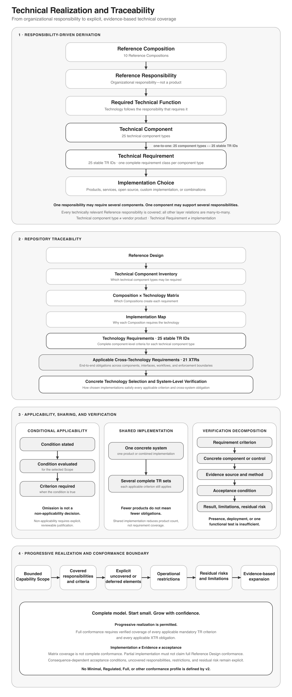

# AI-First Company — Technical Requirements

## Contents

1. [Purpose](#1-purpose)
2. [From Reference Design to Technology](#2-from-reference-design-to-technology)
3. [Technical Principles](#3-technical-principles)
4. [Technical Component Inventory](#4-technical-component-inventory)
5. [Reference Composition × Technology Matrix](#5-reference-composition--technology-matrix)
6. [Implementation Map](#6-implementation-map)
7. [Technology Requirements](#7-technology-requirements)
8. [Cross-Technology Requirements](#8-cross-technology-requirements)
9. [Completeness and Traceability](#9-completeness-and-traceability)
10. [Minimum Technical Realization](#10-minimum-technical-realization)

## 1. Purpose

> **The Technical Requirements define the technology required to realize the AI-First Company Reference Design.**

The Architecture explains what an AI-First Company is. The [Reference Design](../02-reference-design/REFERENCE_DESIGN.md) translates the Architecture into an organizational design. The Technical Requirements define the technology required to realize that design.

They do not prescribe a vendor, product, programming language, cloud platform, model provider, database product, agent framework, or deployment environment. They identify required component classes, trace each requirement to a Reference responsibility, define complete technical capabilities, and preserve Shared Implementation where one concrete system satisfies several requirements.

### 1.1 Requirement Language

When expressing an obligation, **must** and **must not** define mandatory conformance conditions, **should** and **should not** define expected conditions requiring explicit justification when unmet, and **may** defines an optional choice.

`Must Support` identifies the complete capability set against which a concrete implementation is evaluated. Every applicable capability is mandatory whether supplied directly or through an explicitly identified Shared Implementation.

### 1.2 Verification Decomposition

A `TR-*` identifier denotes a stable technical requirement class associated with a technical component type. Each distinct capability or constraint stated in its `Must Support` field is a separate mandatory conformance criterion when applicable; sharing a table cell or sentence does not make a criterion explanatory prose. Each applicable obligation in an `XTR-*` must likewise be decomposed at the concrete components, interfaces, workflows, or enforcement boundaries that realize it.

A concrete implementation must maintain a Verification Decomposition with stable local criterion IDs. Each local criterion record identifies:

- its source `TR-*` or `XTR-*`;
- criterion text;
- applicability and the basis for that applicability decision;
- the responsible concrete component, interface, workflow, or enforcement boundary;
- acceptance condition;
- verification method;
- required or observed Evidence; and
- result and unresolved limitations.

A criterion marked not applicable requires an explicit, reviewable justification based on the selected realization and its Scope; omission is not a non-applicability decision. Product presence, component deployment, one functional test, or high-level matrix coverage does not by itself establish complete conformance. Shared Implementation may satisfy several requirements, but every applicable criterion remains independently traceable and verifiable.

Consequence-dependent acceptance conditions may differ between concrete implementations, but they remain explicit and follow the framework's Consequence Assessment and governance. This repository defines technology-neutral requirement classes and criteria, not one universal implementation-specific test suite. The planned reference implementation is expected to publish one concrete Verification Decomposition and implementation profile as empirical output.

---

## 2. From Reference Design to Technology

The derivation path is:

```text
Reference Composition
        ↓
Reference Responsibility
        ↓
Required Technical Function
        ↓
Technical Component
        ↓
Technical Requirement
        ↓
Implementation Choice
```

A technical component exists because at least one Reference responsibility requires it. Every technically relevant Reference responsibility is covered by one or more components.

> **No Reference responsibility may depend on an unidentified technical capability.**

> **No technical component should be introduced merely because a technology exists.**

A relationship may be conditional because the use case does not always require the function or because a selected Shared Implementation may already provide it. The condition remains explicit, and the component becomes mandatory whenever the condition is true.

---

## 3. Technical Principles

### 3.1 Technology Independence

Technology classes are independent of products and vendors. A requirement may be realized commercially, as a hosted service, through open source, through custom implementation, or by combination.

### 3.2 Shared Implementation

Separate Technical Requirements do not necessarily require separate products. One system may satisfy multiple requirements only when it fulfills each complete requirement set.

### 3.3 Deterministic Control

AI may interpret, reason, generate, recommend, and perform capabilities. Identity, authorization, Authority, durable execution state, external effects, containment, and other hard boundaries remain enforceable independently of Performer willingness or model reasoning.

### 3.4 Durable Organizational State

Material organizational State and Work Item state survive individual Performer, model, and process lifetimes. Restart or replacement must not silently destroy or reinterpret them.

### 3.5 Performer State Separation

> **Working Memory ≠ Performer Memory ≠ Company Brain**

Restart or replacement must not turn Working Memory into Company State, treat Performer Memory as authoritative truth, reconstruct stale access from historical memory, or promote local Experience into organizational Knowledge or Practice. Performer Memory remains subject to current Purpose, Scope, Access, and Memory Policy.

### 3.6 Governed Context Construction

Context Construction preserves or evaluates applicable Purpose, Scope, Authority, Information Classification, Freshness, Applicability, Uncertainty, Provenance, and material Counter-Evidence. Minimization must not silently remove material constraints or counter-evidence. Relevant State, Authority, and access changes can invalidate or refresh affected Working Context.

### 3.7 Controlled External Effects

> **Authorized Effect ≠ Controlled Execution ≠ External Interaction ≠ External Effect ≠ Outcome**

Credentials do not create permission. Unknown External Effects remain explicit and, where technically feasible, are verified and reconciled before retry safety is decided. Blind retry is not the default.

### 3.8 Environment Separation

Sandbox and Production mutable state, execution, credentials, configuration, traces, memory, and external-effect boundaries remain appropriately separated.

### 3.9 Versioned Change

Material Performer Configuration, models, instructions, Skills, tools, memory and context mechanisms, graphs, connectors, policies, evaluators, dependencies, and environment configuration remain identifiable across Evaluation, Production, Assurance, and incidents.

### 3.10 Observable Failure

Failure remains observable and bounded. It may reduce capability but must not silently expand Authority or weaken governance.

### 3.11 Evidence-Based Qualification and Continuous Assurance

Qualification states what pre-Production Evidence demonstrates for a defined Scope. It is not sufficient for indefinite Production trust.

```text
Capability Qualification
        ↓
Production
        ↓
Continuous Assurance
        ↓
Operational Confidence
        ↓
Authority Review
```

Production Evidence remains correlatable where relevant to Capability, Scope, Performer or Capability Implementation, material Performer Configuration, context, operating conditions, Outcomes, and External Effects.

### 3.12 Organizational Learning Boundary

> **Experience ≠ Organizational Learning Candidate ≠ adopted learning**

Repeated observations, local patterns, conversation summaries, Working Memory, or Performer Memory must not automatically modify Production Skills or Policy, change authoritative Company Brain content, create Organizational Practice, or expand Authority. Adoption follows a separate governed activation path.

### 3.13 Authority Contraction

Technical enforcement supports applicable Authority states and transitions: maintain, expand, contract, suspend, and revoke. Material negative assurance Evidence can trigger enforceable contraction or suspension. Positive Evidence does not automatically expand Authority.

### 3.14 Trajectory Integrity

Technical realization prevents or detects when individually valid sequential or parallel actions, delegation or nested execution, retries or repeated calls, multi-performer composition, multiple tools or systems, combined privileges, or accumulated financial, resource, data-egress, access, or external effects form an unauthorized trajectory across one or explicitly related Work Items. The applicable horizon follows governed Work, relationship, risk, Policy, or declared trajectory Scope rather than one universal time window. Preventive and concurrent enforcement is used where feasible for foreseeable material harm; retrospective detection alone is insufficient where earlier prevention was reasonably required.

> **Individual action validity ≠ trajectory validity**

### 3.15 Adversarial Content

Messages, documents, media, retrieval, tool results, and model output may be adversarial. Information remains distinct from Authority, Policy, Memory Policy, organizational instruction, and technical permission.

### 3.16 Bounded Delegation and Composition

Delegation remains attributable and bounded by identity, Capability, action, information, resource, environment, Authorized Effect, and trajectory Scope. It transfers neither Accountability nor broader access automatically.

### 3.17 Security Integrity, Containment, and Defense in Depth

Material components and configurations remain identifiable and verifiable according to consequence. Production execution remains contained across process, file, network, credential, tool, destination, data-flow, memory, context, and resource boundaries. Detection, suspension, revocation, isolation, and Recovery do not depend on affected Performer cooperation. No model, prompt, internal network, evaluation result, or single control is sufficient alone.

---

## 4. Technical Component Inventory

The Reference Design requires the following 25 technical component types. Some are broadly required; others become required only under explicit conditions. Shared Implementation may satisfy several complete requirements.

- Backend Application / Service Framework
- Relational Database Management System
- Object / File Storage System
- Full-Text Search Engine
- Vector Search Engine
- Embedding Model / Service
- Large Language Model / Inference Service
- AI Agent Framework / Runtime
- Workflow Orchestration Engine
- Identity and Access Management System
- Authorization / Policy Enforcement System
- Secrets Management System
- Integration / Connector Framework
- Versioned Configuration Repository
- Application UI Framework
- Logging, Monitoring & Tracing Platform
- Backup & Recovery Tooling
- Environment Isolation Mechanism
- Deployment & Provisioning Tooling
- Automated Testing & Evaluation Framework
- Message Broker / Event Bus
- Service Virtualization / Mocking Framework
- Data Transformation / Anonymization Tooling
- Document Parsing / Text Extraction
- Schema / Data Validation Library

The two additional v2 Compositions introduce no additional component types. Their requirements use the existing 25 component types and may be satisfied through Shared Implementation.

---

## 5. Reference Composition × Technology Matrix

A **✓** means the Composition creates the requirement. A written condition makes the component mandatory when that condition is true. An empty cell means the Composition does not itself create the requirement. A technology requirement is recorded against the Composition that creates it. Other Compositions may use the same capability through an explicitly identified Shared Implementation; that use is not duplicated as an additional requirement. The matrix implies neither Composition containment nor one centralized product or data store.

### 5.1 Application, Data & Search

| Reference Composition | Backend Application / Service Framework | Relational Database Management System | Object / File Storage System | Full-Text Search Engine | Vector Search Engine | Embedding Model / Service |
|---|:---:|:---:|:---:|:---:|:---:|:---:|
| **Executive Agent** | ✓ |  |  |  |  |  |
| **Execution Graph Layer** |  |  |  |  |  |  |
| **Company Brain** | ✓ | ✓ | If files or artifacts are stored rather than referenced | If lexical retrieval is required | If semantic retrieval is required | If Vector Search is used |
| **Organizational Learning** | ✓ | ✓ | If learning Evidence or artifacts require object storage |  |  |  |
| **Capability Agent** |  |  | If the Capability reads, creates, or retains files or large artifacts |  |  |  |
| **Organizational Control Plane** | ✓ |  |  |  |  |  |
| **Company Interface Layer** |  |  | If transferred files require retention or buffering |  |  |  |
| **Sandbox Organization** |  |  |  |  |  |  |
| **Production Organization** |  |  |  |  |  |  |
| **Evaluation & Assurance** | ✓ | ✓ | If Evaluation or Assurance uses files, datasets, replay artifacts, or binary Evidence |  |  |  |

### 5.2 AI & Execution

| Reference Composition | Large Language Model / Inference Service | AI Agent Framework / Runtime | Workflow Orchestration Engine | Message Broker / Event Bus | Schema / Data Validation Library |
|---|:---:|:---:|:---:|:---:|:---:|
| **Executive Agent** | ✓ | ✓ |  |  | ✓ |
| **Execution Graph Layer** |  |  | ✓ | If workflow and integration systems lack required event delivery | ✓ |
| **Company Brain** |  |  |  |  | ✓ |
| **Organizational Learning** | If AI-assisted Reflection is used | If agent-based Reflection is used | ✓ |  | ✓ |
| **Capability Agent** | ✓ | ✓ |  |  | ✓ |
| **Organizational Control Plane** |  |  | If durable control state or coordinated containment requires it |  | ✓ |
| **Company Interface Layer** |  |  |  | If connector and workflow systems lack required event delivery | ✓ |
| **Sandbox Organization** |  |  |  |  |  |
| **Production Organization** |  |  |  |  |  |
| **Evaluation & Assurance** | If semantic or model-based Evaluation is used |  | If continuous assurance or review workflows require orchestration |  | ✓ |

### 5.3 Identity, Authority & Integration

| Reference Composition | Identity and Access Management System | Authorization / Policy Enforcement System | Secrets Management System | Integration / Connector Framework | Versioned Configuration Repository |
|---|:---:|:---:|:---:|:---:|:---:|
| **Executive Agent** | ✓ | ✓ | If protected models or tools use managed credentials |  | ✓ |
| **Execution Graph Layer** | ✓ | ✓ |  |  | ✓ |
| **Company Brain** | ✓ | ✓ | If underlying Systems of Record use managed credentials |  |  |
| **Organizational Learning** | ✓ | ✓ | If protected information or systems use managed credentials |  | ✓ |
| **Capability Agent** | ✓ | ✓ | If protected models or tools use managed credentials |  | ✓ |
| **Organizational Control Plane** | ✓ | ✓ | If scoped credentials enforce effects |  | ✓ |
| **Company Interface Layer** | ✓ | ✓ | If a connector requires managed credentials | ✓ | ✓ |
| **Sandbox Organization** | ✓ | ✓ | If Sandbox or simulated systems use managed credentials |  | ✓ |
| **Production Organization** | ✓ | ✓ | If Production components use managed credentials |  | ✓ |
| **Evaluation & Assurance** | ✓ | ✓ | If protected models, data, or systems are evaluated |  | ✓ |

### 5.4 Interaction & Operations

| Reference Composition | Application UI Framework | Logging, Monitoring & Tracing Platform | Backup & Recovery Tooling | Deployment & Provisioning Tooling |
|---|:---:|:---:|:---:|:---:|
| **Executive Agent** | ✓ | ✓ |  |  |
| **Execution Graph Layer** | If executions include interactive Decision, Approval, or Attention steps | ✓ |  |  |
| **Company Brain** |  | ✓ |  |  |
| **Organizational Learning** | If Reflection or adoption uses human-facing interaction | ✓ |  |  |
| **Capability Agent** | If Actors interact directly with the Capability Agent | ✓ |  |  |
| **Organizational Control Plane** | If Authority or incident review uses human-facing interaction | ✓ |  |  |
| **Company Interface Layer** |  | ✓ |  |  |
| **Sandbox Organization** |  | ✓ |  | ✓ |
| **Production Organization** |  | ✓ | ✓ | ✓ |
| **Evaluation & Assurance** | If Evaluation, assurance, or Authority review uses human-facing interaction | ✓ |  |  |

### 5.5 Isolation & Evaluation-specific Technology

| Reference Composition | Environment Isolation Mechanism | Automated Testing & Evaluation Framework | Service Virtualization / Mocking Framework | Data Transformation / Anonymization Tooling | Document Parsing / Text Extraction |
|---|:---:|:---:|:---:|:---:|:---:|
| **Executive Agent** |  |  |  |  |  |
| **Execution Graph Layer** |  |  |  |  |  |
| **Company Brain** |  |  |  |  | If stored documents require extraction |
| **Organizational Learning** |  | If Learning Candidates require technical validation |  |  | If learning Evidence contains documents requiring extraction |
| **Capability Agent** |  |  |  |  | If Capability work requires document extraction |
| **Organizational Control Plane** | ✓ |  |  |  |  |
| **Company Interface Layer** |  |  |  |  |  |
| **Sandbox Organization** | ✓ |  | If external systems must be simulated | If sensitive Production-derived data enters Sandbox |  |
| **Production Organization** | ✓ |  |  |  |  |
| **Evaluation & Assurance** |  | ✓ |  |  | If Evaluation scenarios contain documents requiring extraction |

---

## 6. Implementation Map

The Implementation Map answers: **Why does this Composition require this technology?** Every matrix relationship has a Reference basis or explicit implementation condition.

### 6.1 Executive Agent

<sub>**Reference basis:** [Executive Agent](../02-reference-design/REFERENCE_DESIGN.md#7-executive-agent)</sub>

| Reference Basis | Required Technology | Used for |
|---|---|---|
| Actor-specific source-grounded operating picture and Context orchestration | Backend Application / Service Framework; Large Language Model / Inference Service; AI Agent Framework / Runtime; Schema / Data Validation Library | Deterministic coordination, interpretation, bounded context assembly, source/status/uncertainty presentation, and structured exchange without creating another System of Record |
| Capability coordination, attributable Action Intent, Attention routing, and Decision support | Identity and Access Management System; Authorization / Policy Enforcement System | Attribute participants and preserve current Assignments, Authority, access, Qualification, Decision Mandates, Work Admission, and per-action enforcement outside the UI |
| Organizational command surfaces, shared collaboration, and embedded specialist interfaces | Application UI Framework | Actor-specific personal and shared interaction, local or remote observation, analysis, proposals, Decisions, action preview and lifecycle, prioritized Attention, incident coordination, handover, and bounded embedded interfaces |
| Configuration, Skills, operation, and assurance | Versioned Configuration Repository; Logging, Monitoring & Tracing Platform | Identify configuration, dependencies, embedded modules, evaluator-relevant changes, health, operating state, interaction, failure, and execution |
| Protected access | Secrets Management System | Required when managed credentials protect models or tools |
| Resilience and replacement | Backend Application / Service Framework; Identity and Access Management System; Versioned Configuration Repository; Logging, Monitoring & Tracing Platform | Reconstruct from organization-owned State and governed configuration, support alternate authorized interfaces, and bound compromise or unavailability |

### 6.2 Execution Graph Layer

<sub>**Reference basis:** [Execution Graph Layer](../02-reference-design/REFERENCE_DESIGN.md#8-execution-graph-layer)</sub>

| Reference Basis | Required Technology | Used for |
|---|---|---|
| Work Item and durable execution | Workflow Orchestration Engine; Schema / Data Validation Library | Long-running state, structured inputs/outputs, waits, Decisions, Approvals, Attention, and safe resume |
| Capability-oriented Performer Assignment | Identity and Access Management System; Authorization / Policy Enforcement System | Attribute assignment and enforce permitted performer, Scope, action, and effect |
| Events and signals | Message Broker / Event Bus | Required when workflow and connector systems lack asynchronous delivery guarantees |
| Interactive gates | Application UI Framework | Required for human-facing Decision, Approval, or Attention interaction |
| Trajectory, effect, and failure correlation | Logging, Monitoring & Tracing Platform | Correlate branches, retries, delegation, effects, Outcomes, and reconciliation |
| Reproducibility | Versioned Configuration Repository | Identify graph definitions and versions |

### 6.3 Company Brain

<sub>**Reference basis:** [Company Brain](../02-reference-design/REFERENCE_DESIGN.md#9-company-brain)</sub>

| Reference Basis | Required Technology | Used for |
|---|---|---|
| Organization-owned intelligence | Backend Application / Service Framework; Relational Database Management System; Schema / Data Validation Library | Represent Company State, Claims, Evidence, Knowledge, Memory, Practices, Decisions, relationships, and provenance |
| Governed access | Identity and Access Management System; Authorization / Policy Enforcement System; Logging, Monitoring & Tracing Platform | Enforce and observe Purpose-, Scope-, Classification-, and source-aware access |
| Retrieval | Full-Text Search Engine; Vector Search Engine; Embedding Model / Service | Conditional lexical or semantic retrieval with source traceability |
| Artifacts and documents | Object / File Storage System; Document Parsing / Text Extraction | Conditional durable storage and extraction without making Working Context part of the Company Brain |
| Protected Systems of Record | Secrets Management System | Required when managed credentials protect authoritative sources |

### 6.4 Organizational Learning

<sub>**Reference basis:** [Organizational Learning](../02-reference-design/REFERENCE_DESIGN.md#10-organizational-learning)</sub>

| Reference Basis | Required Technology | Used for |
|---|---|---|
| Experience, Reflection, and Learning Candidates | Backend Application / Service Framework; Relational Database Management System; Schema / Data Validation Library; Workflow Orchestration Engine | Persist status, provenance, Evidence links, reflection, adoption, rejection, retirement, and activation workflow |
| Governed adoption | Identity and Access Management System; Authorization / Policy Enforcement System; Versioned Configuration Repository | Separate operational Authority from Learning Adoption Authority and activate adopted Knowledge, Practice, or Capability Improvement |
| AI-assisted Reflection | Large Language Model / Inference Service; AI Agent Framework / Runtime | Required only when Reflection uses AI or agent execution |
| Validation and artifacts | Automated Testing & Evaluation Framework; Object / File Storage System; Document Parsing / Text Extraction | Required when candidates need technical validation or artifact/document Evidence |
| Human-facing review | Application UI Framework | Required when Reflection or adoption uses human interaction |
| Protected access | Secrets Management System | Required when protected information or systems use managed credentials |
| Operation | Logging, Monitoring & Tracing Platform | Preserve attributable learning flow and failures |

### 6.5 Capability Agent

<sub>**Reference basis:** [Capability Agent](../02-reference-design/REFERENCE_DESIGN.md#11-capability-agent)</sub>

| Reference Basis | Required Technology | Used for |
|---|---|---|
| Capability Implementation | Large Language Model / Inference Service; AI Agent Framework / Runtime | Agent-based Capability performance with controlled tools and bounded delegation |
| Performer State and Configuration | Versioned Configuration Repository; Schema / Data Validation Library | Identify material configuration, Working Memory, Performer Memory interface, Memory Policy, and Working Context structures |
| Execution Identity and current boundaries | Identity and Access Management System; Authorization / Policy Enforcement System | Enforce current Authority and Information Access; memory never bypasses them |
| Protected access | Secrets Management System | Required for managed model or tool credentials |
| Files and documents | Object / File Storage System; Document Parsing / Text Extraction | Conditional artifact storage and document interpretation |
| Direct interaction | Application UI Framework | Required when Actors interact directly with the Capability Agent |
| Experience and operation | Logging, Monitoring & Tracing Platform | Capture attributable Experience references, execution, failure, and Outcomes |

### 6.6 Organizational Control Plane

<sub>**Reference basis:** [Organizational Control Plane](../02-reference-design/REFERENCE_DESIGN.md#12-organizational-control-plane)</sub>

| Reference Basis | Required Technology | Used for |
|---|---|---|
| Independent enforcement | Backend Application / Service Framework; Identity and Access Management System; Authorization / Policy Enforcement System; Schema / Data Validation Library | Enforce Authority, Policy, Scope, State, preconditions, effects, destinations, and data flows outside the affected Performer |
| Scoped credentials | Secrets Management System | Required when effects use scoped managed credentials |
| Durable control state | Workflow Orchestration Engine | Required when coordinated containment, suspension, or trajectory state must survive process lifetime |
| Independent containment | Environment Isolation Mechanism | Enforce containment outside the affected Performer |
| Control configuration and Evidence | Versioned Configuration Repository; Logging, Monitoring & Tracing Platform | Identify effective controls and observe decisions, contractions, suspensions, revocations, and incidents |
| Interactive review | Application UI Framework | Required when Authority or incident review uses human-facing interaction |

### 6.7 Company Interface Layer

<sub>**Reference basis:** [Company Interface Layer](../02-reference-design/REFERENCE_DESIGN.md#13-company-interface-layer)</sub>

| Reference Basis | Required Technology | Used for |
|---|---|---|
| Inbound Claims and Events | Integration / Connector Framework; Schema / Data Validation Library | Normalize attributable input without converting external content into Authority |
| External Interaction and Effect | Identity and Access Management System; Authorization / Policy Enforcement System; Integration / Connector Framework | Correlate Authorized Effect, Execution Identity, operation, resource, destination, and External Effect |
| Unknown Effect and reconciliation | Integration / Connector Framework; Logging, Monitoring & Tracing Platform | Preserve unresolved state, verification/read-back, postconditions, reconciliation, and retry-safety Evidence |
| Connector configuration and credentials | Versioned Configuration Repository; Secrets Management System | Identify connectors and conditionally protect scoped credentials |
| Files and events | Object / File Storage System; Message Broker / Event Bus | Conditional attachment buffering and asynchronous delivery |

### 6.8 Sandbox Organization

<sub>**Reference basis:** [Sandbox Organization](../02-reference-design/REFERENCE_DESIGN.md#14-sandbox-organization)</sub>

| Reference Basis | Required Technology | Used for |
|---|---|---|
| Isolation and reproducibility | Environment Isolation Mechanism; Deployment & Provisioning Tooling; Versioned Configuration Repository | Separate and reproduce Sandbox state, identity, memory, configuration, and effects |
| Sandbox identity and Policy | Identity and Access Management System; Authorization / Policy Enforcement System | Enforce Sandbox-specific identity, Authority, and access boundaries |
| Sandbox credentials | Secrets Management System | Required when Sandbox or simulated systems use managed credentials |
| Operation | Logging, Monitoring & Tracing Platform | Keep Sandbox execution distinct and observable |
| External simulation | Service Virtualization / Mocking Framework | Required when external systems must be simulated |
| Production-derived data | Data Transformation / Anonymization Tooling | Required for sensitive governed transfer into Sandbox |

### 6.9 Production Organization

<sub>**Reference basis:** [Production Organization](../02-reference-design/REFERENCE_DESIGN.md#15-production-organization)</sub>

| Reference Basis | Required Technology | Used for |
|---|---|---|
| Operational separation | Environment Isolation Mechanism | Separate Production State, memory, execution, identities, and effects |
| Authorized operation | Identity and Access Management System; Authorization / Policy Enforcement System | Preserve attributable bounded Production access |
| Protected Production access | Secrets Management System | Required when Production components use managed credentials |
| Change and replacement | Versioned Configuration Repository; Deployment & Provisioning Tooling | Reproducibly activate, isolate, replace, or roll back components |
| Technical restore | Backup & Recovery Tooling | Restore technical State and configuration without implying organizational Recovery |
| Continuity, degraded operation, and incidents | Logging, Monitoring & Tracing Platform | Detect dependency failure, support Blast Radius analysis, containment, Controlled Pause, rehydration, and bounded return |

### 6.10 Evaluation & Assurance

<sub>**Reference basis:** [Evaluation and Assurance](../02-reference-design/REFERENCE_DESIGN.md#16-evaluation--assurance)</sub>

| Reference Basis | Required Technology | Used for |
|---|---|---|
| Candidate Evaluation and Capability Qualification | Automated Testing & Evaluation Framework; Backend Application / Service Framework; Relational Database Management System; Schema / Data Validation Library | Run scenarios and maintain candidates, Evidence, qualification Scope, and results |
| Continuous Assurance | Logging, Monitoring & Tracing Platform; Versioned Configuration Repository | Correlate Evidence to configuration, context, Capability, Scope, Effects, and Outcomes |
| Assurance workflow | Workflow Orchestration Engine | Required when continuous assurance or review requires durable orchestration |
| Operational Confidence and Authority review | Identity and Access Management System; Authorization / Policy Enforcement System | Attribute reviews and preserve separation among Qualification, Confidence, and Authority |
| Shadow or model-based Evaluation | Large Language Model / Inference Service | Required only for semantic/model-based evaluation; configuration and independence remain identifiable |
| Evidence artifacts and documents | Object / File Storage System; Document Parsing / Text Extraction | Conditional storage and extraction of Evaluation or Assurance Evidence |
| Protected resources | Secrets Management System | Required when protected models, data, or systems are used |
| Human-facing review | Application UI Framework | Required only where Evaluation, assurance, or Authority review uses human interaction |

---

## 7. Technology Requirements

The 25 stable TR IDs correspond one-to-one with the 25 component types in the inventory.

| Requirement ID | Technology | Must Support | Shared Implementation |
|---|---|---|---|
| **TR-APP** | <a name="tr-app"></a>**Backend Application / Service Framework** | Deterministic service logic; APIs; integration with data, AI, identity, workflow, policy, connector, learning, and assurance functions; structured errors; testability; modularity | AI Agent Framework / Runtime; Integration / Connector Framework; Automated Testing & Evaluation Framework |
| **TR-RDB** | <a name="tr-rdb"></a>**Relational Database Management System** | Durable persistence; relational schemas; keys; referential integrity; transactions; constraints; concurrency-safe updates; indexes; schema evolution; programmatic access; backup/restore integration | Full-Text Search Engine; Vector Search Engine; Versioned Configuration Repository |
| **TR-OFS** | <a name="tr-ofs"></a>**Object / File Storage System** | Durable storage; stable identifiers; metadata; integrity verification; access-control integration; large objects; reliable retrieval; applicable retention and versioning | — |
| **TR-FTS** | <a name="tr-fts"></a>**Full-Text Search Engine** | Text indexing; exact/phrase search; ranking; metadata filtering; incremental updates; deletion; source traceability; access-boundary-compatible filtering | Relational Database Management System; Vector Search Engine |
| **TR-VSS** | <a name="tr-vss"></a>**Vector Search Engine** | Vector indexing; similarity/top-k search; metadata filtering; insert/update/delete; environment separation; source references; embedding-version awareness | Relational Database Management System; Full-Text Search Engine |
| **TR-EMB** | <a name="tr-emb"></a>**Embedding Model / Service** | Query and batch embedding; identifiable model/version; stable dimensions within a version; programmatic access; re-embedding after change | Large Language Model / Inference Service |
| **TR-LLM** | <a name="tr-llm"></a>**Large Language Model / Inference Service** | Programmatic inference; reasoning and generation; sufficient bounded context; structured output; tool/function interaction or equivalent; identifiable configuration; errors, timeouts, limits, and usage metadata | Embedding Model / Service |
| **TR-AGT** | <a name="tr-agt"></a>**AI Agent Framework / Runtime** | Model invocation; Working Context injection; isolated actor-specific personal and shared collaboration contexts; Working Memory isolation; Performer Memory interface; Memory Policy hooks; controlled memory read/write/reset/export/delete where required; governance of retained behavior-affecting caches, indexes, retrieval weighting, selected examples, personalization, and comparable mechanisms according to actual Memory or Configuration function; participant and contribution attribution; provenance/context linkage across relays and private-to-organizational transfer; Performer Rehydration from organization-owned intelligence and governed configuration without unrestricted predecessor memory; identifiable Performer Configuration and versioned Skills; current-context/current-Authority integration; allowlisted tools; structured I/O; workload identity; bounded attributable delegation; source-content/instruction separation; external authorization; no silent self-modification of Skills, Authority, Qualification, or governing procedures; containment; limits; cancellation; tracing; replaceable models and tools | Backend Application / Service Framework; Workflow Orchestration Engine |
| **TR-WFL** | <a name="tr-wfl"></a>**Workflow Orchestration Engine** | Durable Work Item identity/state; long-running execution; waits; timers; signals; decision/approval gates; Attention-required states; attributable context-appropriate Consequence Assessment where required for Work Admission or response; safe pause/resume; controlled parallelism; bounded retries/delegation; effect correlation; Unknown Effect reconciliation state; trajectory constraints; recovery after restart; failure paths; versioning; idempotency support without treating it as sufficient for unknown effects; reconstructable execution; budgets; circuit breakers; termination | AI Agent Framework / Runtime; Message Broker / Event Bus |
| **TR-IAM** | <a name="tr-iam"></a>**Identity and Access Management System** | Human and workload/agent identities; Performer and Execution Identity where required; authentication; actor/session/client/host identity for authorized local or remote surfaces where applicable; lifecycle; machine-readable principals/claims; environment separation; temporary, short-lived, or task-scoped identity; separately bounded personal and shared sessions; group/assignment context where required without forcing one-to-one Actor mapping or granting access through technical membership; delegation chain; prompt session expiry, revocation, device-loss response, and containment | Authorization / Policy Enforcement System |
| **TR-AUT** | <a name="tr-aut"></a>**Authorization / Policy Enforcement System** | Decisions based on identity, Assignments, Capability, Qualification, Scope, resource, action, Authorized Effect, context, current Company State, preconditions, Authority state, Decision Mandate, contract/policy conditions, Classification, Operational Confidence where applicable, attributable context-appropriate Consequence Assessment, residual Uncertainty, risk, and environment; explicit/default deny; versioned auditable decisions; proportional selection of enforceable controls and restrictions without treating missing consequence information as low consequence; no Authority or access from workspace, channel, host, or technical-group membership; per-action enforcement independent of initiating surface, UI visibility, embedded credentials, technical administration, or Performer willingness; rapid contraction, suspension, and revocation; no Authority restoration without the applicable authorized Decision; trajectory, Attention, tool, destination, data-flow, and external-effect boundaries; bounded onward delegation; privilege-composition and egress prevention; separately enforceable operational and Learning Adoption Authority where they differ | Identity and Access Management System; Backend Application / Service Framework |
| **TR-SEC** | <a name="tr-sec"></a>**Secrets Management System** | Encrypted storage; programmatic retrieval; fine-grained and scoped access; environment separation; audit; rotation; keys/tokens/certificates/service credentials; prompt/context/log protection; rapid revocation | IAM or deployment platforms satisfying the full requirement |
| **TR-CON** | <a name="tr-con"></a>**Integration / Connector Framework** | Replaceable connectors; bounded allowlisted operations/resources/destinations; authentication; External Interaction identity; external System-of-Record identity and source references; Authorized Effect and effect correlation; schema translation; inbound trust and derived-view metadata; outbound Policy; controlled effects or demonstrably equivalent provider-side controls; read-only/proposal-only restriction when preventive action control is unavailable; observation and reconciliation of permitted direct actions; timeouts; rate limits; bounded retries; idempotency support; explicit errors; Unknown/Unresolved External Effect state; verification/read-back and postcondition operations where available; reconciliation; retry-safety metadata; provenance; versioning | Backend Application / Service Framework; Message Broker / Event Bus |
| **TR-CFG** | <a name="tr-cfg"></a>**Versioned Configuration Repository** | Versions; history; diff/review; restoration; environment configuration; access; integrity; attributable approval and controlled activation; effective Performer Configuration including model, instructions, Skills, tools, retained behavior-affecting content, selection rules, retrieval weighting, examples, personalization, memory/context mechanisms, permissions, runtime, dependencies, evaluator and assurance configuration, and behavior-affecting Policy regardless of implementation label; references from Evaluation, Qualification, Production, Assurance, and incidents | Relational Database Management System; Deployment & Provisioning Tooling |
| **TR-UIF** | <a name="tr-uif"></a>**Application UI Framework** | Authenticated actor-specific personal and shared sessions and views; participant/contribution attribution; controlled status-preserving transfer from private drafts to organizational records; isolation across participants, search, summaries, caches, conversation state, Working Context, memory, credentials, tools, hosts, and embedded modules where applicable; multiple authorized local or remote surfaces with pre-disclosure filtering and minimized actor-/Purpose-/Scope-/session-appropriate projections; source, Provenance, Freshness, Scope, Uncertainty, derived status, and responsible System-of-Record presentation for material information; distinction among exploration, proposal, and material external action; structured operating/responsibility state; forms; Decisions; Approvals; reviews; attributable Action Intent; consequential-action preview and lifecycle; prioritized Attention; incident and handover workspaces; assurance and learning-adoption review; bounded specialist interfaces; dashboards/reports; optional conversation; IAM/backend integration; attributable consequential interaction; accessible degraded or alternative interfaces without inherited memory, credentials, or session state where required; no treatment of visibility or client-side hiding as enforcement and no assumption that every consequential process requires UI | One UI framework may serve several Compositions |
| **TR-OBS** | <a name="tr-obs"></a>**Logging, Monitoring & Tracing Platform** | Logs; metrics; alerts; correlation across Capability, Scope, Performer/Implementation, Performer Configuration, actor/session/surface, participant contribution, context reference/version, authorization, delegation, Action Intent, tools, External Interaction, External Effect, Outcome, incident, and assurance Evidence; attributable Consequence Assessment basis, method/version, material inputs, result, missing information, residual Uncertainty, selected response, and review where applicable; command-surface, host, remote-session, and embedded-module health, configuration, version, dependency, revocation/expiry, operating-state, action-lifecycle, Attention-age/status, incident-timeline, and handover observability where applicable; observation and reconciliation of permitted direct provider actions; evaluator identity, model/family/provider, prompt, rubric, method, tools, retrieval/context/Evidence dependencies, protocol history, disagreement, abstention, calibration, correlation, drift, and residual uncertainty metadata where material; tracing; search; retention; environment separation; sensitive-data protection; tamper evidence where required; Context Health, Memory Health, Behavioral Drift, Novelty/distribution shift, anomalous access/egress/resource/cost/trajectory signals; Blast Radius queries where required | One observability platform may provide all three functions |
| **TR-BKP** | <a name="tr-bkp"></a>**Backup & Recovery Tooling** | Relevant technical State/configuration backup; encryption; retention; tested restore; consequence-based recovery objectives; coordination with execution recovery; restoration limited to currently authorized access and operation; explicit recognition that restore alone establishes neither organizational Recovery, Qualification, Operational Confidence, Information Access, nor Authority and cannot bypass an applicable restoration Decision | Native RDBMS/Object Storage backup; Deployment & Provisioning Tooling |
| **TR-ISO** | <a name="tr-iso"></a>**Environment Isolation Mechanism** | Separation of State, execution, credentials, configuration, traces, external effects, Performer Memory, and memory/data lifecycle; explicit environment/workload identity; Sandbox→Production prevention; controlled Production-derived information access; process, file, network, credential, tool, destination, egress, resource, and time isolation; incident isolation and containment independent of affected Performer | Deployment & Provisioning Tooling |
| **TR-DEP** | <a name="tr-dep"></a>**Deployment & Provisioning Tooling** | Reproducible environments; versioned deployment; controlled activation; environment secrets/configuration; technical rollback; health verification; attributable history; drift detection; Sandbox reset/disposal; verifiable artifacts and dependencies; integrity/provenance; controlled promotion; rapid isolation or rollback | Environment Isolation Mechanism; Versioned Configuration Repository |
| **TR-EVL** | <a name="tr-evl"></a>**Automated Testing & Evaluation Framework** | Versioned candidates/scenarios, context-appropriate consequence rubrics or methods, calibration sets, evaluators, and protocol history; synthetic, historical, replay, failure, bias, and adversarial cases; repeatable batch/regression runs; deterministic checks/invariants and optional model-based evaluators explicitly distinguished from deterministic enforcement; System-of-Record or observed Outcome comparison; expected/observed comparison; Continuous Assurance integration; Shadow Evaluation; evaluator identity/configuration and independence/dependence metadata across model/family/provider, known method similarity, prompt/rubric, tools, retrieval/context/Evidence, infrastructure/failure mode, incentives/ownership, human-review dependence, and common bias/attack/blind spot; correlation-aware evidential weighting; disagreement, abstention/inability-to-evaluate, drift, periodic second-method sampling, and optional targeted human-review handling without requiring infinite evaluator regress; consequence-applicable tests for boundaries, Novelty, uncertainty/abstention, incomplete Consequence Assessment, unroutable Attention, Memory Policy, behavior-affecting retained mechanisms, Shadow Access, Shadow Truth, Context integrity, cross-Work and concurrent Trajectory Integrity, unknown effects/reconciliation, rehydration, continuity/recovery, Authority contraction/suspension/non-restoration, assurance-to-learning governance, and learning auto-adoption prevention; metrics; Evidence; trace | Backend Application / Service Framework; Service Virtualization / Mocking Framework |
| **TR-EVT** | <a name="tr-evt"></a>**Message Broker / Event Bus** | When separately required: durable asynchronous queue/pub-sub delivery; authenticated participants and contribution attribution; source and transformation Provenance through relays; correlation; bounded retry; dead-letter handling; backpressure; deduplication/idempotency without treating repeated delivery or relay as independent Evidence; required ordering; environment separation; monitoring | Workflow Orchestration Engine; Integration / Connector Framework |
| **TR-MCK** | <a name="tr-mck"></a>**Service Virtualization / Mocking Framework** | Simulated APIs/services/events; controlled responses; latency, timeout, and rate limits; defined failures, duplicates, and unresolved outcomes; repeatability; no real Production effects | Automated Testing & Evaluation Framework; Integration / Connector Framework |
| **TR-ANM** | <a name="tr-anm"></a>**Data Transformation / Anonymization Tooling** | Purpose-specific selection; minimization; masking; pseudonymization/anonymization; repeatable transformation; provenance; validation; auditability | Backend Application / Service Framework; Integration / Connector Framework |
| **TR-DOC** | <a name="tr-doc"></a>**Document Parsing / Text Extraction** | Format parsing; text/metadata extraction; source references; explicit failures; batch/programmatic use; attachments; optional OCR; reprocessing; source-content boundaries; extracted instructions remain data | Backend Application / Service Framework |
| **TR-SCH** | <a name="tr-sch"></a>**Schema / Data Validation Library** | Structured schemas; fields; types; enums; constraints; nesting; runtime validation; machine-readable errors; evolution; validation for APIs, LLMs, Working Context, memory records, Work Items, workflows, connectors, tool calls, Authorized Effects, External Effects, learning candidates, assurance Evidence, and Evaluation; rejection of undeclared operations/resources/destinations/fields | Backend Application / Service Framework; AI Agent Framework / Runtime; Integration / Connector Framework; Automated Testing & Evaluation Framework |

Object/file storage supplied by a deployment platform is a valid concrete implementation of **TR-OFS** only when it satisfies that requirement completely.

---

## 8. Cross-Technology Requirements

Cross-Technology Requirements are system-level obligations implemented and verified across concrete components, interfaces, and enforcement boundaries.

### 8.1 End-to-End Attribution

**Requirement ID:** XTR-ATR

```text
Actor / Performer
      ↓
Performer Assignment
      ↓
Company Capability
      ↓
Work Item / Execution
      ↓
Execution Identity
      ↓
Tool / Connector
      ↓
External Interaction
      ↓
External Effect
      ↓
Outcome
```

Shared infrastructure must not erase Actor, Performer, Executive Agent session, Organizational Group, contribution, Responsibility, Authority, or Accountability attribution. Participation in shared collaboration creates no access or Authority, and a private-to-organizational transition remains attributable.

### 8.2 End-to-End Version Traceability

**Requirement ID:** XTR-VTR

Material execution, Evaluation, Assurance, and incidents identify applicable Performer Configuration, models and model families/providers, instructions, Skills, tools, retained behavior-affecting content and selection/retrieval mechanisms regardless of implementation label, Memory Policy and mechanism, context mechanism, graph, connector, evaluator prompt/rubric/method/configuration and protocol history, consequence method or rubric, assurance configuration, control/Policy version, environment, dependencies, and material changes. Where relevant, calibration, disagreement, abstention, dependence/correlation, residual Uncertainty, and evaluator-drift records remain traceable to the Evidence they affect.

### 8.3 Provenance Preservation

**Requirement ID:** XTR-PRV

Provenance remains connected through retrieval, communication relays, transformation, summarization, indexing, embedding, Context Construction, private-to-organizational transfer, memory writes and retrieval, Reflection, Learning Candidate generation, and other derived representations. A relay must not become the apparent origin, repeated communication must not multiply independent Evidence, and derived content must not silently replace authoritative source identity.

### 8.4 Source Authority vs. Retrieval Relevance

**Requirement ID:** XTR-SAR

> **Retrieval relevance must not determine organizational Authority.**

Search or AI retrieval may identify relevant Source Claims. Company State and source authority remain determined by organizational governance and Systems of Record, not rank, similarity, or model preference.

### 8.5 Information Governance Across Representations

**Requirement ID:** XTR-IGV

Retrieved, relayed, shared, transformed, summarized, embedded, indexed, cached, visualized, remembered, reflected-upon, or AI-generated information must not silently change meaning, Authority, Information Classification, Scope, Provenance, retention obligations, current access, authoritative-source identity, derived status, or adoption status. Information is filtered before disclosure to an untrusted or remote host; client-side hiding is not an access boundary.

Transformation alone does not make a Source Claim Evidence, Evidence Company State, Performer Memory Company Brain, or a Learning Candidate adopted Knowledge or Practice; nor does it declassify information.

### 8.6 Performer Memory Governance

**Requirement ID:** XTR-MEM

Where Performer Memory exists, writes follow Purpose, Scope, and Memory Policy; retrieval re-evaluates current Information Access; Past Access ≠ Current Access; memory cannot override authoritative current State; and it remains distinguishable from Company Brain. Governance follows actual behavior-affecting function rather than labels: retained content, caches, indexes, selection rules, retrieval weighting, examples, personalization, or comparable mechanisms that materially influence later behavior receive applicable Memory Policy, Provenance, access, lifecycle, configuration, Evaluation, and traceability controls, while temporary caches without retained behavior-affecting information may remain ordinary implementation state. Required provenance is retained, required reset/export/delete remains possible, rehydration does not blindly copy predecessor memory, and memory creates neither Shadow Access nor Shadow Truth.

### 8.7 Context Construction Integrity

**Requirement ID:** XTR-CTX

Context Construction preserves applicable Purpose, Scope, Authority, Classification, Freshness, Applicability, Uncertainty, Provenance, and Counter-Evidence. It supports refresh, invalidation, bounded handoff, current access checks, and feasible detection of omitted material constraints or counter-evidence. Working Context is neither Company Brain nor permanent access.

### 8.8 Organizational Learning Governance

**Requirement ID:** XTR-LRN

```text
Experience
   ↓
Organizational Reflection
   ↓
Organizational Learning Candidate
   ↓
Evidence / Validation
   ↓
applicable Adoption Authority
   ↓
activation / rejection / retirement
```

Repeated observations do not auto-adopt; model or Performer Memory does not become Company Brain automatically; Production Skills do not self-modify without governed change; and operational Authority does not imply Learning Adoption Authority. Reuse of retained behavior-affecting mechanisms across Performers, Work, or organizational Scope does not itself become Organizational Learning, Validated Knowledge, Organizational Practice, or a Production Skill; organizational reuse or Production behavior change follows Reflection, Learning Candidate, governed Adoption, Evaluation, Capability Qualification, authorization, configuration, and deployment, including review of prior Qualification and Operational Confidence where material. Provenance and adoption status remain explicit.

### 8.9 Continuous Assurance

**Requirement ID:** XTR-ASR

Production Evidence remains correlated to Capability, Scope, Performer Configuration, context, operating conditions, Effects, and Outcomes as applicable; supports evaluation and Operational Confidence updates; and triggers review. Leading indicators, concurrent controls, lagging Outcomes, Shadow Evaluation, drift, Novelty, corrections, incidents, and evaluator dependence/independence metadata are supported where relevant.

Assurance Independence is assessed across relevant model/family/provider, method, prompt/rubric, tools, retrieval/context/Evidence, infrastructure/failure-mode, incentives/ownership, human-review, and shared-bias/attack/blind-spot dependencies. Repeated samples or correlated evaluator agreement are not counted automatically as independent confirmations; an AI judge supplies Evidence rather than truth; material dependence and residual uncertainty affect evidential weight. Implementations support a consequence-appropriate combination of deterministic checks, System-of-Record or observed Outcome Evidence, versioned rubrics, heterogeneous evaluation where justified, calibration and adversarial probes, disagreement/abstention handling, targeted human review, periodic second-method sampling, and evaluator-drift monitoring without requiring every method universally.

Limited independence can produce narrower Qualification, reduced Operational Confidence, stronger restriction, additional evaluation, or Attention. No infinite evaluator regress is required: evaluators remain subject to identifiable configuration, dependence analysis, observed performance, residual Uncertainty, and a governed context-appropriate Consequence Assessment. Model-based or heuristic evaluation contributes Evidence, detection, estimation, or decision support and must not be represented as deterministic enforcement or infallible control. Assurance failure, disagreement, drift, blind spots, or invalid Evidence can produce attributable Experience, Evidence, or Events routed to Attention and Reflection without automatically changing Production, Authority, Policy, Qualification, or accepted Knowledge. Negative Evidence can trigger enforceable contraction/suspension. Positive Evidence does not automatically expand or restore Authority, and review without an authorized Decision leaves current Authority State in force.

### 8.10 Environment Separation

**Requirement ID:** XTR-ENV

Production and Sandbox separation remains effective across State, execution, identity, credentials, configuration, traces, Performer Memory, external interactions/effects, and generated information. Production-derived evaluation transfer is purpose-specific and governed.

### 8.11 Safe Failure

**Requirement ID:** XTR-SAF

Failure and uncertainty may cause the organization to wait, restrict, degrade, pause, contain, gather Evidence, route Attention, reconcile, or stop. An Attention Requirement with no appropriately authorized, qualified, informed, and available recipient remains unresolved, attributable, observable, and retained; routing failure and Urgency create neither Authority, access, availability, Qualification, nor expertise. Failure never silently expands Authority.

### 8.12 External Effect Integrity and Recovery

**Requirement ID:** XTR-EXT

```text
Authorized Effect
      ↓
Controlled Execution
      ↓
External Interaction
      ↓
External Effect
      ↓
verification / reconciliation
      ↓
Outcome
```

Unknown Effect remains explicit: the implementation cannot establish whether an External Effect occurred or which effect occurred. Where possible, it verifies and reconciles before deciding whether retry is safe and supports compensating action. When the actual External Effect is known, verification or postcondition evaluation compares it with the Authorized Effect; a known material deviation is an Effect Fidelity failure, must not be silently accepted as the intended Outcome, and leads according to consequence to Reconciliation, Attention, Safe Failure, Containment, or Compensation. A direct provider-side action is permitted only with equivalent applicable controls and remains attributable, observable, and reconcilable. Retrospective logging does not replace prior Authority, Decision, Work Admission, or preventive control. Technical rollback ≠ reversal of real-world consequence.

### 8.13 Trajectory Integrity

**Requirement ID:** XTR-TRJ

Cross-component realization prevents or detects when permitted sequential actions, parallel branches, multiple Human/AI/Group Performers, delegation or nested execution, retries or repeated calls, multiple tools/external systems/destinations/environments, privilege composition, accumulated financial/resource/data-egress/access/external-effect thresholds, or one or explicitly related Work Items combine into an unauthorized organizational effect. Evaluation remains linked to applicable Authority, Authorized Effect, Work relationship, Policy, risk, and declared trajectory Scope.

No universal time window is required; the applicable horizon follows the governed Work, relationship, risk, Policy, or declared trajectory. Preventive enforcement is required where feasible for foreseeable material harm, and continuous or concurrent evaluation is used where appropriate during execution. Retrospective evaluation supports Assurance, Incident review, Reflection, and Learning but does not excuse preventable harm. Uncertain cumulative effect routes to Attention or Safe Failure according to consequence.

### 8.14 Adversarial Content and Instruction Separation

**Requirement ID:** XTR-ACI

External content may produce Source Claims, Organizational Events, or Working Context input subject to governance. Content alone must not create Authority, Work outside governance, Policy, Memory Policy, Learning Adoption, Skills/configuration change, credentials/access, unauthorized tool/resource/destination selection, or bypass Decision, Work Admission, or Control Plane boundaries. Structured interfaces, trust metadata, schemas, allowlists, content isolation, and independent authorization provide enforceable separation; prompt wording alone is insufficient.

### 8.15 Delegation and Authorization Composition

**Requirement ID:** XTR-DEL

Material delegation preserves originating execution, Capability, delegating and delegated identities, permitted action, information/resource Scope, environment, expiry, Accountability boundary, trajectory Scope and horizon, related Work, cumulative thresholds, and separately bounded onward delegation. Nested and parallel delegation remains visible to cross-performer trajectory evaluation. Delegation does not aggregate Information Access or automatically transfer Accountability. Current authorization is re-evaluated at material action boundaries.

### 8.16 Runtime, Tool, and Network Containment

**Requirement ID:** XTR-CTN

Applicable deterministically representable process, file, network, tool, credential, data, memory, context, effect-destination, resource, threshold, schema, explicit Policy, trajectory, and Learning Adoption boundaries remain enforceable outside the affected Performer. Semantic, cumulative, contextual, or real-world limits that cannot be enforced with sufficient deterministic confidence retain explicit residual Uncertainty and must not be represented as equivalently controlled. According to Consequence Assessment, the implementation narrows Scope, Authority, Standing Authorization, or Authorized Effects; requires another Decision or heterogeneous evaluation; uses read-only or proposal-only operation; routes Attention; applies Safe Failure or Controlled Pause; or declines the action. Production placement grants no unrestricted Production access, and infeasibility of perfect prediction does not excuse feasible preventive controls.

### 8.17 Information Egress

**Requirement ID:** XTR-EGR

Classification applies to generated, relayed, shared, transformed, summarized, aggregated, cached, rendered, and outbound information. Before disclosure or material transmission—including to a client, host, embedded module, or remote surface—the implementation filters and verifies execution, Capability, class, recipient/destination, Purpose, Scope, session, action, and Authority. Information access plus outbound-channel or presentation-host access does not authorize their combination.

Egress paths include external research queries, prompts, uploaded files, model-provider requests/context, tool calls, reflection and evaluation output, memory synchronization, learning artifacts, logs, traces, error reports, and observability exports.

### 8.18 Component and Supply-Chain Integrity

**Requirement ID:** XTR-SCI

Material models, prompts, Skills, agent configuration, connectors, tools, policies, dependencies, deployment artifacts, datasets, memory/context/learning mechanisms, assurance and shadow evaluators, and control configuration remain identifiable and verifiable. Source, approval, integrity, controlled activation, drift, restoration, and isolation are supported according to consequence. Technical compatibility grants no trust, access, credentials, or Authority.

### 8.19 Incident Detection, Containment and Recovery Support

**Requirement ID:** XTR-INC

Where consequence requires, the system supports incident correlation, containment, Blast Radius analysis, External Effect reconciliation, Evidence preservation, workload/Performer isolation, credential revocation, replacement, Performer Rehydration, requalification and Authority-review triggers, Authority restoration control, and bounded return to operation. Containment does not depend on affected Performer cooperation. Recovery restores only currently justified and authorized operation and does not automatically restore Information Access, Qualification, Operational Confidence, Authority, or suspended/restricted operation. Where applicable governance requires a restoration Decision, the current limited state remains until that Decision occurs; positive technical Evidence alone creates no Authority.

### 8.20 Agentic Security Evaluation

**Requirement ID:** XTR-ASE

The Automated Testing & Evaluation Framework supports consequence-applicable adversarial and boundary scenarios selected by Evaluation & Assurance. These may cover instruction injection; manipulated content/tool output; Company Brain, Performer Memory, Working Context, Company State, Source Claim, or Learning Candidate poisoning; Shadow Access/Truth; compromised components/evaluators; identity/delegation/privilege composition; exfiltration; unauthorized code, network, tool, or effect; trajectory violations; unknown effects; Attention failure; learning auto-adoption; Authority expansion; runaway work; observability bypass; and containment/Recovery failure.

Evaluation preserves candidate, environment, Policy, scenario, expected boundary, observed behavior, trace, and result. Functional tests alone do not justify consequential Production Authority.

### 8.21 Baseline Cybersecurity Integration

**Requirement ID:** XTR-BCI

According to classification, exposure, and consequence, agentic security operates within encrypted communications/storage, hardened configuration, secure identity/secret lifecycles, vulnerability/dependency/update management, artifact integrity, network/workload/storage protection, monitoring, incident response, containment, Recovery, and periodic testing of restore, revocation, isolation, and other material controls. Applicable legal, contractual, regulatory, and sector requirements remain additional obligations.

---

## 9. Completeness and Traceability

### 9.1 Inventory ↔ Matrix

Every one of the 25 inventory components appears in the Matrix, and every Matrix technology exists in the Inventory.

### 9.2 Matrix ↔ Implementation Map

Every relationship for all ten Compositions has an Implementation Map basis. Conditional relationships preserve their condition.

Repository validation enforces Inventory, Matrix, Implementation Map, and stable TR relationship coverage. Review remains required for the semantic adequacy of each basis and the equivalence of written conditions.

### 9.3 Implementation Map ↔ Technology Requirements

Every mapped component has one complete stable `TR-*` definition. All 25 TR IDs remain unique and correspond to inventory components.

### 9.4 Cross-Technology Requirements ↔ Concrete Implementation

Every applicable `XTR-*` obligation is assigned to concrete components, interfaces, or enforcement boundaries and verified end to end. Component coverage alone is insufficient.

```text
Reference Design
      ↓
Technical Component Inventory
      ↓
Composition × Technology Matrix
      ↓
Implementation Map
      ↓
Technology Requirements
      ↓
Applicable Cross-Technology Requirements
      ↓
Concrete Technology Selection and System-Level Verification
```



*Ten Reference Compositions trace through 25 component types and 25 stable TR IDs; the 21 XTRs apply across concrete components, interfaces, workflows, and enforcement boundaries where applicable.*

> **Every technically relevant Reference responsibility is covered by at least one Technical Requirement.**

> **Every Technical Requirement exists because it supports at least one Reference responsibility.**

> **Every applicable Cross-Technology Requirement is assigned to and verified across concrete components or enforcement boundaries.**

---

## 10. Minimum Technical Realization

The minimum technical realization is defined by complete requirement coverage, not product count.

A minimal realization, small organization, or larger organization may use Shared Implementation proportionate to consequence and assurance needs while preserving every boundary. For example, one database may provide relational storage, full-text retrieval, vector retrieval, and parts of configuration storage; one workflow system may provide durable execution, waits, timers, retries, signals, and scheduling; one identity platform may provide Human and workload identity, authentication, and authorization; and one observability platform may provide logs, metrics, monitoring, and tracing.

`Minimal realization` refers to consolidation of products, systems, roles, processes, or implementations; it does not reduce applicable organizational boundaries or mandatory technical criteria. Organizational size and product count do not determine conformance. Full conformance to the complete Reference Design requires verified coverage of every applicable mandatory `TR-*` criterion and `XTR-*` obligation, and a conditional criterion becomes mandatory whenever its stated condition is true.

Environment Isolation may use logical isolation, containers, virtual machines, separate accounts, separate hosts, or physical systems according to risk. Complexity alone creates no preference.

> **The minimum technical realization is not defined by the number of products used. It is defined by complete coverage of the Technical Requirements.**

A progressive implementation may establish coverage Capability by Capability. A progressive or partial implementation identifies:

- its implemented Scope;
- covered Reference responsibilities;
- applicable criteria already satisfied;
- uncovered responsibilities or criteria;
- operational restrictions; and
- residual risks and limitations.

A partial implementation must not claim full Reference Design conformance. Whether full coverage is operationally and economically proportional for a small concrete organization remains an empirical question for the planned reference implementation. v2 defines no `Minimal`, `Regulated`, `Full`, or other conformance profile; preliminary profiles may later be derived from implementation Evidence.

Existing Systems of Record may continue during transition until successors preserve required data, Provenance, Authority, State, controls, and Recoverability.

---

## Scope Status

```text
Architecture
      ↓
Reference Design
      ↓
Technical Requirements
      ↓
Concrete Technology Selection
```

The content is complete for the defined Reference Design scope. Future change belongs here only when a Reference change, implementation Evidence, or verified technical coverage gap requires it.
