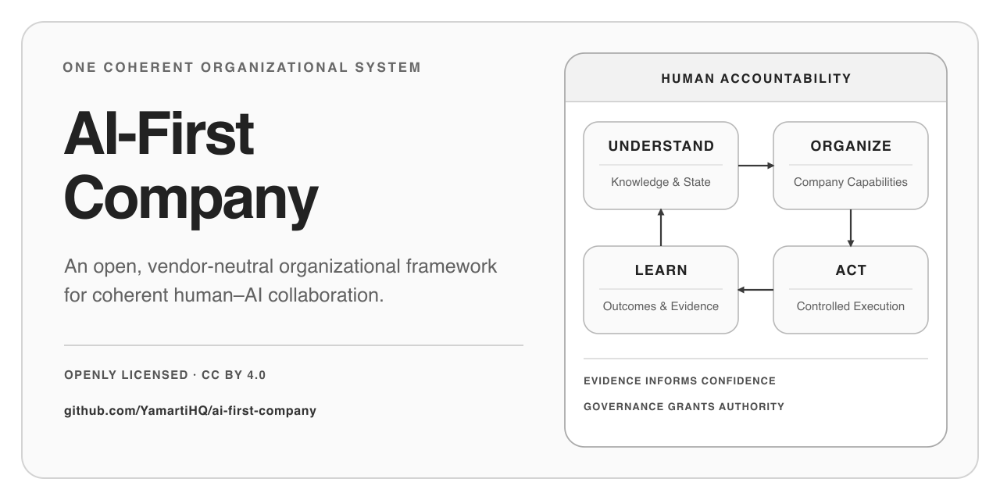

# AI-First Company



AI-First Company is a vendor-neutral organizational model for organizations in which humans and AI systems operate within one coherent organizational system.

It addresses a problem that tools alone cannot solve: how knowledge, responsibility, authority, execution, and learning can remain coherent when both human and AI contributors participate in the organization.

The project is about organizational design, not a product or software stack. Models, agents, tools, providers, and runtimes are replaceable implementation choices within the boundaries of the organization.

In this repository, the **Foundation** means the complete vendor-neutral body of work formed by the Architecture, Reference Design, and Technical Requirements. It is the basis from which application guidance, examples, and implementations may be derived, not an additional architectural layer or a reference to an earlier project name.

## Project status and independent reuse

AI-First Company v1.0 is published as an openly licensed reference framework. Version 1.0 defines the framework; it does not claim that the complete model has already been operationally validated.

This repository is not operated as a support forum or community-maintained project. Issues, Discussions, and external pull requests are therefore not used.

You are encouraged to use the framework, create an independent repository from this template, adapt it to your own organization, and develop derived work under the terms of the CC BY 4.0 license. Please retain appropriate attribution, link to the original repository, and indicate material changes.

The author may publish evidence-based updates resulting from practical application within his own company. No update schedule, implementation support, or review of independent derivatives is promised.

## Reading path

Start with the conceptual introduction, then follow the three substantive layers:

1. [The Core Idea](00-introduction/THE-CORE-IDEA.md)
2. [Architecture](01-architecture/ARCHITECTURE.md)
3. [Reference Design](02-reference-design/REFERENCE_DESIGN.md)
4. [Technical Requirements](03-technical-requirements/TECHNICAL_REQUIREMENTS.md)

The Architecture explains what an AI-First Company is.

The Reference Design translates the Architecture into an organizational design.

The Technical Requirements define the technology required to realize that design.

Repository governance and document authority are defined in [PROJECT.md](PROJECT.md).

## Author and contact

AI-First Company was created by **Andreas Nöthen** through human–AI collaboration.

This repository does not provide individual implementation support or architectural consulting. For private, security-sensitive, or material factual matters concerning the original publication, contact [contact@yamarti.com](mailto:contact@yamarti.com).

Independent adaptations and extensions should be maintained in their own repositories.

## Context and positioning

[Origin, Related Work, and Contribution](00-introduction/ORIGIN_AND_RELATED_WORK.md) explains why the Foundation was developed, how it relates to established fields of work, what contribution it intends to make, and how human–AI collaboration supported its development. It is optional context rather than part of the authoritative three-layer model.

## Use the Foundation with an LLM

[Using the Foundation with an LLM](00-introduction/USING_THE_FOUNDATION_WITH_AN_LLM.md) provides a short conversational Start Prompt, a transparent full prompt, a later-session Resume Prompt, repository-grounding checks, and practical starting paths for new and existing organizations.

The Foundation remains the stable knowledge and requirements basis. The LLM acts as a replaceable interpretation, interaction, and current-research layer. It can help a founder apply the model, ask for missing company context, evaluate a proposed design, or research current technology choices against the Technical Requirements without making one model authoritative.

To begin:

1. If the LLM can access public GitHub repositories, copy the [Short Start Prompt](00-introduction/USING_THE_FOUNDATION_WITH_AN_LLM.md#short-start-prompt) and optionally add the first question.
2. If the LLM usage document has been downloaded and attached, send the [activation message shown at the top of the file](00-introduction/USING_THE_FOUNDATION_WITH_AN_LLM.md#start-here-after-upload). Uploading the file alone does not activate its instructions.
3. If the LLM cannot access the repository, also upload [`PROJECT.md`](PROJECT.md), [`ARCHITECTURE.md`](01-architecture/ARCHITECTURE.md), [`REFERENCE_DESIGN.md`](02-reference-design/REFERENCE_DESIGN.md), and [`TECHNICAL_REQUIREMENTS.md`](03-technical-requirements/TECHNICAL_REQUIREMENTS.md), then send the same activation message.
4. In a repository-aware local workspace, open this repository and instruct the LLM to follow `00-introduction/USING_THE_FOUNDATION_WITH_AN_LLM.md`.
5. Continue the conversation normally. The LLM should preserve the established scope and guide the next relevant step.

## Architecture companions

The authoritative Architecture is supported by derived artifacts for different forms of use:

- [Architecture Knowledge Graph](01-architecture/ARCHITECTURE_KNOWLEDGE_GRAPH.md) — a semantic representation of concepts and relationships;
- [Architecture Glossary](01-architecture/ARCHITECTURE_GLOSSARY.md) — a terminology reference; and
- [Architecture Validation](01-architecture/ARCHITECTURE_VALIDATION.md) — the framework for validating Architecture meaning and traceability.

## Future application evidence

Foundation v1 defines the framework itself. Practical application may later produce evidence and derived artifacts such as:

- **Solo Founder Minimal Realization** — demonstrate and validate the smallest coherent realization for one founder or one primary accountable individual;
- **Day-One Reference Configuration** — a concrete initial organizational and technical configuration;
- **Existing Organization Transition Blueprint** — a governed path for establishing the target organization alongside existing structures;
- **Capability-by-Capability Adoption Path** — progressive validation, adoption, cutover, and retirement of existing capability implementations;
- **Reference Company** — one end-to-end company example that makes the framework concrete;
- **Reference Implementation** — a future programmed realization derived from the Reference Design and Technical Requirements.

The author intends to apply the Foundation within the real solo-founder company whose intended creation initiated this project. Evidence and reusable artifacts may be published when that practical work produces material results. Their publication is not required for Foundation v1 and follows no promised schedule. The current repository-grounded prompt is the provided LLM interaction method; any later packaging decision would be a separate implementation choice supported by operational Evidence rather than a missing part of Foundation v1.

Company formation procedures such as legal-form selection, naming rights, registration, taxation, banking, or notarization are not part of these artifacts unless a separate product or jurisdiction-specific guide defines them.

## Repository structure

```text
ai-first-company/
├── .gitignore
├── CITATION.cff
├── LICENSE
├── README.md
├── PROJECT.md
├── 00-introduction/
│   ├── diagrams/               # Introductory overview SVG source and PNG render
│   ├── THE-CORE-IDEA.md
│   ├── ORIGIN_AND_RELATED_WORK.md
│   └── USING_THE_FOUNDATION_WITH_AN_LLM.md
├── 01-architecture/
│   ├── ARCHITECTURE.md
│   ├── ARCHITECTURE_KNOWLEDGE_GRAPH.md
│   ├── ARCHITECTURE_GLOSSARY.md
│   ├── ARCHITECTURE_VALIDATION.md
│   └── diagrams/                # Architecture diagram SVG sources and PNG renders
├── 02-reference-design/
│   ├── REFERENCE_DESIGN.md
│   └── diagrams/                # Reference Design diagram SVG sources and PNG renders
└── 03-technical-requirements/
    └── TECHNICAL_REQUIREMENTS.md
```

## License

This project is licensed under the
[Creative Commons Attribution 4.0 International License](LICENSE).
